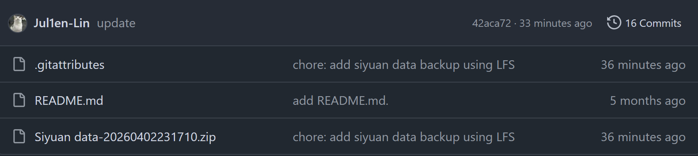

# Git LFS
> 相关笔记：[[Git|Git 知识总结]]


# 利用 Git LFS 突破 GitHub 大文件上传限制

# 接触此技术背景

本人一直有将笔记备份的习惯，虽然已经有云同步，但是异地存档能再加多层保险

随时间推移，笔记内容也越来越多，我的笔记快照的体积越来越大，最近一次直接超出了 Git 单次推送的最大体积限制（100MB），在查询解决方法时，发现 Git 有一种叫 LFS 的技术（Large File Storage），他能很好的解决此问题。

# 技术介绍

Git LFS 是 Git 的一个开源扩展，旨在解决 Git 在处理大尺寸二进制文件（如视频、数据集、压缩包）时的性能瓶颈。

因为 Git 的设计初衷是管理文本文件，它会完整记录文件的每一个版本。对于像我这样提交这么大我体积的的 ZIP 包，如果修改一次再提交，仓库体积会立刻翻倍。

# 底层原理

那么它的思路就是把大文件给“拆开”。

LFS 的解决方法是：当你将文件放入 LFS 管理时，Git 仓库中存储的不再是那个 180MB 的实体，而是一个几百字节的**指针文件**。真实的二进制数据被存储在 GitHub 的 LFS 专用服务器上。

当执行 `git checkout`​ 时，LFS 会根据指针里的哈希值，自动从服务器下载对应的真实文件覆盖到你的工作区。这样本地的 `.git` 目录（版本库历史）依然保持精简，这个设计非常巧妙。

# 技术实现

我的最近一次提交是错误的，虽然提交了但是 push 失败了，故必须通过重置索引并应用 LFS 规则来修复。

1. 首先要安装 LFS 扩展

   ```bash
   # 在你本地的git工作区
   git lfs install
   ```

2. 标记你的大文件由 LFS 来管理，以我的笔记快照为例，它的文件格式就是 `.ZIP`，那么命令就是

   ```bash
   git lfs track "*.zip"
   ```

   注意：这会生成或更新 `.gitattributes` 文件，必须将其一同提交

3. 重新添加并提交

   由于你之前的 Commit 已经包含了这个超限文件，需要先撤销上一次失败的提交，重新打包提交

   ```bash
   # 撤销上一次 commit，但保留文件变动
   git reset --soft HEAD~1

   # 重新添加属性文件和大文件
   git add .
   git commit -m "commit message"
   git push origin master
   ```

执行到这一步，就已经能正确 push 上去了



# 后续维护

看到这会有疑惑：那么这次能提交成功了，后续该如何维护呢？

维护 LFS 需要关注  **​`.gitattributes`​** 文件、本地存储占用以及云端配额三个维度

- 追踪管理

  你需要明确告诉 Git 哪些文件属于大文件。使用命令 `git lfs track "你的文件"`​。 这会更新 `.gitattributes`​ 文件。**<u>每次更新必须提交这个属性文件</u>**，否则协作成员拉取代码时，Git 会将其当作普通大文件处理，再次导致推送失败
- 监控状态

  - 使用 `git lfs ls-files`：查看当前索引中哪些文件正受 LFS 管理
  - 使用 `git lfs status`：检查当前暂存区的对象状态
- 本地存储清理

  长期频繁更新大文件会导致本地 `.git/lfs`​ 目录体积激增。使用 `git lfs prune` 可以安全删除本地不再被当前分支引用的旧版二进制块。

- 配额管理

  GitHub 免费账户提供 1GB 存储和 1GB 每月下行流量，这要注意它的限制，如果配额耗尽，别人拉下来的包都是指针文本，不会真正下载内容

‍

‍
