# 命令
> 相关笔记：[[Git|Git 知识总结]]

前提介绍

git是一个分布式版本控制系统，相当于一个时光机，拿来保管代码，一旦出错，可以随时回滚到任何一个历史节点

其核心架构分为三个区域：**工作区（写代码的地方）、暂存区（临时存放的地方）和版本库（安全存档的地方）**

# 添加

将在工作区的文件添加至暂存区中

**添加所有文件：**​`git add .`

**添加单个/指定文件：**​`git add <fileName> <fileName>`

eg：`git add file1 file2`

# 提交

提交暂存区的文件至版本库中

​`git commit -m "<填写你要备注的内容>"`

eg：`git commit -m "no message commit"`

# 查看日志

查看提交日志

- 查看最近日志：`git log`​ / `git log --pretty=oneline`

- 记录本地每一次提交的命令 `git reflog`

得到每一次的id，此id可用于版本回退功能

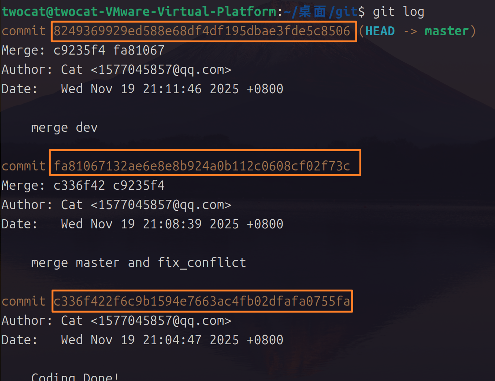

高亮部分就是每次提交的id，用`git reflog`命令也能得到，且id更加简洁

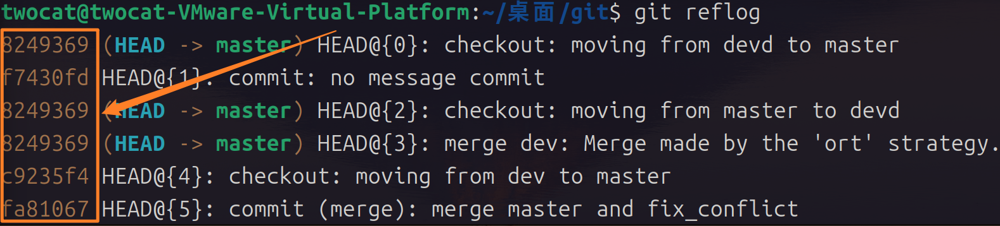

# 版本回退

回退到某一提交版本历史中，响应的区域的代码会被覆盖

它有三个版本

​`git reset [--soft / --mixed / --hard] <HEAD>`，区别如图所示

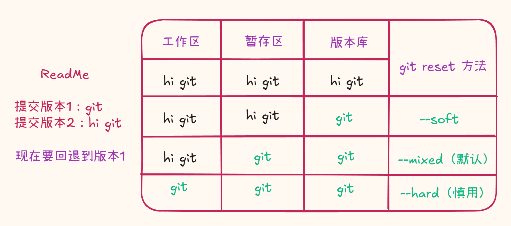

​`git reset <使用 git log / git reflog 后查看的对应版本的提交id>`，版本id在<查看日志>部分可得到

eg：`git reset --mixed 3f50f68`

# 查看当前仓库状态

查看与上一次提交之后到现在是否对文件进行修改（工作区）

​`git status`

查看是哪个文件被修改了之后，用下面介绍的`diff`命令即可查看修改的具体内容

# 查看差异

​`git diff`

- 查看暂存区与工作区之间的差异：`git diff <fileName>`

  eg：`git diff ReadMe`‍

- 查看版本库和工作区文件的区别：`git diff HEAD --<fileName>`

  eg：`git diff HEAD -- ReadMe`

# 撤销修改

如果你在工作区中写了好多天的代码，但是效果还不如初次的，此时你想要退回到未修改的状态，就需要撤销修改操作

撤销修改虽然可以手动把你自己写的代码删掉，但如果写的太多了，手动删除会有隐患且耗费时间精力

撤销的目的，就是为了不影响远程仓库，所以撤销修改的前提是代码没有push到远程仓库

以下是撤销修改的命令，分三种情况

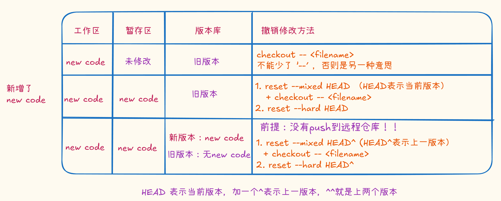

# 删除文件

1. 终端命令使用`rm <fileName>`​，这时会将工作区的文件删除，如果想提交修改的话后续使用`add 、commit`操作，分为三步
2. git 也提供了这个命令，将这个流程简化为了两布：`git rm <fileName>`​，这是将工作区与暂存区的文件同时删除，此时git已经自动将删除后的文件提交到暂存区中，只需要`commit`操作即可

‍

# 分支

创建分支能更加有效安全地更新主分支的功能

## 查看本地仓库分支

​`git branch`

## 查看远程仓库分支

​`git branch -r`

## 创建分支

在`git branch`后加上想要添加分支的名字即可

​`git branch <branchName>`​，如：`git branch dev`

## 切换分支

跟撤销修改的命令有点相似，只是少了`--`

​`git checkout <已有的分支>`​，如：`git checkout dev`

还能使用切换并创建一个未创建的分支，使用`git checkout -b <branchName>`​，相当于`git branch <branchName> + git checkout <branchName>`

## 合并分支

合并分支的前提下是在选定某一个分支内对另一分支进行合并，不能合并现在所选的分支上

1. ​`git merge <branchName>`（Fast-forward模式）

   例如有两个分支：`master 和 dev`

   如果想要合并dev分支，那需要讲选中的分支切换到master上，用`git branch`来查看现在所处的分支，前面带 * 号的就是所在分支

   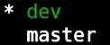

   像这样，所在是分支dev，就使用`git checkout master`转回master分支

   然后就能进行合并操作了，使用`git merge dev`，这时master就指向了dev的最新一次提交

   此时的分支情况为

   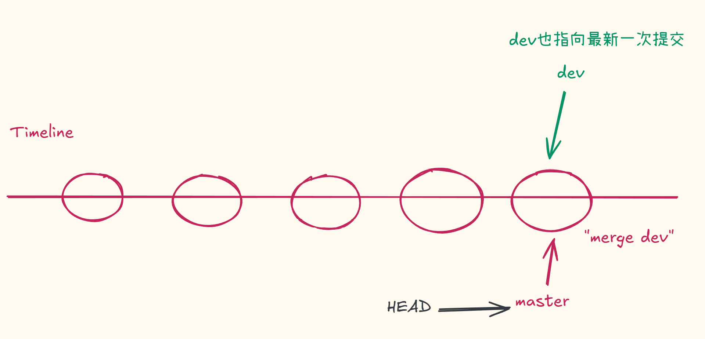

在这种Fast-forward模式下，删除分支历史时，会丢掉分支的信息，看不出来最新的提交是merge进来的还是master分支上正常提交的，为了更好的溯源以及留痕，日后便于发现是哪个分支提交出了问题，在合并的时候会使用no-ff模式，即No-Fast-forward

2. ​`git merge --no-ff -m "新提交的信息" <branchName>`

   其中`-m "新提交的信息"`表示在使用no-ff的模式下，表示merge之后还带有一个提交，说明no-ff模式下，master必须要指向一个新的提交

   例如：有分支`dev、master`​，在选中master分支的前提下使用`git merge --no-ff -m "merge dev" dev`，此时分支的情况为

   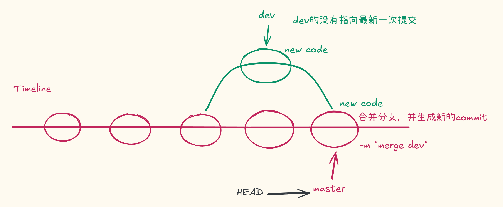

   <mark class="hltr-pink">**在平时使用中，更加建议使用no-ff模式，能进行更好的区别与溯源**</mark>

## 合并冲突

如果出现merge冲突，需要手动解决，**并进行一次《添加 + 提交》操作！！！如果不提交，是不属于成功的merge**

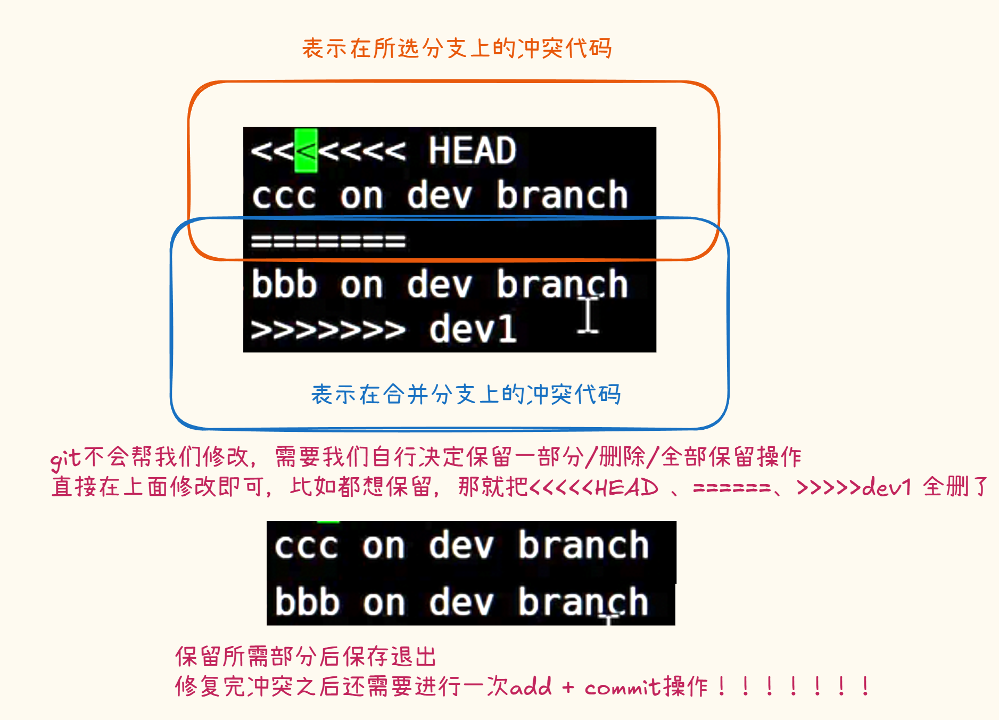

此时的分支情况

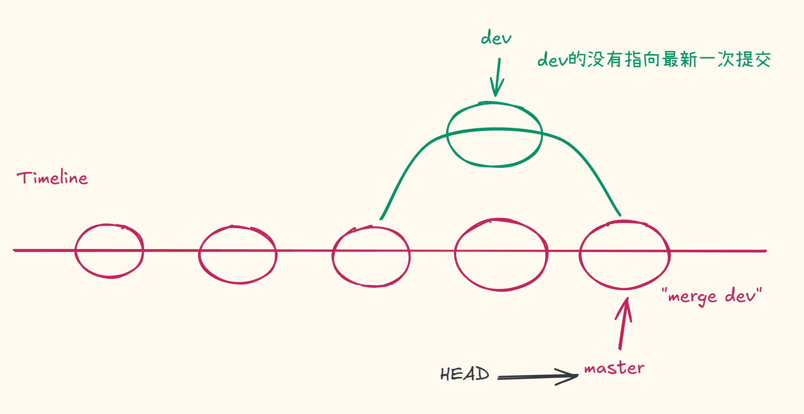

在git中也支持提交线的可视化图标，使用`git log --graph --abbrev-commit`，如图所示

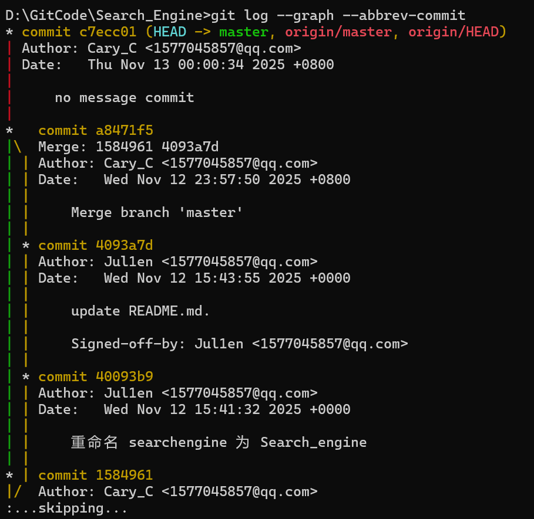

## 删除分支

删除分支也是只能在其他的分支上删除分支，比如在dev分支上就不能删除dev，必须要切到master分支上才可以

使用`git branch -d <branchName>`

因为创建、合并和删除分支非常快，所以鼓励你使用分支完成某个任务，合并后再删掉分支，这和直接在master分支上工作效果是一样的，但过程更加的安全

## 删除分支2

开发过程中，可能`dev`​分支在中途被废弃了，不需要合并到`master`​中，直接删除`dev`​分支，此时强制删除分支用命令`git branch -D <branchName>`

在终端命令中也会提醒你，这个分支未被完全合并到master分支上，如果确定你要删除，使用`git branch -D <branchName>`

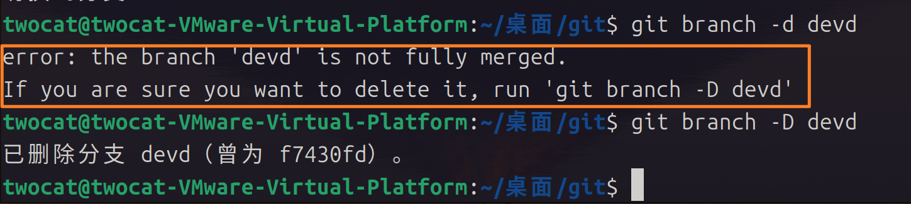

## 分支策略

在实际开发中，git给我们的分支管理能力是非常重要的，这能帮我们进行多人协同开发

在git管理中，需要遵守的几个重要约定

- master分支应该是非常稳定的，仅用来发布新版本，平时不能在上面修改操作
- 干活修改的内容都应该在dev分支上，等到某个时候迎来版本更新，再把dev分支合并到master上，在master分支上发布新版本

  这样每个人都能在基于master上创建dev分支进行协同开发，每个人都有自己的分支，时不时往dev分支上合并即可

  故团队协同开发的分支belike：

  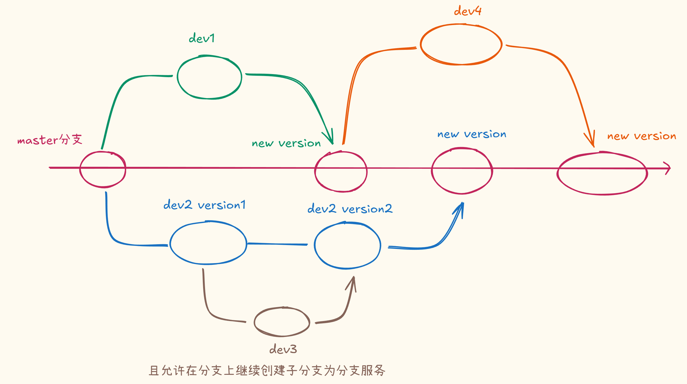

## Bug分支

在平时开发过程中，master分支一般是稳定的版本，其他分支都是基于master分支进行完善开发，但master也有可能有bug，此时如果没能及时发现小bug，其他分支在有bug的master上基础上进行开发，这就需要我们建立bug分支对master进行bug修复

假如已经建立了分支dev，但是发现了master上有bug，那是不建议在dev分支上进行bug修复的，因为这违背了分支dev的任务，可能dev的任务是对某个模块进行更新，且已经修改了部分文件，所以我们需要再创建分支专门对master分支进行修复bug

这时候我们切回master分支后其实能看到分支dev修改的代码，虽然这只是在工作区的修改，还未提交到暂存区，但这也影响了对master的创建bug分支的步骤

比如在dev上修改了readme文件

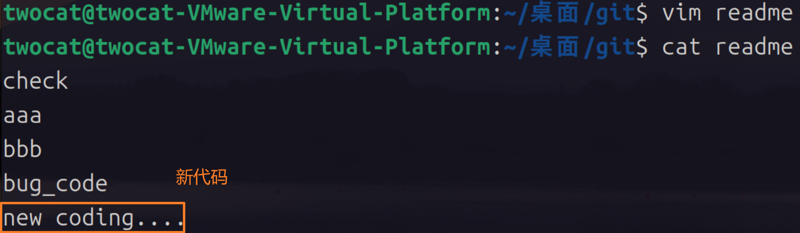

在master分支上也能看到dev修改的内容

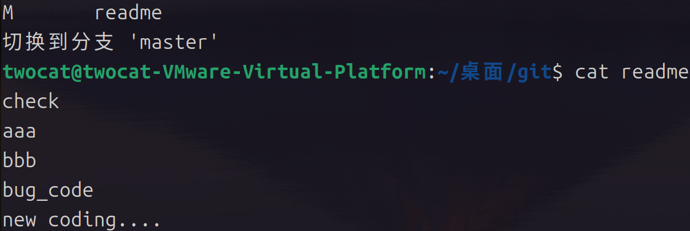

原因是master工作区中的代码有变动的

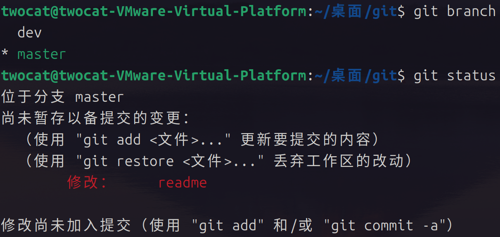

虽然代码只存在工作区中，但我们还是不想在master上看到dev修改的代码，且在dev分支上不影响master，可在dev分支上用`git stash`，将工作区中的内容进行储存。

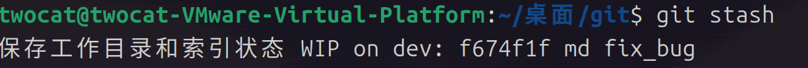​此时的`tree .git`​仓库一下就能看到`stash`分区保存在refs上

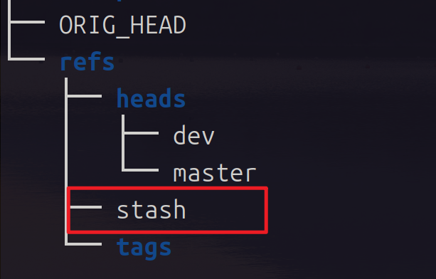

此时再返回到`master`​分支上，就已经看不到`dev`修改的代码了

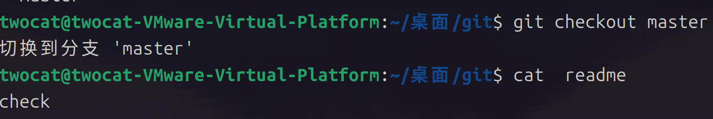

此时就能对`master`​进行bug修复了，先切回`master`​分支。然后在`master`​上新建fix_bug分支并切换到fix_bug，可用`git checkout -b fix_bug`

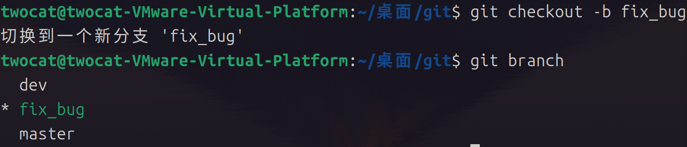

在fix_bug上修改代码后，更新提交后就可以提交到`master`​上了，可合并后直接提交，这里用no-ff方式提交，命令为`git merge --no-ff -m "<commit message>" <devName>`

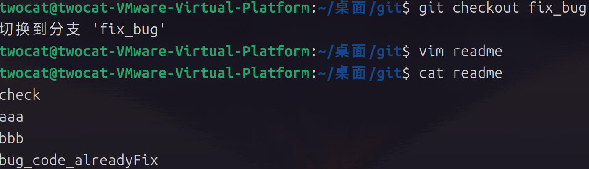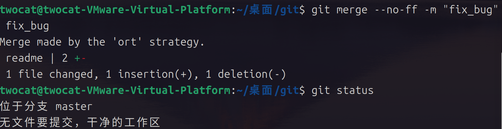

此时的`master`分支上就是已经修复好的bug了

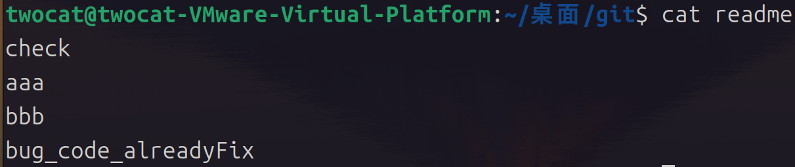

但`dev`​分支上我们还是以有bug的`master`​基础上开发的，那怎么办呢？`dev`​分支的修改信息还存在`stash`上，我们需要把暂存在stash区的代码给拉回来，这是没拉回来的readme文件

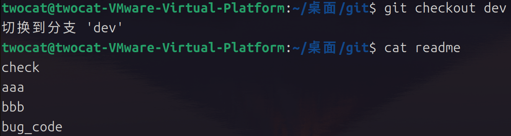

在上面提到，`dev`​已经修改了readme的内容，那这些内容都存在了`stash`​区，且dev本地是没在的。可以用`git stash list`查看stash区的状态

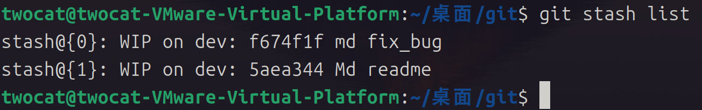

现在拉回来的dev分支上的readme文件就显示正常了，用到命令`git stash pop`，这时readme文件就正常显示了

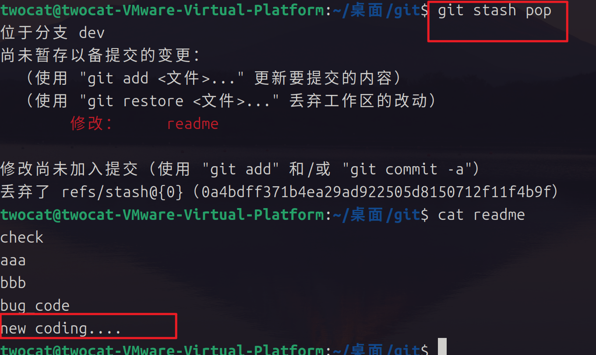

假设dev分支上已经完成开发，且已经更新最新一次提交。（add + commit）

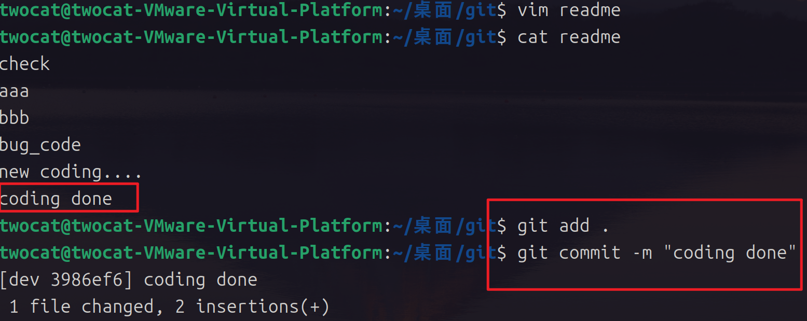

现在要提交到master上，那怎么办呢？它还存有`master`​原来的bug代码，**==如果直接合并到==****==​`master`​==**​**==分支上，那会出现合并冲突，需要我们手动解决，手动解决是非常危险的，处理不当可能会污染master分支，变得更加不稳定。==** 情况如图所示，会更加直观。

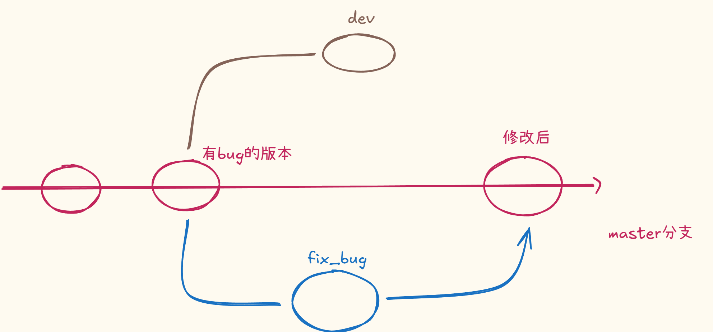

解决这个问题的一个好的建议是：最好在自己的分支上合并下`master`​，再让`master`​去合并`dev`​，这样做的目的是有冲突可以在本地分支解决并进行测试，而不影响`master`，这样做此时的状态为：

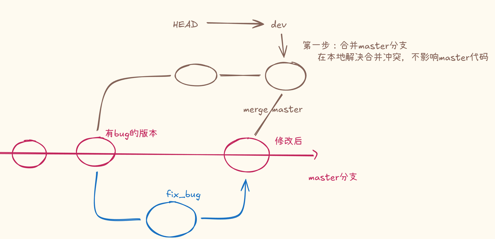

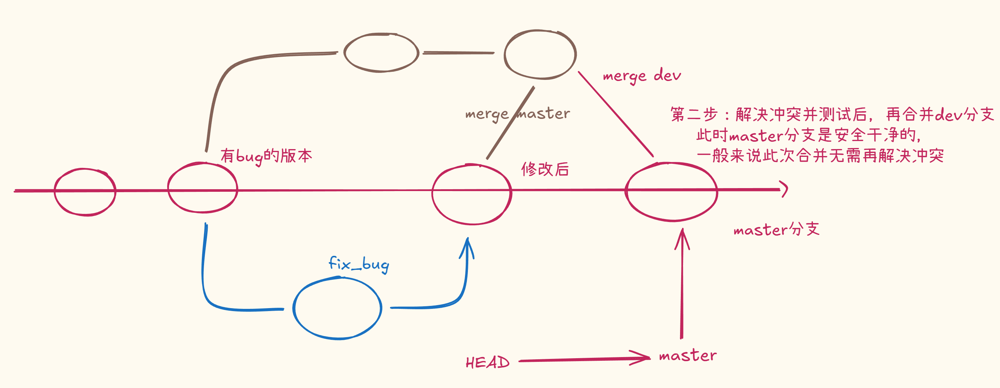

具体操作如下，在第一步中不出意外遇到了冲突

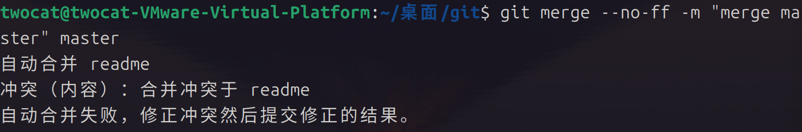

手动修改后别忘了提交，然后切回到`master`​分支上，再合并`dev`​，此时`master`​上就既有修改后的代码，也有`dev`上提交的新代码且不冲突了

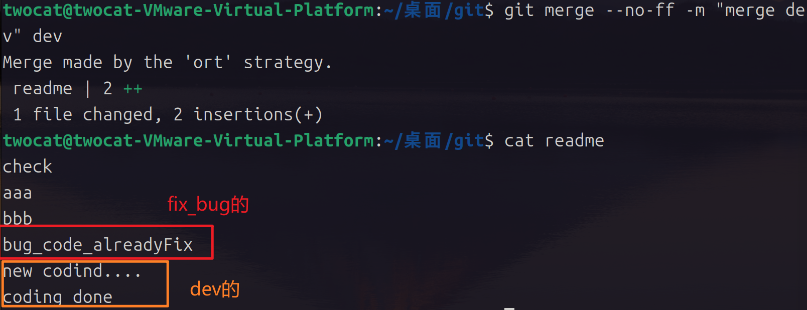

完成后记得删分支，这是个好习惯😁

​`git branch -d dev`​、`git branch -d fix_bug`

# 推送

​`git push origin <远程主机名> <本地分支名>:<远程分支名>`​，比如`git push origin test-branch:remote-test-branch`，远程仓库就会出现

​`remote-test-branch` 的新分支

# 拉取

Pull其实是有拉取 + 合并的操作，拉取过程中自动帮你合并了，且默认的是fast-forward模式

​`git pull origin <远程branchName>:<要拉取到的本地branchName>`

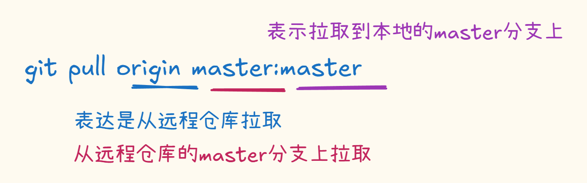

如果远端的master与本地的分支名字一样，即是拉取到本地master分支，则可以省略`:master`​，即`git pull origin master`

# 忽略特殊文件

在开发中，有时候有些文件不应该被提交到远端仓库，比如重要的数据库密码等配置文件，那怎么才能让git知道并自动忽略呢？

在git的工作区根目录上创建一个特殊的`.gitignore`文件，然后把忽略的文件名填进去，git就会自动忽略这些文件了

可以手动创建，如：`touch .gitignore`，也可以在创建远程仓库的时候选择

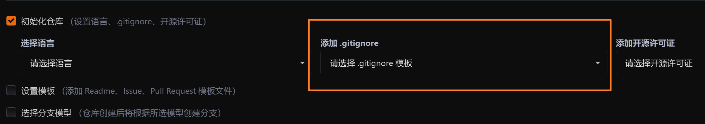

然后修改在`.gitignore`​上写上要忽略的文件类型 / 文件后缀名，修改命令为`vim`​，如`vim .gitignore`

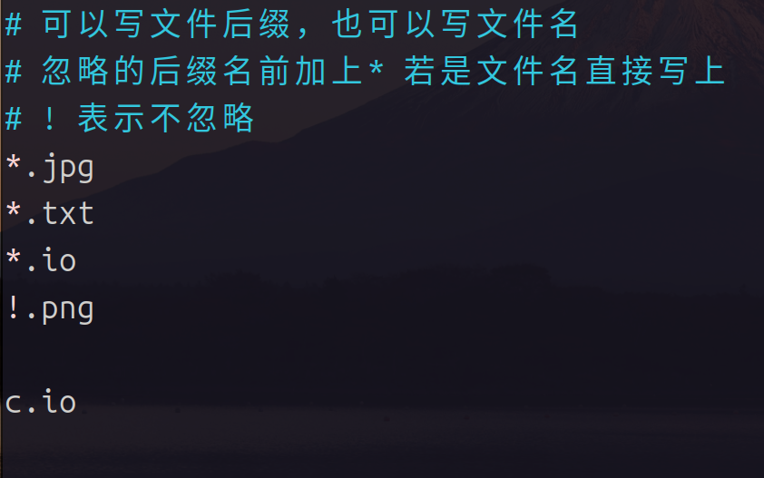

此处我在工作区中新建了`file.txt`​、`a.io`​、`c.io`​、`picture.png`文件

查看git状态的时发现，`picture.png`​没有被忽略，`file.txt`​、`a.io`​和单独指定的`c.io`文件被忽略了，没有被git追踪管理，这个结果是理想的

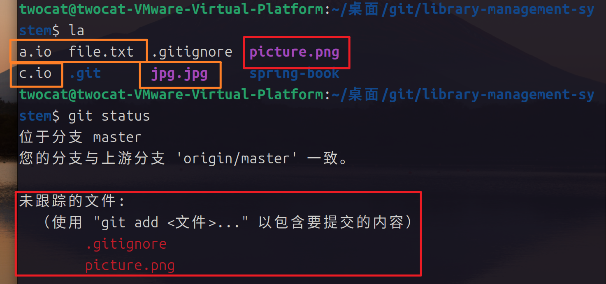

有时候`.gitignore`​文件太大了，记不清具体忽略了哪些文件，但是又不小心建立了被忽略的文件，手动在ignore文件内查看太费劲了，可以使用命令`git check-ignore -v <被忽略的文件名>`

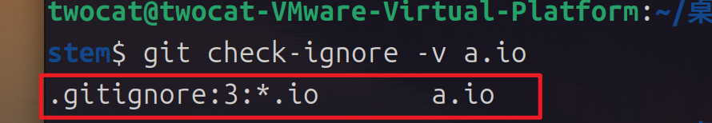

这就能看到具体的被忽略的文件的具体位置

# 标签管理

标签`tag`​，可以简单理解为对某次`commit` 的一次标识，相当于起了个别名。

相较于难以记住的`commit id`​，`tag`​可以很好的解决这个问题，当我们需要回退某个重要的版本时，直接使用标签就能很快的定位到对应的`commit`

这里引用hutool 工具包的GitHub仓库，能看到不同版本的tag

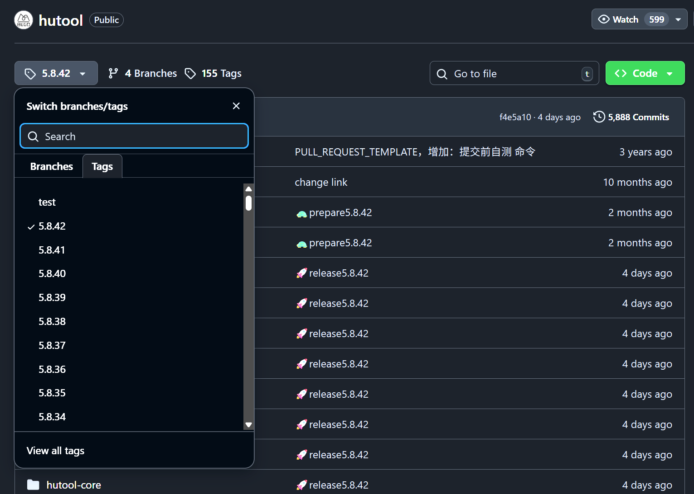

## 创建标签

在Git中打标签非常简单，首先切换到需要打标签的分支上，直接`git tag <name>`​就可以打一个新的标签，**这样的标签默认指向最新的一次提交**

当然也可以**指定某个提交打**​`tag`​，只需在后面加上提交的id，如：`git tag v0.9 f7340fd`

## 描述标签

新建`tag`​​​的同时还能对标签进行一些描述，使用`git tag -a v0.8 -m "XXX" <需要指定的哪次提交id，如果没有默认指向最新的一次>`

## 查看标签

使用`git tag`就能看到当前目录下有多少个标签，

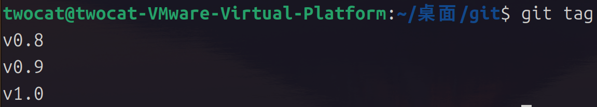

如果需要看具体某一次的`tag`​的详细描述，则需要命令`git show <某一次的tag>`​，如：`git show v0.8`​ / `git show v1.0`

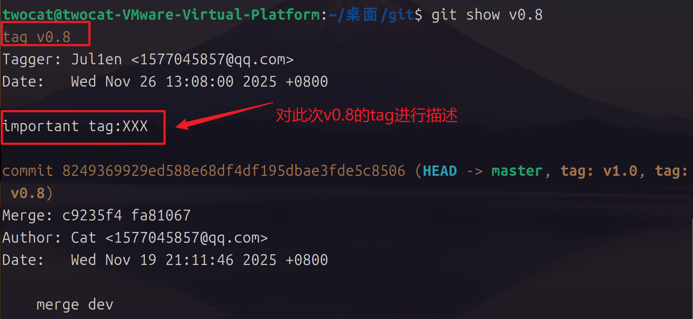

## 删除标签

**本地删除：** 删除标签与删除分支的操作类似：`git tag -d <tagName>`​，如`git tag -d v0.8`​，可见已经删除了`tag`v0.8

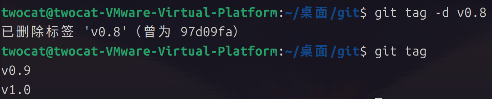

**删除远程仓库标签：**

1. 直接在远程仓库删除
2. 在本地执行`git push origin :<你要删除的标签>`​，注意这个标签需要先在本地进行删除，才有变更，变更之后才能`push`

## 推送标签

将标签推送同步至远程仓库

**推送单一标签：**​`git push origin <标签名>`

**一次性推送所有标签：**​`git push origin --tags`，就能把本地所有的标签都推送到远程仓库

# 本地分支与远程仓库分支建立连接

在git课堂的36集

‍
