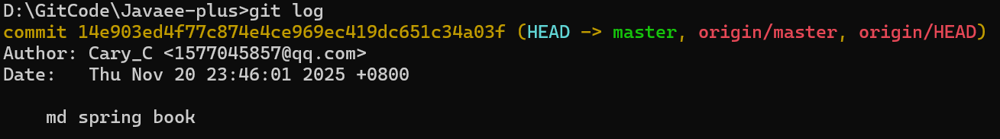
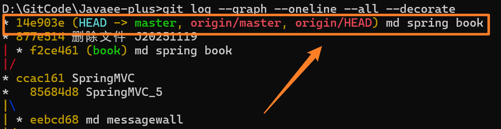
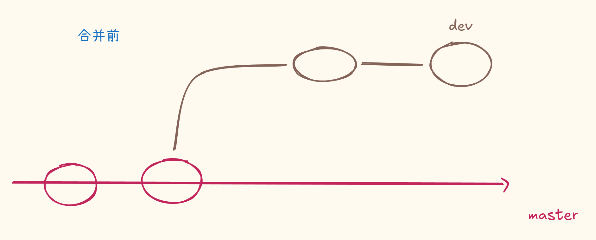
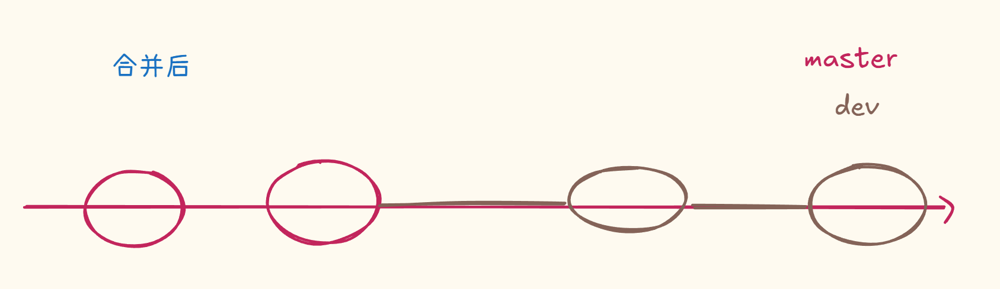

# 实际问题
> 相关笔记：[[Git|Git 知识总结]]

# 在master合并分支后看不到最新提交日志

No-FastForward方法失效（master合并后看不到最新提交日志）

在实现Springboot图书管理系统的时候，首次使用了dev分支上更新在合并，一路上都很顺利，直到在push的时候遇到了隐藏的问题

**我在dev分支上提交了最新的一次代码，且比**​**​`master`​**​**领先一个版本，在**​**​`master`​**​**分支使用--no-ff合并后出现了问题：在**​**​`master`​**​**分支上的提交，本地与远程的仓库上都没看到**​**​`master`​**​**的日志，显示的是**​**​`dev`​**​**分支上的日志**

为了区分，我将`dev`​分支的commit日志写为“md spring book”，`master`合并后的commit日志为“new bookproject”，执行顺序是：

1. git checkout -b dev
2. 在dev分支上 ——> commit -m “md spring book”
3. 切回master分支：git checkout master
4. git merge  **--no-ff** -m "new bookproject" dev
5. git push origin master

可以看到我是用了--no-ff方式来提交，正常来说是可以看到master的"new bookproject"日志，但现在是：

查看log日志树：`git log --graph --oneline --all --decorate`

所以实际发生是`master`​提交了一个和 book 一样的 commit，而不是 merge。push的也是master最新的commit，内容和dev分支很相似，**<u>但没有实际merge到</u>**

那为什么看起来像是**<u>已经合并了</u>**？

- ​`md spring book` 在 book 做过一次
- 后来 master 上你也做了一个 **相同 commit** 提交

Git认为你这是一次没必要的提交，所以直接快进master主线，即使是使用了`--no-ff`，状态图所示

如果需要禁止 fast-forward（最推荐），使用`no-ff`（强制产生merge commit）

- 🤗可全局配置：`git config --global merge.ff false`
- 或手动制造分叉（先让`master`​领先分支版本，这样用`git merge --no-ff`就能生效）

 **📌 最后一句总结**

> 你不是命令用错，而是 master 与 book 没形成分叉点，导致 `--no-ff` 没有发挥作用，Git 直接快进了。

## 推送 dev 到远程（非常重要）

后续建议：

- 如果分支重要、且长期开发、需要备份、需要协作的情况下，可以推远程仓库托管分支代码

  首次推：`git push -u origin dev`​，带 `-u` 后，Git 记住这个分支和远程关联。

  后续推：`git push`

  ‍

- 如果分支只是在本地临时测试、本地用、本地删除，则可以不用推远程~

---

‍
