# CRUD
> 相关笔记：[[MySQL|MySQL 知识总结]]

CRUD是对数据库中的记录进行最基本的==增删改查==的操作

Insert——语句插入

​`insert into 表名 values (...)`注意（）内的内容要保证类型匹配，SQL中会出现弱类型转换

1. *<u>插入查询结果——select 和 insert 结合起来了，将一个查询语句的结果，作为另一个插入语句的插入数据</u>*

   ​`insert into student2 select * from students1 `

   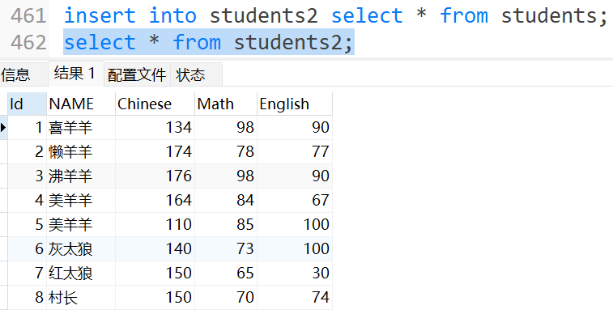

---

Select——通过select查询表的内容

1. 全局查询`select * from 表名`——⚠️在自己的数据库进行 * 全部查找无所谓，在公司中，尤其是生产环境，数据库数据庞大，select * 会非常危险，可能会吃满内存/网卡/带宽

2. 选择查询`select 列名，列名... from 表名`——大幅度降低性能开销，只需要列出需要的列

3. 带有表达式的查询 `select number + 10 from 表名`​——*==任何select的语句，包括表达式都不会修改原始数据库的内容==*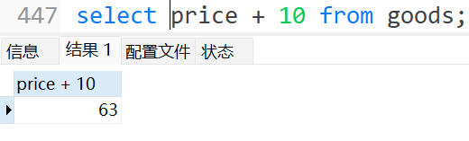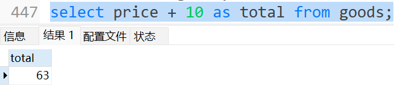可以起别名，增加代码可读性

4. 结果去重查询`select distinct name,math... from 表名`

   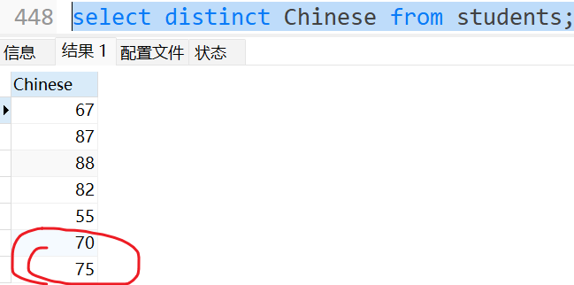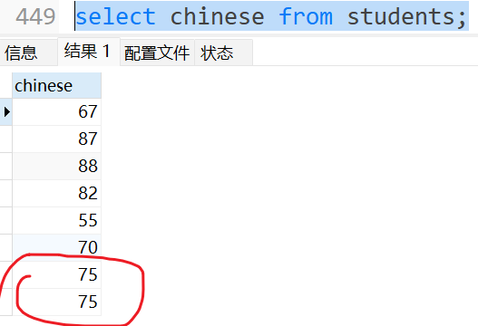
5. Where 条件查询

   ​`select total from students where English >= 80 and Math > 90`

   ​`select name from students where name like '%张%'`

   ​`select name from students where English is (not) null`

   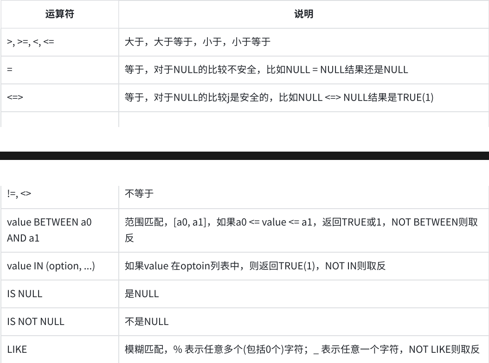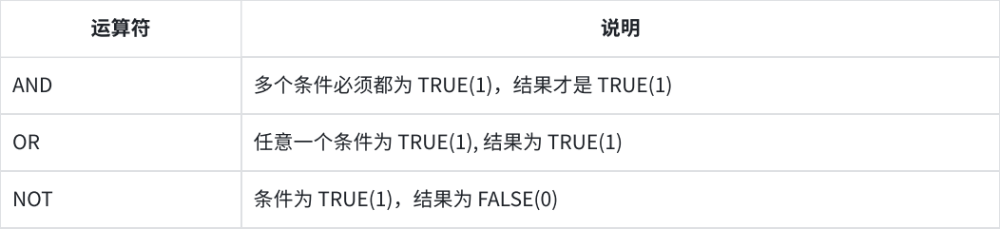

   条件查询的执行顺序

   1. 先遍历这个表的每一行数据
   2. 把这一行数据带入的where条件里
   3. 如果条件成立（true），则把这一行加入结果集合中，（false）则跳过
   4. 当完成所有的遍历过程后，此时得到了结果集合
   5. ==最后再根据select指定的列/表达式/别名/去重操作等，对结果集合进行进一步筛选==
6. Order By 排序

   ​`select name,Math from students order by English (desc)`

   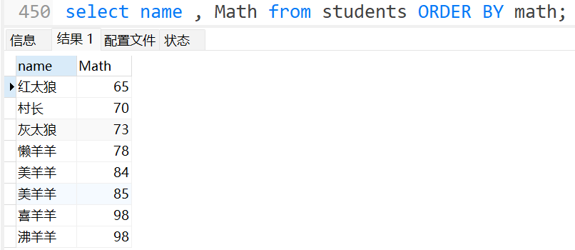

   desc倒序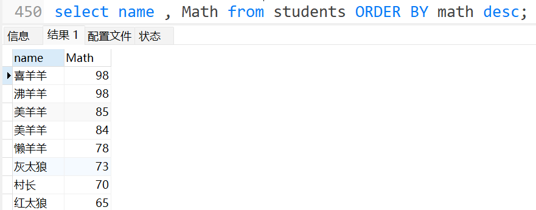

   也可以在后面加上表达式`select name,Chinese + Math + English as total from students order by `​`total`​​​` desc`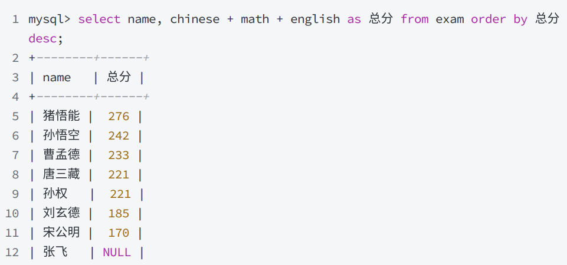此时表达式先执行，所以后面的order by可以识别 total
7. 分页查询

   - 下标从0开始，从0开始筛选num条结果

   ​`select * from students order by Math desc limit num`

   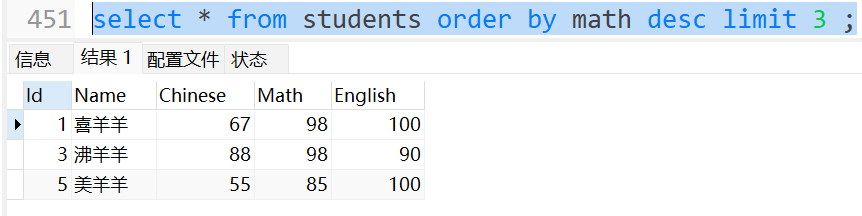

   - 指定从start下标开始筛选num条结果

   ​`select * from students order by Math desc limit start，num`

   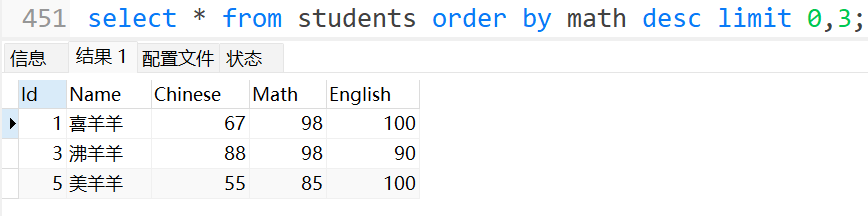

   - 第二种的更易读的方式

   ​`select * from students order by Math desc limit num offset start`

   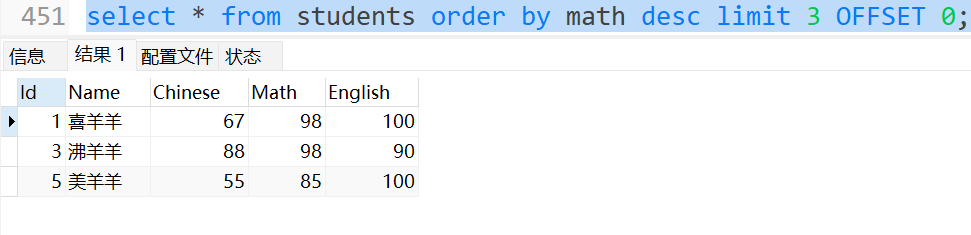
8. 聚合查询（聚合函数）

   *<u>聚合函数属于SQL中自带的函数（库函数）</u>*

   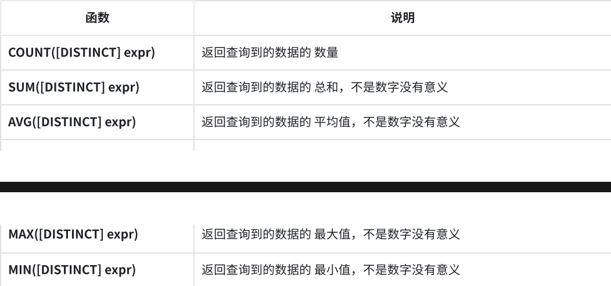

   - Count 函数

     这样的操作是包括 Null 行的

     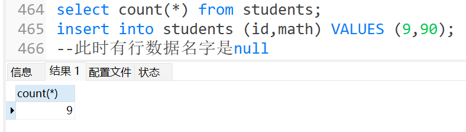

     传入name的时候就不包括 Null 行

     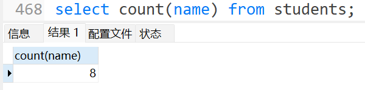

     🏄‍♀️注意 count函数没法写多个列，传入多个参数的时候会有歧义   belike `select count (id,name) from students`❌
   - Sum函数（自动排除 Null 数据）

     ​`select sum(english) from students` 计算所有学生的英语分数的总和

     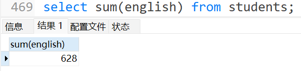
   - Avg函数

     ​`select avg(english + math + chinese) from students` 计算总成绩的平均分

     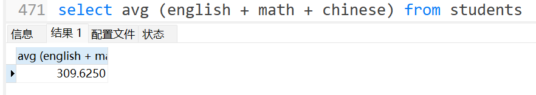

     ​`select avg(math) from students` 计算数学平均分

     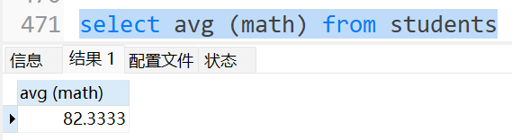

---

Update——真正修改数据库的原始数据

​`update 表名 set 修改数据，修改数据... where 修改范围`

​`update students set english = 90 where name = '喜羊羊'`

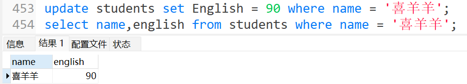

​`update students set Chinese = (Chinese * 2)`——不加Where全局修改

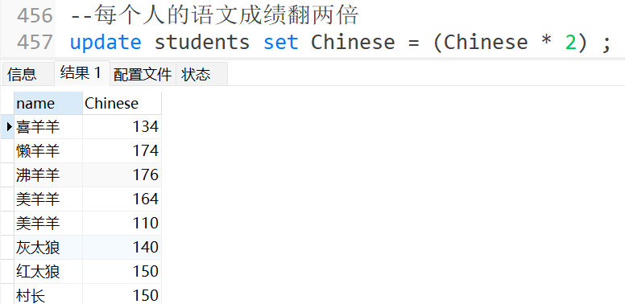

⚠️ 注意事项

1. 在原基础值的基础上做变更时，不能使用类似 English += 100 这样的表达式

   English += 100 ❌        English = English + 10✔
2. 若不加 Where 语句 则会全局修改，谨慎使用 ！！！

---

Delete——删除

谨慎操作！！ 删库轻则开除，重则吃国家饭😨

---

‍
