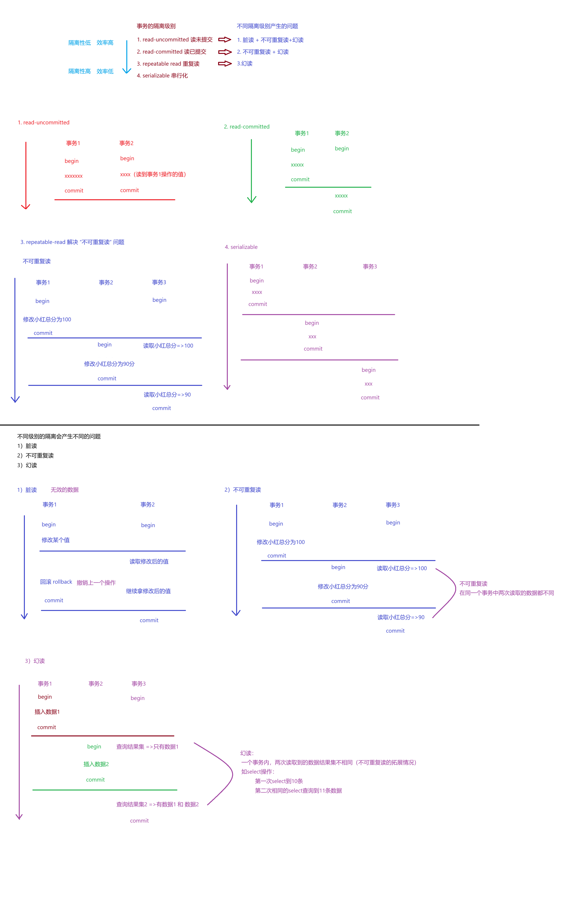

# 事务
> 相关笔记：[[MySQL|MySQL 知识总结]]

**<u>MySQL是一个客户端-服务器结构的程序</u>**

# 事务的四大原则ACID

1. A——（Atomicity）原子性：

   把多个SQL打包成一个整体，不可分割，要么执行全部，要么不执行
2. C——（Consistency）一致性：

   事务执行前与执行后，数据符合正常的逻辑的情况，如小明给小红转账100，事务执行后小明兜里少100块，小红兜里多100块
3. ==💫I——（Isolation）隔离性：==

   一个数据库中可以执行多个事务，并且要求使多个事务之间互相影响尽量小，故有隔离性概念

4. D——（Duration）持久性：

   事务的执行的结果会保存在硬盘上

它与多线程中的[[锁|锁]]密切相关，其背后的逻辑是相似的

‍
