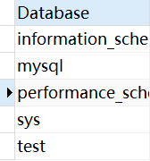
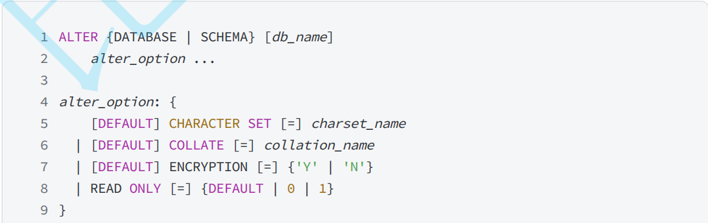

# 数据库操作
> 相关笔记：[[MySQL|MySQL 知识总结]]

这是MySQL中基本的库的操作

# 查看所有数据库

​`show databases;`

# 创建数据库

​`create database ( if not exists ) db_name;`

- 取的名不能与SQL关键字相同
- 若名字一定要和关键字重复 用反引号将名字引起来

​`(if not exists)`

- 是判断要创建的数据库在你本身的库是否存在，如果存在同名数据库则不做任何事情
- 此语句多用于——如果你创建的数据库的SQL是和其他的SQL放在一起，批量执行的情况，一旦出现报错后序语句不执行

​#字符集#

类似于ASCII表，是一种规则，MySQL中对中文也有规范，哪个数字，对应哪一个汉字，这个规则有多种方案，每种方案就能算是一个 “字符集”，MySQL 8.0中是UTF8mb4

常见字符集

1. GBK —— 使用两个字节表示汉字
2. UTF8 —— 变长编码，能表示更多语言文字，1~4个字节范围，在MySQL中通常是3个字节 (MySQL中的UTF8有bug，缺少emoji，UTF8mb4是UTF8的完整版）
3. UTF16 —— 两个字节表示汉字，Java中使用的方案

在创建数据库的时候可以指定字符集，默认是UTF8mb4

​`charset UTF8mb4;`

# 删除数据库

​`drop database (if exists）db_name;`

- 删除数据库是一个危险操作

# 选中数据库

​`use db_name;`

- MySQL中可能有多种数据库，需要先选择一个再操作，指定数据库的对象

# 修改数据库

​`alter database db_name;`

很少进行修改，以上内容在创建的时候就定好了

‍
