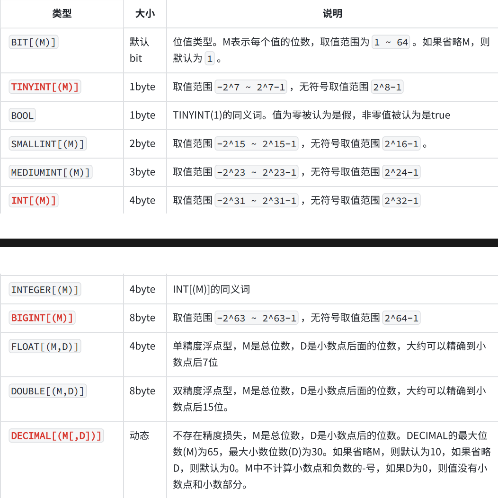
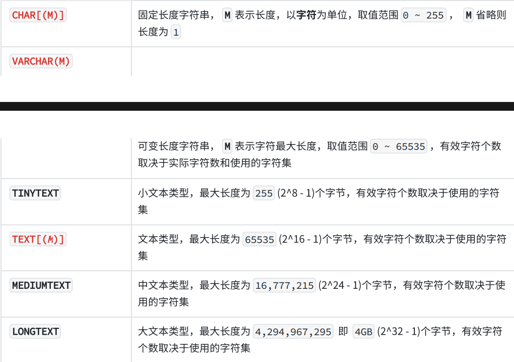
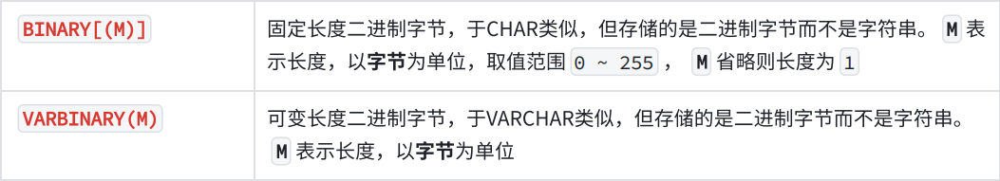
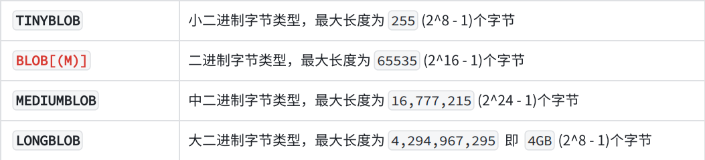
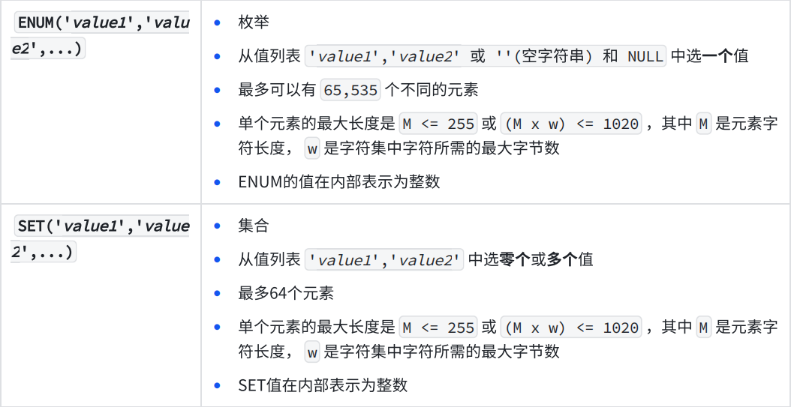
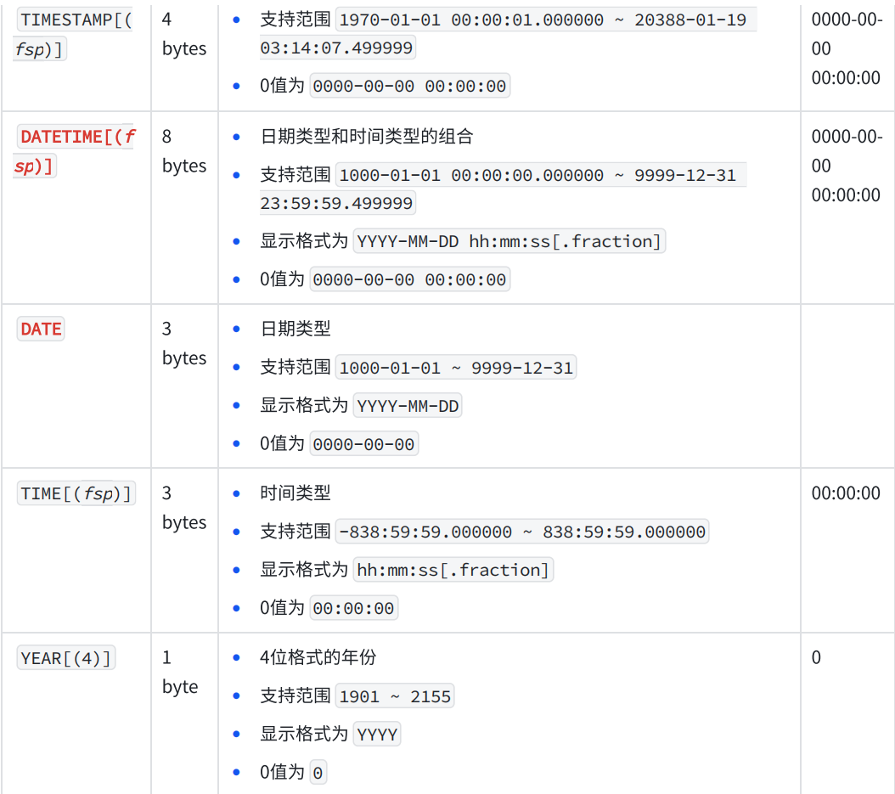

# 数据类型
> 相关笔记：[[MySQL|MySQL 知识总结]]

Q：什么是数据类型？

A：数据给分出了一些种类，我们需要给数据进行分类，不同种类的数据，表示着不同的含义，对应的操作也会有不同

与其他编程语言一致，SQL中也规定了用于描述属性的数据类型，常见的数据类型有

1. 时间类型
2. 字符串类型
3. 数值类型
4. 二进制类型

接下来对以下类型进行解释

# 数值类型

重要的数据值类型有 bool int bigint double decimal   其中除了decimal其他的数据都会出现丢失，如果计算精确数字时需要用decimal，但代价是牺牲性能与存储空间

# 字符串类型

重要的字符串类型有char(M)  varchar(M)  text    其中M是表示字符串的长度，不是字节，如字符串hello的长度为5，text则是自动扩容，用于保存较长的字符串

varchar和char区别

varchar（100）表示的是最长的长度是100，如果只存apple，则实际长度只占5个字符，char（100）则实际长度就为100个字符，两者如果超过规定的长度都会报错

应用场景：

- 标题——varchar/char

- 正文——text

# 二进制类型

字节数组，不能自动扩容

字节数组，可以自动扩容

应用场景：用于保存图片，音频，视频等，很少会使用

也很少使用，实际中更多使用int

# 时间类型

在理解时间类型之前要明白一个概念——时间戳

​#时间戳#

时间戳是以格林威治时间1970年1月1日（00:00:00 GMT）作为基准时刻，计算当前时刻与基准时刻的秒/毫秒/微妙的差值——时间戳是计算机表示和保存时间的常见方式

由于TimeStamp支持的时间范围有限，现多使用DateTme来存储/查询时间

总结

在数据类型中，我们重点关注的类型是

1. bool
2. int
3. bigint
4. double
5. decimal
6. varchar
7. text
8. datetime

理解并熟练运用数据类型，有助于更好地使用数据库

‍
