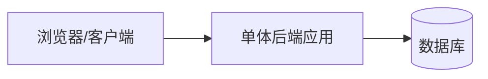
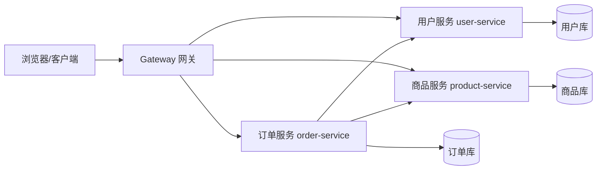
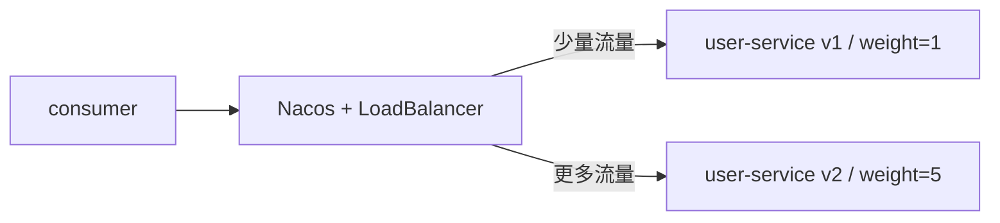
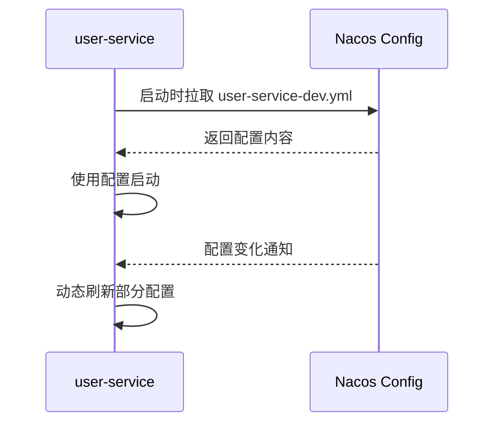
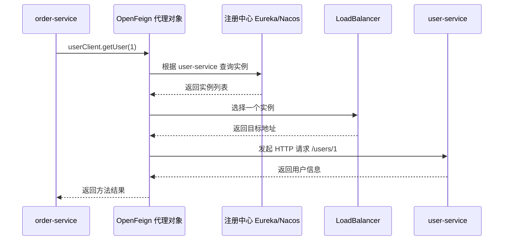
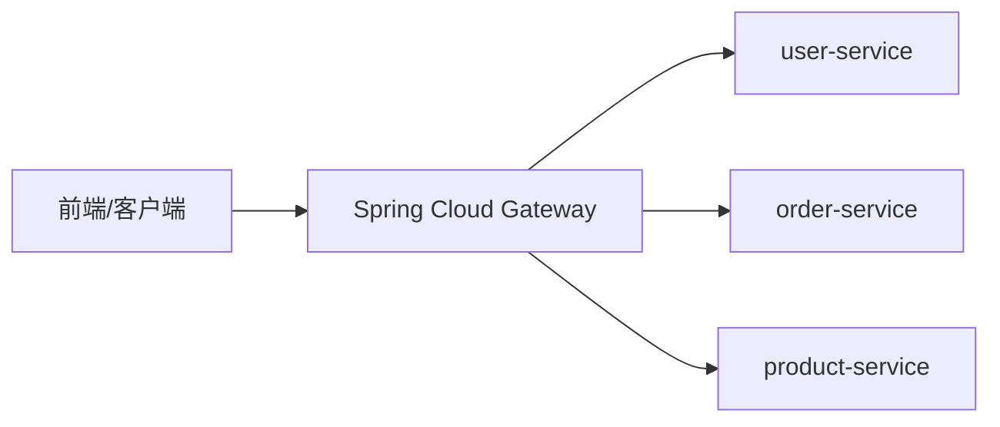
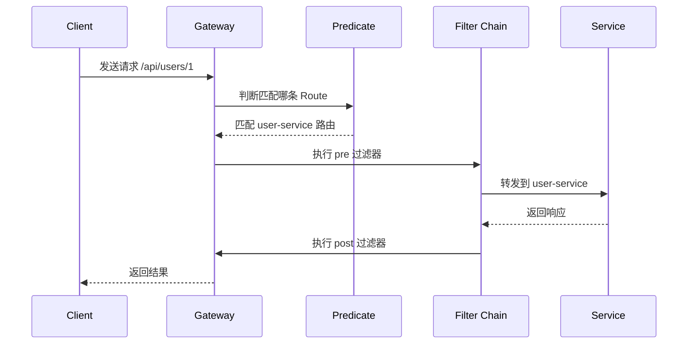
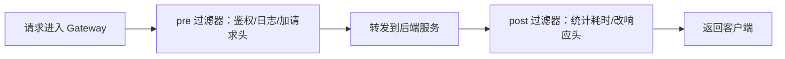
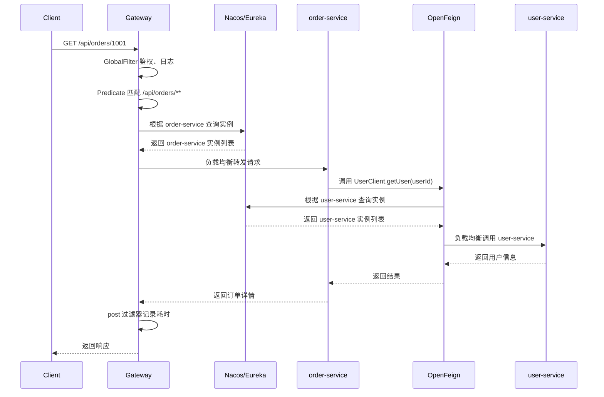

# Eureka、Nacos、OpenFeign 、Gateway
> 相关笔记：[[Spring Cloud|微服务 知识总结]]


# Spring Cloud 简单概念笔记：Eureka、Nacos、OpenFeign 与 Gateway

版本说明：本文以 Spring Boot 3 / Spring Cloud 新版本思路为主。很多旧教程会使用 `bootstrap.yml`​、Ribbon 等写法，学习时可以看，但自己写新项目时更建议优先使用 Spring Cloud LoadBalancer、`spring.config.import` 等新写法。

## 微服务里的几个核心问题

单体项目里，前端请求通常直接打到一个后端服务：



微服务项目拆分后，系统可能变成这样：



拆分之后会出现几个新问题：

- 服务越来越多，调用方怎么知道某个服务现在在哪台机器、哪个端口？
- 同一个服务可能部署多个实例，请求应该打到哪一个实例？
- 服务上线、下线、宕机后，调用方如何及时感知？
- 公共认证、日志、限流、跨域等逻辑放在哪里更合适？
- 多个服务的配置如何统一管理、动态刷新？

对应到 Spring Cloud 生态中，常见组件分工如下：

| 问题       | 典型组件                                 | 作用            |
| -------- | ------------------------------------ | ------------- |
| 服务在哪里    | Eureka / Nacos Discovery             | 服务注册与服务发现     |
| 多实例怎么选   | Spring Cloud LoadBalancer / Nacos 权重 | 客户端负载均衡       |
| 服务之间怎么调用 | OpenFeign                            | 声明式 HTTP 远程调用 |
| 外部请求从哪里进 | Spring Cloud Gateway                 | API 网关、统一入口   |
| 配置怎么统一管  | Nacos Config / Spring Cloud Config   | 配置中心、动态配置     |


> 服务启动后注册到注册中心；调用方从注册中心发现目标服务实例；负载均衡器从多个实例中选一个；OpenFeign 发起服务间调用；Gateway 负责外部入口和公共过滤逻辑；Nacos 还可以统一管理配置。

## Eureka：注册中心、服务注册与服务发现


### Eureka 是什么

Eureka 是 Netflix OSS 体系里的服务注册与发现组件。它主要分成两类角色：

- ​**Eureka Server**：注册中心，负责保存服务实例信息。
- ​**Eureka Client**：微服务应用，启动后把自己注册到 Eureka Server，也可以从 Eureka Server 获取其他服务列表。

可以把 Eureka Server 理解成一个“服务通讯录”其他服务调用 `user-service` 时，不需要写死 IP 和端口，只需要通过服务名去查。

### 服务注册

服务注册指的是：服务启动后，把自己的服务名、IP、端口、健康状态等信息上报给注册中心。

以 `user-service` 为例，它启动时会把自己注册进去：

```yaml
server:
  port: 8081

spring:
  application:
    name: user-service

eureka:
  client:
    service-url:
      defaultZone: http://localhost:8761/eureka/
```

​`spring.application.name`​ 很关键，它就是服务名。服务之间一般不是通过 `localhost:8081`​ 调用，而是通过 `user-service` 这个逻辑名称调用。

### 服务发现

服务发现指的是：调用方根据服务名，从注册中心拿到目标服务的实例列表。

例如 `order-service`​ 想调用 `user-service`​，它不需要知道 `user-service` 部署在哪，只需要知道服务名：

```text
order-service -> 注册中心 -> 查询 user-service -> 得到实例列表 -> 选择一个实例调用
```

如果 `user-service` 有多个实例：

```text
user-service
├── 192.168.1.10:8081
├── 192.168.1.11:8081
└── 192.168.1.12:8081
```

注册中心会保存这些实例，调用方再结合负载均衡策略选择一个。

### Eureka 简单部署流程

#### 第一步：创建 Eureka Server

依赖示例：

```xml
<dependency>
    <groupId>org.springframework.cloud</groupId>
    <artifactId>spring-cloud-starter-netflix-eureka-server</artifactId>
</dependency>
```

启动类：

```java
@SpringBootApplication
@EnableEurekaServer
public class EurekaServerApplication {
    public static void main(String[] args) {
        SpringApplication.run(EurekaServerApplication.class, args);
    }
}
```

配置文件：

```yaml
server:
  port: 8761

spring:
  application:
    name: eureka-server

eureka:
  client:
    register-with-eureka: false
    fetch-registry: false
    service-url:
      defaultZone: http://localhost:8761/eureka/
```

这里的两个配置需要注意：

- ​`register-with-eureka: false`：Eureka Server 不把自己当作普通服务注册。
- ​`fetch-registry: false`：Eureka Server 不需要从自己这里拉取服务列表。

启动后访问：

```text
http://localhost:8761
```

可以看到 Eureka 控制台。

#### 第二步：创建服务提供者 user-service

依赖示例：

```xml
<dependency>
    <groupId>org.springframework.cloud</groupId>
    <artifactId>spring-cloud-starter-netflix-eureka-client</artifactId>
</dependency>
```

配置文件：

```yaml
server:
  port: 8081

spring:
  application:
    name: user-service

eureka:
  client:
    service-url:
      defaultZone: http://localhost:8761/eureka/
```

简单接口：

```java
@RestController
@RequestMapping("/users")
public class UserController {

    @GetMapping("/{id}")
    public String getUser(@PathVariable Long id) {
        return "user id = " + id;
    }
}
```

启动后，Eureka 控制台中会出现 `USER-SERVICE`。

#### 第三步：创建服务消费者 order-service

```yaml
server:
  port: 8082

spring:
  application:
    name: order-service

eureka:
  client:
    service-url:
      defaultZone: http://localhost:8761/eureka/
```

后面可以通过 OpenFeign 或 RestTemplate 调用 `user-service`。

---

## 负载均衡：为什么不能只调用一个实例


### 负载均衡解决什么问题

当一个服务部署多个实例时，请求不能永远打到同一个实例，否则会导致：

- 某台机器压力过大；
- 其他实例空闲浪费；
- 单个实例宕机后请求失败；
- 系统整体吞吐量上不去。

负载均衡就是在多个实例中选择一个实例来处理请求。

### 服务名调用与负载均衡

以前很多教程会讲 Ribbon，现在新版本更推荐 Spring Cloud LoadBalancer。

服务调用时通常不是这样写：

```text
http://localhost:8081/users/1
```

而是这样写：

```text
http://user-service/users/1
```

这里的 `user-service` 不是域名，而是注册中心中的服务名。调用流程大致是：

1. 先根据 `user-service` 去注册中心拉取实例列表；
2. 负载均衡器从列表里选一个实例；
3. 把 `http://user-service/users/1`​ 转成类似 `http://192.168.1.10:8081/users/1`；
4. 最后发起真正的 HTTP 请求。

### 常见负载均衡策略

常见策略包括：

- ​**轮询**：第 1 次打实例 A，第 2 次打实例 B，第 3 次打实例 C，然后循环。
- ​**随机**：随机选择一个实例。
- ​**权重**：权重越高，被选中的概率越大。
- ​**同集群优先**：消费者优先调用同一个集群或同一个机房内的服务实例。

## Nacos：注册中心 + 配置中心


### Nacos

Nacos 是阿里开源的动态服务发现、配置管理和服务管理平台。在 Spring Cloud Alibaba 体系中，Nacos 通常承担两个角色：

- ​**Nacos Discovery**：服务注册与发现，类似 Eureka。
- ​**Nacos Config**：配置中心，集中管理应用配置，支持动态刷新。

所以 Nacos 比 Eureka 的能力更综合。Eureka 主要关注服务注册发现，而 Nacos 同时可以做注册中心和配置中心。

### Nacos 服务注册与发现

服务启动后，将自己注册到 Nacos：

```yaml
server:
  port: 8081

spring:
  application:
    name: user-service
  cloud:
    nacos:
      discovery:
        server-addr: 127.0.0.1:8848
```

启动多个服务后，可以在 Nacos 控制台看到服务列表。

Nacos 控制台默认地址通常是：

```text
http://localhost:8848/nacos
```

常见默认账号密码是：

```text
nacos / nacos
```

具体以你本地安装版本为准。

### 服务下线

服务下线有两种理解：

一种是​**应用真正停止**​。例如你关闭了某个 `user-service` 实例。注册中心会通过心跳或健康检查发现它不可用，然后把它从可用列表中剔除或标记异常。

另一种是​**手动下线实例**。在 Nacos 控制台中可以把某个实例临时下线。这样它虽然进程还在，但消费者不会再优先调用它。

典型使用场景：

- 服务要灰度发布，先下线旧实例；
- 某台机器异常，先摘掉流量；
- 临时维护，不希望继续接收请求。

理解重点：

> 下线不是删除服务，而是让该实例暂时不参与调用。

### 权重配置

Nacos 支持给实例设置权重。权重越高，被调用的概率越大。

例如：

```text
user-service 实例 A：权重 1
user-service 实例 B：权重 5
```

如果负载均衡策略使用权重，实例 B 大约会获得更多流量。

配置示例：

```yaml
spring:
  cloud:
    nacos:
      discovery:
        server-addr: 127.0.0.1:8848
        weight: 5
```

权重常用于：

- 新版本灰度发布：新版本先给较小权重，观察稳定后再逐步提高；
- 机器性能不同：高配置机器设置更高权重；
- 临时降流量：把某个实例权重调低。



### 同集群优先

同集群优先的意思是：消费者优先调用与自己处在同一集群、同一机房或同一区域的服务实例。

例如：

```text
上海集群：user-service A、order-service A
北京集群：user-service B、order-service B
```

上海的 `order-service`​ 优先调用上海的 `user-service`​，北京的 `order-service`​ 优先调用北京的 `user-service`。

这个做的好处是网络延迟更低、跨机房调用更少，速度更加快。还有就是一个集群故障时，可以再考虑降级调用其他集群。

配置示例：

```yaml
spring:
  cloud:
    nacos:
      discovery:
        cluster-name: SHANGHAI
```

如果要让 Spring Cloud LoadBalancer 更好地结合 Nacos 的集群信息，需要根据项目版本启用对应的 Nacos LoadBalancer 集成配置，例如：

```yaml
spring:
  cloud:
    loadbalancer:
      nacos:
        enabled: true
```

> 权重解决“谁多接一点流量”，集群优先解决“尽量调用离我近的服务”。

### 环境隔离：Namespace、Group、DataId

Nacos 里常见的隔离概念有三个：

|概念|用途|类比|
| -----------| --------------| ------------------------------|
|Namespace|环境级隔离|dev、test、prod 三个空间|
|Group|分组隔离|同一环境下按业务线或项目分组|
|DataId|配置文件标识|​`user-service-dev.yml`|

最常用的是 Namespace。比如你可以创建三个命名空间：

```text
dev      开发环境
test     测试环境
prod     生产环境
```

这样开发环境的服务和配置不会误连到生产环境。

示例：

```yaml
spring:
  cloud:
    nacos:
      discovery:
        namespace: dev-namespace-id
      config:
        namespace: dev-namespace-id
```

注意：`namespace` 配的通常不是命名空间名称，而是命名空间 ID。

### Nacos 配置中心

配置中心的价值是：把配置从代码包里抽出来，集中放到 Nacos 管理。

以前配置可能写在每个服务自己的 `application.yml` 中：

用了 Nacos Config 后，可以把这些配置放在 Nacos 控制台中。应用启动时从 Nacos 拉取配置，运行中还可以监听配置变化。



现代写法示例：

```yaml
spring:
  application:
    name: user-service
  cloud:
    nacos:
      config:
        server-addr: 127.0.0.1:8848
        group: DEFAULT_GROUP
        file-extension: yaml
  config:
    import:
      - optional:nacos:user-service-dev.yaml
```

如果使用动态刷新，可以配合 `@RefreshScope`，这就支持不用重新启动服务即可更改配置：

```java
@RestController
@RefreshScope
public class ConfigController {

    @Value("${user.level:normal}")
    private String userLevel;

    @GetMapping("/config/user-level")
    public String getUserLevel() {
        return userLevel;
    }
}
```

在 Nacos 控制台修改配置后，接口返回值可以随配置变化而变化。

### Nacos 简单部署流程

#### 第一步：启动 Nacos Server

学习环境可以直接本地启动 Nacos 单机版，常见端口是8848

启动成功后访问：

```text
http://localhost:8848/nacos
```

#### 第二步：服务接入 Nacos Discovery

添加依赖：

```xml
<dependency>
    <groupId>com.alibaba.cloud</groupId>
    <artifactId>spring-cloud-starter-alibaba-nacos-discovery</artifactId>
</dependency>
```

配置：

```yaml
server:
  port: 8081

spring:
  application:
    name: user-service
  cloud:
    nacos:
      discovery:
        server-addr: 127.0.0.1:8848
```

启动后在控制台查看服务列表。

#### 第三步：服务接入 Nacos Config

添加依赖：

```xml
<dependency>
    <groupId>com.alibaba.cloud</groupId>
    <artifactId>spring-cloud-starter-alibaba-nacos-config</artifactId>
</dependency>
```

配置：

```yaml
spring:
  application:
    name: user-service
  cloud:
    nacos:
      config:
        server-addr: 127.0.0.1:8848
        file-extension: yaml
  config:
    import:
      - optional:nacos:user-service-dev.yaml
```

然后在 Nacos 控制台新建配置：

```text
Data ID: user-service-dev.yaml
Group: DEFAULT_GROUP
配置格式: YAML
```

配置内容示例：

```yaml
user:
  level: vip
```

#### 第四步：多环境隔离

创建命名空间：

```text
dev
prod
```

然后在服务配置中指定命名空间 ID：

```yaml
spring:
  cloud:
    nacos:
      discovery:
        namespace: dev-namespace-id
      config:
        namespace: dev-namespace-id
```

这样开发环境服务只注册到开发环境空间，开发环境配置也只从开发空间读取。

---

## Eureka 与 Nacos 的区别


|对比项|Eureka|Nacos|
| ------------| ------------------------------------------| --------------------------------------------------|
|定位|服务注册与发现|服务注册发现 + 配置中心 + 服务管理|
|生态|Netflix OSS / Spring Cloud Netflix|Spring Cloud Alibaba / Nacos 生态|
|配置中心|不提供，需要搭配其他组件|原生支持配置中心|
|控制台能力|相对简单，主要查看服务实例|更丰富，可管理服务、实例、权重、配置、命名空间等|
|权重配置|原生能力弱，通常依赖负载均衡策略扩展|原生支持实例权重|
|环境隔离|通常靠不同注册中心或配置区分|支持 Namespace、Group 等隔离方式|
|服务下线|更多依赖心跳和实例状态|控制台可更方便地下线实例、调整权重|
|适合场景|学习注册中心原理、传统 Spring Cloud 项目|国内项目常见，适合注册中心和配置中心统一管理|

## OpenFeign：声明式服务调用


### OpenFeign 是什么

OpenFeign 是一个声明式 HTTP 客户端。所谓声明式，就是你不用手写完整的 HTTP 请求过程，只需要定义一个接口，Spring Cloud 会帮你生成代理对象去调用远程服务。

没有 Feign 时，你可能要写：

```java
restTemplate.getForObject("http://user-service/users/1", String.class);
```

用了 Feign 后，你可以写成接口，服务类只需要实现这个接口功能即可。

```java
@FeignClient(name = "user-service")
public interface UserClient {

    @GetMapping("/users/{id}")
    String getUser(@PathVariable("id") Long id);
}
```

在业务代码里像调用本地方法一样调用：

```java
@Service
public class OrderService {

    private final UserClient userClient;

    public OrderService(UserClient userClient) {
        this.userClient = userClient;
    }

    public String getOrderUser(Long userId) {
        return userClient.getUser(userId);
    }
}
```

### OpenFeign 调用流程



OpenFeign 主要负责服务内部之间的远程调用 **，** Gateway 是网关，是外部请求进入系统的统一入口。这两个很容易搞混

### OpenFeign 简单部署流程

#### 第一步：消费者服务添加依赖

```xml
<dependency>
    <groupId>org.springframework.cloud</groupId>
    <artifactId>spring-cloud-starter-openfeign</artifactId>
</dependency>
```

#### 第二步：启动类开启 Feign

```java
@SpringBootApplication
@EnableFeignClients
public class OrderServiceApplication {
    public static void main(String[] args) {
        SpringApplication.run(OrderServiceApplication.class, args);
    }
}
```

#### 第三步：定义 Feign奋斗奋斗 接口

```java
@FeignClient(name = "user-service")
public interface UserClient {

    @GetMapping("/users/{id}")
    String getUser(@PathVariable("id") Long id);
}
```

#### 第四步：注入并调用

```java
@RestController
@RequestMapping("/orders")
public class OrderController {

    private final UserClient userClient;

    public OrderController(UserClient userClient) {
        this.userClient = userClient;
    }

    @GetMapping("/{id}")
    public String getOrder(@PathVariable Long id) {
        String user = userClient.getUser(1L);
        return "order id = " + id + ", " + user;
    }
}
```

### 6.4 OpenFeign 常见注意点

- ​`@FeignClient(name = "user-service")`​ 中的 `name` 一般写注册中心里的服务名。
- ​`@PathVariable`​ 建议明确写变量名，例如 `@PathVariable("id")`。
- OpenFeign 默认适合服务间 HTTP 调用，不适合传输特别大的文件。

---

## Gateway：网关服务


### Gateway

Spring Cloud Gateway 是微服务系统的 API 网关。它通常位于客户端和后端服务之间，作为统一入口。



Gateway 常见职责：

- 路由转发：根据路径把请求转发到不同服务；
- 统一认证：判断用户是否登录、Token 是否有效；
- 日志记录：记录请求耗时、IP、路径；
- 跨域处理：统一配置 CORS；
- 限流降级：保护后端服务；
- 请求/响应改写：添加请求头、修改路径等。

### Gateway 的三个核心概念

|概念|作用|举例|
| ----------------| --------------------------| ----------------------------|
|Route 路由|定义请求转发到哪里|​`/api/users/**`​转发到`user-service`|
|Predicate 断言|判断请求是否匹配这条路由|Path、Method、Header、Host|
|Filter 过滤器|在请求前后做增强处理|鉴权、加请求头、日志、限流|

一个请求进入 Gateway 后，大致流程如下：



### Gateway 简单部署流程

#### 第一步：添加依赖

```xml
<dependency>
    <groupId>org.springframework.cloud</groupId>
    <artifactId>spring-cloud-starter-gateway</artifactId>
</dependency>
```

如果要通过注册中心用服务名转发，还需要接入 Eureka 或 Nacos Discovery。

#### 第二步：配置路由

以 Nacos 为例：

```yaml
server:
  port: 10010

spring:
  application:
    name: gateway-service
  cloud:
    nacos:
      discovery:
        server-addr: 127.0.0.1:8848
    gateway:
      routes:
        - id: user-service-route
          uri: lb://user-service
          predicates:
            - Path=/api/users/**
          filters:
            - StripPrefix=1

        - id: order-service-route
          uri: lb://order-service
          predicates:
            - Path=/api/orders/**
          filters:
            - StripPrefix=1
```

这里要理解几个点：

- ​`uri: lb://user-service`​ 表示通过负载均衡调用注册中心里的 `user-service`。
- ​`Path=/api/users/**` 表示路径匹配时才走这条路由。
- ​`StripPrefix=1`​ 表示转发前去掉第一层路径，例如 `/api/users/1`​ 转成 `/users/1`。

请求链路：

```text
客户端请求：/api/users/1
Gateway 匹配：Path=/api/users/**
StripPrefix=1 后：/users/1
转发目标：lb://user-service/users/1
```

## GatewayFilter、GlobalFilter 与自定义 Filter


### GatewayFilter

​`GatewayFilter`​ 是​**路由级过滤器**，只对某一条或某几条路由生效。

例如：

```yaml
spring:
  cloud:
    gateway:
      routes:
        - id: user-service-route
          uri: lb://user-service
          predicates:
            - Path=/api/users/**
          filters:
            - AddRequestHeader=X-Source, gateway
            - StripPrefix=1
```

这个过滤器只对 `user-service-route` 生效。它会给转发到后端服务的请求添加请求头：

```text
X-Source: gateway
```

常见内置 GatewayFilter：

|Filter|作用|
| --------------------| --------------|
|AddRequestHeader|添加请求头|
|AddResponseHeader|添加响应头|
|StripPrefix|去掉路径前缀|
|PrefixPath|添加路径前缀|
|RewritePath|重写路径|
|RequestRateLimiter|请求限流|
|Retry|请求失败重试|

### GlobalFilter

​`GlobalFilter`​ 是​**全局过滤器**，会对所有匹配到路由的请求生效。

它适合处理公共逻辑：

- 登录校验；
- Token 解析；
- 请求日志；
- 灰度标记；
- 统一添加请求头；
- 统计请求耗时。

举一个简单实现栗子

```java
@Component
public class AuthGlobalFilter implements GlobalFilter, Ordered {

    @Override
    public Mono<Void> filter(ServerWebExchange exchange, GatewayFilterChain chain) {
        String token = exchange.getRequest().getHeaders().getFirst("Authorization");

        if (token == null || token.isBlank()) {
            exchange.getResponse().setStatusCode(HttpStatus.UNAUTHORIZED);
            return exchange.getResponse().setComplete();
        }

        return chain.filter(exchange);
    }

    @Override
    public int getOrder() {
        return -1;
    }
}
```

​`getOrder()` 用来控制过滤器顺序。数值越小，优先级越高。

### pre 与 post 过滤逻辑

Gateway 的过滤器通常可以分成两个阶段：

- ​**pre 阶段**：请求转发到后端服务之前执行。
- ​**post 阶段**：后端服务返回响应之后执行。



pre 适合做：鉴权、参数校验、添加请求头、路径改写、限流。

post 适合做：响应日志、统计耗时、添加响应头、统一包装响应。

### 自定义 GatewayFilterFactory

如果你想写一个只在某些路由上生效的自定义过滤器，可以写自定义 `GatewayFilterFactory`。

示例：

```java
@Component
public class CheckHeaderGatewayFilterFactory
        extends AbstractGatewayFilterFactory<CheckHeaderGatewayFilterFactory.Config> {

    public CheckHeaderGatewayFilterFactory() {
        super(Config.class);
    }

    @Override
    public GatewayFilter apply(Config config) {
        return (exchange, chain) -> {
            String value = exchange.getRequest().getHeaders().getFirst(config.headerName);

            if (value == null || value.isBlank()) {
                exchange.getResponse().setStatusCode(HttpStatus.BAD_REQUEST);
                return exchange.getResponse().setComplete();
            }

            return chain.filter(exchange);
        };
    }

    public static class Config {
        private String headerName;

        public String getHeaderName() {
            return headerName;
        }

        public void setHeaderName(String headerName) {
            this.headerName = headerName;
        }
    }
}
```

配置中使用：

```yaml
spring:
  cloud:
    gateway:
      routes:
        - id: user-service-route
          uri: lb://user-service
          predicates:
            - Path=/api/users/**
          filters:
            - name: CheckHeader
              args:
                headerName: X-Token
```

命名规则要注意：

```text
CheckHeaderGatewayFilterFactory -> 配置中写 CheckHeader
```

也就是说，类名一般以 `GatewayFilterFactory` 结尾，配置时去掉这个后缀。

### 8.5 自定义 GlobalFilter

如果逻辑对所有路由都生效，比如统一日志，可以写 `GlobalFilter`。

```java
@Component
public class LogGlobalFilter implements GlobalFilter, Ordered {

    @Override
    public Mono<Void> filter(ServerWebExchange exchange, GatewayFilterChain chain) {
        long start = System.currentTimeMillis();
        String path = exchange.getRequest().getURI().getPath();

        return chain.filter(exchange).then(Mono.fromRunnable(() -> {
            long cost = System.currentTimeMillis() - start;
            System.out.println("path=" + path + ", cost=" + cost + "ms");
        }));
    }

    @Override
    public int getOrder() {
        return 0;
    }
}
```

理解重点：

> GatewayFilter 更像“某条路由的局部增强”，GlobalFilter 更像“整个网关的全局拦截器”。

---

## 请求链路串联

学了这么多概念，在这里做一个简单的知识串联吧~

假设用户访问订单详情：

```text
GET /api/orders/1001
```

完整流程如下：



- Gateway：负责外部入口、路由、过滤器；
- Nacos/Eureka：负责服务注册与发现；
- LoadBalancer：负责从多个实例中选一个；
- OpenFeign：负责服务内部之间的声明式 HTTP 调用；
- Nacos Config：虽然不在请求链路中，但负责服务启动和运行时读取配置。


‍
