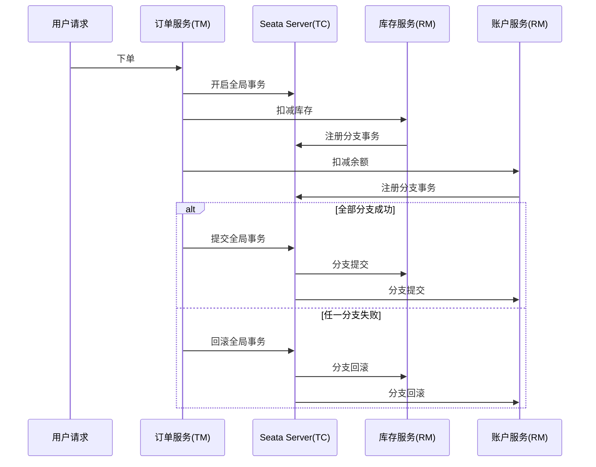

# Seata

> 相关笔记：[[MySQL/事务|MySQL 事务]]、[[Spring Cloud|Spring 微服务 总结]]


`Seata` 是 Spring Cloud Alibaba 体系里常用的分布式事务解决方案。它解决的核心问题是：微服务拆分之后，一个业务请求可能跨多个服务、多个数据库，Seata 负责把这些分散的本地事务组织成一个全局事务，让整条业务链路尽量保持一致。

可以先这样记：

- Eureka、Nacos、OpenFeign、Gateway 解决服务治理：注册、发现、调用、网关转发。
- Sentinel 解决流量治理：限流、熔断、降级、系统保护。
- `Seata` 解决事务治理：跨服务写库后的数据一致性。

学习 Seata 时可以先不展开某个注解或配置，先看这条主线：

> 微服务把一个业务动作拆成多个本地事务，Seata 再用全局事务把这些本地事务协调起来。

## 为什么需要 Seata

单体应用里，下单、扣库存、扣余额可能都在一个工程、一个数据库里。此时只要开启一个本地事务，就能保证：

- 订单创建成功；
- 库存扣减成功；
- 账户扣款成功；
- 中间任一步失败就整体回滚。

拆成微服务后，情况变复杂了：

| 服务 | 数据库 | 本地事务能管什么 |
| --- | --- | --- |
| 订单服务 | 订单库 | 只能保证订单表修改成功或失败 |
| 库存服务 | 库存库 | 只能保证库存表修改成功或失败 |
| 账户服务 | 账户库 | 只能保证账户表修改成功或失败 |

问题在于：每个服务只能保证自己的本地事务，没人天然知道整条下单链路应该一起提交，还是一起回滚。

典型异常场景：

1. 订单服务创建订单成功。
2. 库存服务扣减库存成功。
3. 账户服务扣减余额时超时。
4. 最后变成“订单有了，库存少了，钱没扣”。

这就是分布式事务要解决的核心问题：一个业务动作被拆成多个本地事务后，如何避免“部分成功、部分失败”。

![[seata-global-transaction.png|698]]

这张图可以抓三个角色：`TM` 发起全局事务，`RM` 执行各自的本地分支，`TC` 负责从全局视角决定提交或回滚。

## Seata 的三个核心角色

Seata 的模型可以理解为：业务服务继续执行自己的本地操作，但每个本地事务分支都要登记到同一个全局事务里。

| 角色 | 全称 | 作用 |
| --- | --- | --- |
| TC | Transaction Coordinator | 全局事务协调者，通常就是 Seata Server，负责维护全局事务状态。 |
| TM | Transaction Manager | 全局事务管理器，通常在入口业务服务里，负责开启、提交、回滚全局事务。 |
| RM | Resource Manager | 资源管理器，负责管理本地分支事务，并向 TC 注册和上报状态。 |

放到下单业务里：

- 订单服务通常是 `TM`，因为它是业务入口。
- 库存服务、账户服务中的数据库资源通常由 `RM` 管理。
- Seata Server 是 `TC`，负责协调所有分支。

整体流程可以这样看：



## CAP 和 BASE

学习 Seata 前，经常会遇到 `CAP` 和 `BASE`。这两个概念不用过度抽象，它们主要是在解释：分布式系统为什么很难只追求“绝对强一致”。

### CAP

| 目标                    | 含义                   |
| --------------------- | -------------------- |
| C：Consistency         | 一致性，多个节点看到的数据结果一致。   |
| A：Availability        | 可用性，请求能得到正常响应。       |
| P：Partition tolerance | 分区容错性，网络异常时系统还能继续运行。 |
|                       |                      |

微服务一定会发生远程调用，所以网络问题无法完全避免。也就是说，`P` 基本是必须接受的。一旦发生网络分区，系统通常要在强一致性和可用性之间做取舍。

### BASE

`BASE` 是工程上的折中思路：

- `Basically Available`：基本可用，系统不要因为局部失败完全瘫痪。
- `Soft State`：软状态，允许短时间中间状态存在。
- `Eventually Consistent`：最终一致，通过补偿、重试、异步修复让数据最终对上。

所以 Seata 的重点不是把分布式系统变得和单机数据库一样，而是在一致性、性能、可用性、业务侵入之间找一个能落地的方案。

## 两阶段提交（2PC）

`2PC` 是分布式事务里最经典的提交思想：先询问所有参与者能不能提交，再根据所有人的结果统一提交或回滚。
![[Pasted image 20260609172309.png|656]]
### 阶段一：Prepare

第一阶段，协调者先问所有参与者：

- 能不能提交？
- 资源是否准备好？
- 本地操作是否可以进入待提交状态？

参与者准备好后回复“可以”，否则回复“不可以”。

### 阶段二：Commit or Rollback

- 如果所有参与者都同意，协调者通知大家提交。
- 只要有一个参与者不同意，协调者通知大家回滚。

### 主要问题

- 协调者故障时，参与者可能不知道该提交还是回滚。
- 一阶段需要锁定资源，等到二阶段结束才释放，导致事务资源长时间得不到释放，锁定周期长，性能和可用性压力比较大。

所以 2PC 是重要基础，但不一定是所有业务的最佳选择。Seata 的 `XA` 模式更接近标准 2PC，而 `AT` 模式是在两阶段思想上做了工程优化。

## XA 模式

`XA` 模式依赖数据库原生对 XA 协议的支持，是基于两阶段提交实现的
工作机制原理图
![[Pasted image 20260609175025.png|781]]

**执行逻辑**
1. 开启事务：事务管理器（TM）开启一个全局事务，并于事务协调器（TC）建立连接，TC返回一个全局事务 ID（XID）给 TM
2. 分支事务注册与执行：资源管理器（RM）收到业务请求操作后，会向 TC 注册分支事务（可能有多个RM，故称是分支事务），执行事务 SQL，并携带 XID 保证事务一致性
3. 分支事务状态报告：RM 执行完分支事务后，向 TC 报告分支事务的执行状态
4. TC 决定事务提交或回滚策略：TM 等待 RM 中的所有的分支任务执行完成后，通知 TC 事务结束。TC 接收通知后会检查各个分支事务的执行状态，如果所有的分支事务都成功，则通知所有 RM 提交所有事务；若有其中一个分支事务失败，则通知所有的 RM 回滚事务
5. RM 接收 TC 通知并执行分支事务提交或回滚：RM 接收 TC 指令后执行对应的 commit 或 rollback 操作

### 优缺点

<mark class="hltr-green-light">优点</mark>
- 事务强一致性：XA 模式能满足 ACID 原则，确保分布式事务的强一致性
- 实现简单且无代码侵入：常用数据库都支持 XA 协议，使用 Seata 的 XA 模式无需修改业务代码，只需简单配置即可
<mark class="hltr-pink">缺点</mark>
- 依赖关系型数据库、驱动、连接池对 XA 的支持
- 性能较差：因为是基于两阶段提交，故也保留了两阶段的缺点：一阶段需要锁定资源，等待二阶段结束才释放——资源锁持有时间长

## AT 模式

`AT` 也是基于二阶段提交实现的，但它不会像 XA 一样把数据库事务一直保持到第二阶段。一阶段会提交业务数据和 `undo_log`，先释放数据库连接与本地锁；全局事务是否结束，则继续由 TC 和全局锁控制。

![[Pasted image 20260611170703.png|752]]

### 优缺点

<mark class="hltr-green-light">优点</mark>
- 适合支持本地 ACID 事务且被 Seata 数据源代理支持的关系型数据库
- 无代码侵入
- 一阶段本地事务先提交，持有资源时间短，不会像 XA 那样长时间持有数据库事务，性能开销小

<mark class="hltr-pink">需要注意</mark>
- 依赖关系型数据库的本地 ACID 事务，并通过数据源代理解析 SQL
- 全局锁发生冲突时会重试，冲突频繁会增加等待和回滚成本
- 二阶段回滚前需要校验 After Image，数据被其他操作改动时不能直接覆盖

### undo_log

`undo_log` 可以理解成 Seata 给数据修改准备的“后悔药”。它记录业务 SQL 修改前后的数据状态，方便全局失败时自动生成反向 SQL。

当业务 SQL 修改数据时，Seata 会记录两份数据快照：
- Before Image：SQL 执行前记录当前要修改的数据的快照——全局失败时用于回滚
- After Image：SQL 执行后的快照——回滚前校验是否发生脏写

比如库存从 `100` 扣到 `99`：

- Before Image：`100`
- After Image：`99`
- 如果全局事务失败，就根据 Before Image 把库存恢复成 `100`

### 本地锁与全局锁

AT 会同时使用数据库本地锁和 Seata 全局锁，两者解决的问题不同。

**本地锁：** 数据库执行 `UPDATE`、`DELETE` 或 `SELECT FOR UPDATE` 时产生的行锁，只在当前数据库本地事务中生效。本地事务提交或回滚后，本地锁就会释放。

**全局锁：** TC 维护的逻辑锁，通常根据数据源、表名和主键标识被修改的行。分支事务在一阶段提交前必须先获得全局锁；本地事务提交后，全局锁仍由当前全局事务持有，直到二阶段提交或回滚结束。

所以一阶段提交后会出现这样的状态：

- 数据库本地事务已经提交，本地锁和连接已经释放
- 业务数据对普通数据库查询已经可见
- 全局锁仍然存在，其他 AT 全局事务不能提交对同一行的修改

### 一阶段

AT 一阶段会在同一个本地事务中完成业务数据修改和回滚日志记录：

1. RM 开启本地事务，业务 SQL 获取数据库本地锁。
2. 数据源代理解析 SQL，确定表名、条件和要修改的数据。
3. 查询修改前的数据，生成 Before Image。
4. 执行业务 SQL，再根据主键查询修改后的数据，生成 After Image。
5. 将 Before Image、After Image、XID、Branch ID 等信息写入 `undo_log`。
6. RM 向 TC 注册分支事务，并申请当前数据行的全局锁。
7. 获得全局锁后，在同一个本地事务中提交业务数据和 `undo_log`，随后释放本地锁与数据库连接。
8. RM 向 TC 报告一阶段执行结果。

如果全局锁获取失败，当前分支不能提交本地事务。RM 会在超时时间内重试；一直无法获得时，本地事务回滚，同时释放本地锁。

### 二阶段

**全局提交：**

1. TM 通知 TC 提交全局事务，TC 将分支标记为提交并释放对应的全局锁。
2. RM 收到提交请求后可以快速返回，后续异步批量删除 `undo_log`。

这里不需要再次提交业务数据，因为业务数据在一阶段已经提交完成。

**全局回滚：**

1. RM 收到 TC 的回滚请求后开启新的本地事务，并尝试获取业务数据的本地锁。
2. 根据 XID 和 Branch ID 查询对应的 `undo_log`。
3. 将数据库当前值与 After Image 比较，检查一阶段之后数据是否又被修改。
4. 数据一致时，根据 Before Image 和原业务 SQL 信息生成反向 SQL，恢复业务数据。
5. 删除对应的 `undo_log`，提交本地回滚事务并向 TC 报告结果。
6. TC 确认分支回滚完成后释放全局锁。

如果当前数据与 After Image 不一致，说明发生了脏写或有其他操作修改了这行数据，此时不能直接用 Before Image 覆盖，需要按照异常处理策略处理。

### 写隔离

写隔离依赖全局锁。两个全局事务修改同一行时，后提交本地事务的分支必须等待前一个全局事务释放全局锁。

![[seata-at-write-isolation.png|713]]

图中 `tx1` 一阶段提交后已经释放本地锁，所以 `tx2` 可以获得本地锁并更新同一行。但是 `tx1` 仍持有全局锁，`tx2` 在提交本地事务前无法获得全局锁，只能重试。`tx1` 二阶段提交并释放全局锁后，`tx2` 才能继续提交。

如果 `tx1` 进入二阶段回滚，它还需要重新获取本地锁执行反向 SQL。此时若本地锁被等待全局锁的 `tx2` 持有，`tx1` 会等待；`tx2` 获取全局锁超时后回滚本地事务并释放本地锁，`tx1` 才能完成补偿回滚。

### 读隔离

AT 一阶段会提前提交本地事务，因此普通 `SELECT` 不参与全局锁竞争，可能读到另一个全局事务尚未完成二阶段提交的数据。从全局事务范围看，默认只能达到读未提交。

![[seata-at-read-isolation.png|657]]

如果业务需要全局范围的读已提交，可以使用 `SELECT FOR UPDATE`。Seata 会代理这类查询并申请全局锁：当锁被 `tx1` 持有时，`tx2` 会释放本地锁并重试，直到 `tx1` 完成二阶段并释放全局锁后再读取数据。

这里的读已提交是全局事务范围的隔离效果。数据库本身仍需要配置为读已提交或更高的本地隔离级别。

> AT = 一阶段提交业务数据和 `undo_log`，用全局锁控制并发写；二阶段提交时异步清理日志，失败时根据数据镜像自动补偿。

## TCC 模式

`TCC` = `Try / Confirm / Cancel`

它和 AT 最大的区别是：AT 通过数据源代理、`undo_log` 和全局锁自动管理分支事务，TCC 则要求业务自己实现资源预留、确认和取消逻辑。它不依赖数据库提供特定的分布式事务能力，也可以管理缓存、消息、远程接口等业务资源。

![[assets/seata-tcc-flow.png|850]]

图中两个 Try 分支都成功时进入 Confirm，只要有一个 Try 失败，就进入 Cancel 释放已经预留的资源。Confirm 和 Cancel 是二选一的二阶段操作。

### 三个阶段

| 阶段 | 核心任务 | 库存例子 |
| --- | --- | --- |
| Try | 检查业务条件并预留资源 | 可用库存减 1，冻结库存加 1 |
| Confirm | 使用 Try 预留的资源完成业务 | 冻结库存减 1，正式完成扣减 |
| Cancel | 释放 Try 预留的资源 | 冻结库存减 1，可用库存加 1 |

Try 不能只检查资源而不做预留。比如 Try 只检查库存充足，却没有扣减可用库存，那么进入 Confirm 前库存还可能被其他请求用掉，Confirm 就无法保证成功。比较常见的设计是把资源从“可用”转成“冻结”，让后续 Confirm 只确认结果，Cancel 只释放资源。

### 执行流程

一个全局事务包含多个 TCC 分支时，流程如下：

1. TM 开启全局事务，获得 XID。
2. 每个参与服务执行自己的 Try 方法，完成业务检查和资源预留，并向 TC 注册分支事务。
3. 所有 Try 都成功后，TM 通知 TC 提交全局事务，TC 调用各分支的 Confirm。
4. 只要有一个 Try 失败，TM 就通知 TC 回滚全局事务，TC 调用已经注册分支的 Cancel。
5. Confirm 或 Cancel 执行完成后，RM 向 TC 报告分支结果；执行失败时，TC 会按照策略继续重试。

Try、Confirm 和 Cancel 都是独立的本地事务，不会像 XA 一样长期占用数据库连接和行锁。Try 完成资源预留后就会提交本地事务，所以 TCC 的并发性能通常较好。

### 业务接口

Seata 使用 `@TwoPhaseBusinessAction` 标记 Try 方法，并指定 Confirm 和 Cancel 方法。`BusinessActionContext` 会携带 XID、Branch ID、Action Name 以及 Try 阶段需要传递到二阶段的业务参数。

```java
@LocalTCC
public interface InventoryTccAction {

    @TwoPhaseBusinessAction(
        name = "inventoryTccAction",
        commitMethod = "confirm",
        rollbackMethod = "cancel",
        useTCCFence = true
    )
    boolean tryFreeze(
        BusinessActionContext context,
        @BusinessActionContextParameter(paramName = "productId") Long productId,
        @BusinessActionContextParameter(paramName = "count") Integer count
    );

    boolean confirm(BusinessActionContext context);

    boolean cancel(BusinessActionContext context);
}
```

`@LocalTCC` 用于本地 Bean 形式的 TCC 接口。远程服务也可以作为 TCC 资源，关键是三个阶段必须围绕同一份业务资源设计。

### 设计要求

**Try：** 完成参数校验、资源检查和资源预留。Try 成功后，必须保证 Confirm 有条件完成。

**Confirm：** 只处理 Try 已预留的资源，不再执行可能失败的业务检查。Confirm 需要支持重复调用。

**Cancel：** 释放 Try 预留的资源，并恢复到执行 Try 前可继续使用的状态。Cancel 同样需要支持重复调用。

### TCC 的三个常见问题

| 问题 | 含义 | 处理思路 |
| --- | --- | --- |
| 幂等 | 网络超时或结果未确认时，Confirm、Cancel 可能被重复调用 | 根据 XID 和 Branch ID 记录分支状态，已经完成的操作直接返回成功 |
| 空回滚 | Try 请求未到达或执行失败，但 TC 已经调用 Cancel | Cancel 找不到 Try 记录时不修改业务资源，同时记录已回滚状态 |
| 悬挂 | Cancel 先完成，迟到的 Try 请求之后又开始执行 | Try 执行前检查分支是否已经回滚，已经回滚则拒绝执行 |

Seata 可以通过 TCC Fence 处理这些问题。开启 `useTCCFence = true` 后，框架会使用 `tcc_fence_log` 记录分支状态，并让 Fence 记录与业务操作处于同一个本地事务中。

### 优缺点

<mark class="hltr-green-light">优点</mark>
- 不依赖底层数据库，可以管理跨数据库、跨应用的业务资源
- Try 提交后不长期持有数据库锁，适合并发量和性能要求较高的核心链路
- 资源预留粒度由业务控制，可以根据场景进行优化

<mark class="hltr-pink">需要注意</mark>
- 三个阶段都需要业务实现，代码侵入和设计成本较高
- 需要额外维护冻结资源、业务状态或中间表
- Confirm、Cancel 必须考虑重试、幂等、空回滚和悬挂

TCC 适合库存、账户、优惠券这类可以明确预留资源的核心业务。若业务资源无法冻结，或者很难设计可靠的 Confirm 和 Cancel，通常不适合直接使用 TCC。

## Saga 模式

`Saga` 主要解决长流程事务。一个业务可能要依次调用订单、库存、支付、积分、物流和第三方系统，如果使用 XA 长时间持有资源，整个流程的性能和可用性压力会很大；有些参与者也无法提供 TCC 所需的三个接口。
![[Pasted image 20260614175442.png|738]]
Saga 会把长事务拆成多个可以独立提交的本地事务。每个正向服务执行成功后立即提交，不持有全局锁；后续步骤失败时，再按相反顺序调用已经成功步骤对应的补偿服务。

| 正向动作 | 补偿动作 |
| --- | --- |
| 创建订单 | 取消订单 |
| 扣减库存 | 释放库存 |
| 发放积分 | 撤销积分 |
| 创建物流单 | 取消物流单 |

比如依次执行“创建订单 -> 扣减库存 -> 扣减余额”，如果扣减余额失败，状态机不会撤销一个数据库事务，而是先补偿库存，再取消订单，让业务最终回到可接受的状态。

### 状态机

Seata 的 Saga 模式基于状态机引擎实现。业务流程通过状态图定义，并生成 JSON 状态语言文件。

状态机中的一个节点可以调用一个正向服务，也可以配置对应的补偿节点。除了普通服务调用，还支持条件分支、并行执行、子流程、参数映射、状态判断和异常捕获。

执行流程如下：

1. 状态机启动全局事务并生成 XID，同时持久化状态机实例。
2. 引擎根据状态图执行正向服务，每个服务在自己的本地事务中提交。
3. 每个节点的开始、结束和执行状态都会写入状态日志，便于故障后恢复。
4. 所有节点成功时，状态机正常结束。
5. 某个节点失败时，引擎根据流程定义决定继续重试、向前恢复，或者触发补偿。
6. 触发补偿后，引擎按照成功节点的相反顺序执行补偿服务，直到流程结束。

### 补偿

补偿是一个新的业务操作，不等于数据库回滚。比如“发放积分”的补偿可以是“扣回积分”，但如果积分已经被使用，补偿就可能失败。因此正向服务和补偿服务都需要保存业务状态，并明确哪些状态允许继续执行或补偿。

补偿服务需要考虑：

- **幂等：** 正向服务和补偿服务都可能因为超时而重试，同一个业务键不能重复修改数据
- **空补偿：** 正向请求未成功到达，但补偿请求先执行时，应记录补偿状态并返回成功
- **悬挂：** 已经完成空补偿后，迟到的正向请求必须被拒绝

### 故障恢复

Saga 不一定只能向后补偿。对于某些流程，前面已经完成的动作很难撤销，或者继续完成后续步骤更合理，此时可以恢复状态机上下文并继续向前执行。

常见处理方向有两种：

- **反向补偿：** 按相反顺序撤销已经成功的步骤，适合补偿动作明确的流程
- **正向恢复：** 重试失败节点并继续完成后续步骤，适合业务更希望最终成功的流程

状态机日志记录了节点执行结果，因此服务或状态机重启后，可以根据已有状态继续处理，不需要从头执行整个流程。

### 隔离问题

Saga 的本地事务会立即提交，也没有全局锁，所以不能保证事务隔离。中间状态可能被其他请求读取或继续使用，之后即使触发补偿，也不一定能够完全恢复。

比如先给账户增加余额，再执行后续步骤。如果余额在流程结束前已经被使用，后续失败时就无法直接扣回。因此设计 Saga 时需要限制中间资源的使用，或者调整执行顺序，让难以补偿、风险较高的操作尽量晚执行。

**优缺点**

<mark class="hltr-green-light">优点</mark>
- 每个步骤独立提交本地事务，不长期持有数据库锁，适合长流程
- 可以调用第三方系统或旧系统，不要求参与者提供 TCC 三阶段接口
- 状态机支持异步、并行、条件分支和故障恢复，适合复杂服务编排

<mark class="hltr-pink">需要注意</mark>
- 不保证隔离，中间状态可能被其他业务读取和修改
- 每个正向服务需要设计对应的补偿服务，补偿本身也可能失败
- 业务状态、幂等、重试和人工处理机制需要提前设计

Saga 适合流程长、参与系统多、允许最终一致的业务。对于金额、库存等不能暴露中间状态，且补偿失败影响较大的场景，需要先评估隔离和补偿是否可以可靠实现。

## 四种模式怎么选

选择 Seata 模式时需按业务约束往下判断：是否必须强一致，是否只是关系型数据库短事务，能不能在业务上预留资源，失败后能不能补偿。判断有先后关系：越靠前，越偏数据库事务能力；越靠后，越依赖业务自己设计预留、确认、撤销和补偿。

| 模式 | 优先选择条件 | 代价 | 不适合的场景 |
| --- | --- | --- | --- |
| XA | 所有分支资源支持 XA，业务要求强一致和较高隔离 | 分支事务和数据库锁会持续到二阶段 | 长事务、高并发热点资源 |
| AT | 关系型数据库、本地 ACID 事务、SQL 可被 Seata 代理 | 依赖 `undo_log`、全局锁和 SQL 解析，复杂 SQL 要谨慎 | 非关系型资源、外部系统、无法代理的 SQL |
| TCC | 资源可以预留，业务能实现 Try、Confirm、Cancel | 需要处理幂等、空回滚、悬挂，接口改造成本高 | 资源无法冻结，或业务方不愿维护三阶段接口 |
| Saga | 流程长，参与系统多，允许通过补偿达到最终一致 | 不保证隔离，补偿服务本身也要考虑失败后的再次执行 | 金额、库存等不能暴露中间状态的核心资源 |

### 选择顺序

1. **强一致和隔离优先：** 所有参与资源都支持 XA，并且可以接受较长的锁持有时间时，考虑 XA。
2. **普通数据库短事务：** 主要是关系型数据库增删改查，希望减少业务改造时，优先考虑 AT。
3. **资源可以预留：** 并发压力比较高，又能设计冻结资源和三阶段接口时，考虑 TCC。
4. **长流程和外部系统：** 事务持续时间长，参与者无法统一接入 AT 或 TCC，并且业务允许补偿时，考虑 Saga。

如果一个流程既不能接受长时间锁定，又无法自动回滚、预留资源或设计可靠补偿，说明当前事务范围过大，需要先划分清楚业务边界。常见做法是把大事务拆成更小的本地事务，再通过消息、事件表、人工处理或对账流程处理后续状态～

## 部署方式

Seata 在 Spring Cloud Alibaba 项目中，通常会和注册中心、配置中心、远程调用一起出现。

典型接入步骤：

1. 启动 Seata Server，也就是 TC
2. 业务服务引入 Seata 依赖
3. 配置事务分组、注册中心和配置中心
4. 在每个业务库里创建 `undo_log` 表
5. 在入口业务方法上使用 `@GlobalTransactional`

示例：

```java
@GlobalTransactional
public void createOrder(OrderDTO orderDTO) {
    orderService.saveOrder(orderDTO);
    stockClient.deduct(orderDTO.getProductId(), orderDTO.getCount());
    accountClient.deduct(orderDTO.getUserId(), orderDTO.getMoney());
}
```

由于文档更新较勤，部署步骤会有些差异，最好阅读官方文档进行部署 👉 https://seata.apache.org/zh-cn/docs/user/quickstart