# Map & Set
> 相关笔记：[[数据结构/数据结构|数据结构 知识总结]]


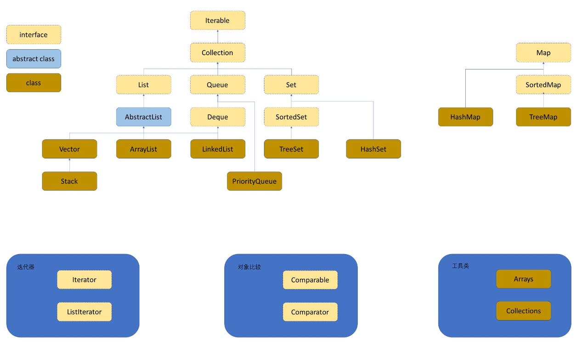

# ​#搜索树#

## 概念

二叉搜索树/二叉排序树，满足以下性质

- 若左树不为空，则左树上所有节点的值都小于父节点的值
- 若右树不为空，则右树上所有节点的值都大于父节点的值
- 它的左右子树也满足以上性质

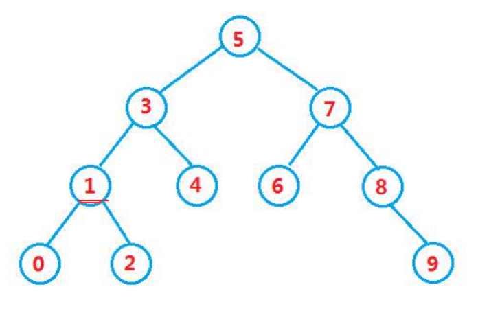

二叉搜索树的中序遍历是有序的：{0，1，2，3，4，5，6，7，8，9}

---

## 搜索树操作

### 插入`Insert`

搜索树的插入也要满足本身性质，若插入元素在原本的搜索树中已经拥有，则插入失败

思路：定义Cur走到null位置，同时Parent做Cur的根节点，记录Cur之前走过的位置，避免cur定位丢失

```java
public boolean insert(int key) {
        if (root == null) {
            root = new TreeNode(key);
            return true;
        }
        TreeNode cur = root;
        TreeNode parent = null;
        while (cur != null) {
            if (cur.val < key) {
                parent = cur;
                cur = cur.right;
            }else if (cur.val > key){
                parent = cur;
                cur = cur.left;
            }else {
                return false;
            }
        }
        TreeNode newNode = new TreeNode(key);
        if (parent.val > key) {
            parent.left = newNode;
        }else {
            parent.right = newNode;
        }
        return true;
    }
```

---

### 查找`Remove`

定义Cur遍历搜索树，在对比左右子树.val 与Key的大小关系时，注意Cur的遍历方向

```java
public TreeNode searchTree (int key) {
        if (root == null) {
            return null;
        }
        TreeNode cur = root;
        while (cur != null) {
            if (cur.val < key) {
                cur = cur.right;
            }else if (cur.val > key){
                cur = cur.left;
            }else {
                return cur;
            }
        }
        return null;
    }
```

---

### 删除

删除节点时，要注意不要破坏二叉搜索树的性质

思路：定义Cur并定位到待删除节点，待删除节点的父节点为Parent，找到Cur后分三种情况

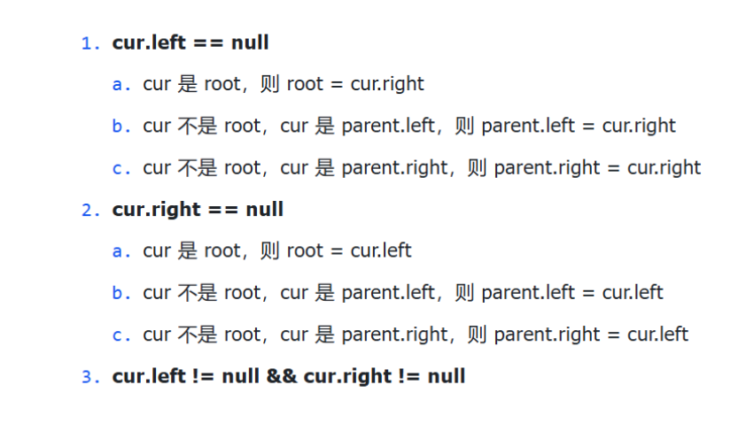

1. cur.left == null 三种情况

   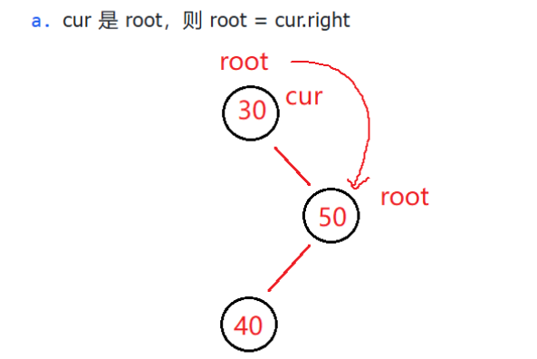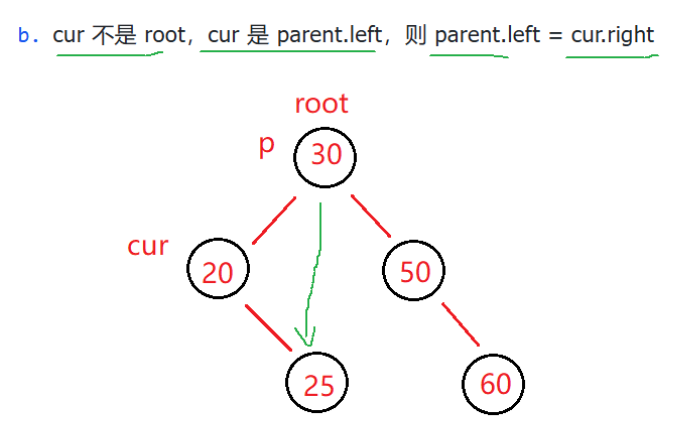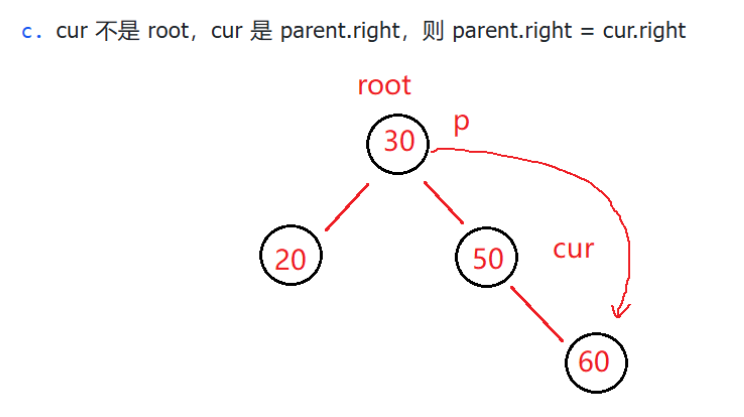

2. cur.right == null 三种情况

   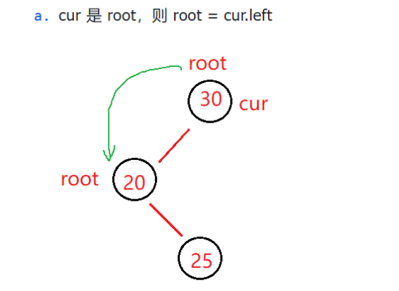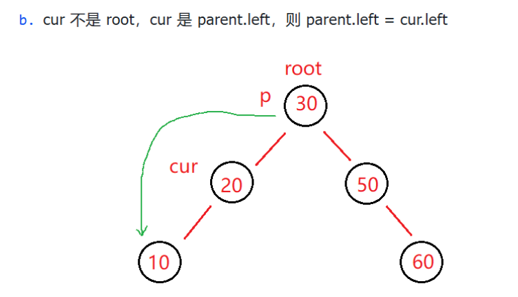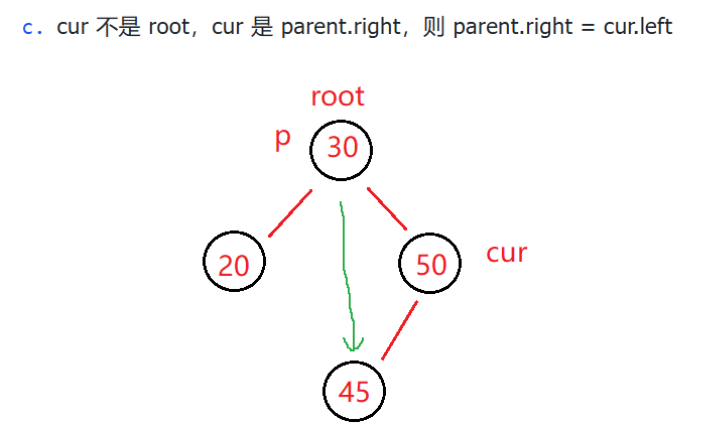

3. cur两边都不为空的情况

   此时需要<u>替换法</u>进行删除，找到右子树中的最小节点（即最左节点），用它的值来填补到被删除节点中，覆盖Cur节点，再处理节点的指向问题

   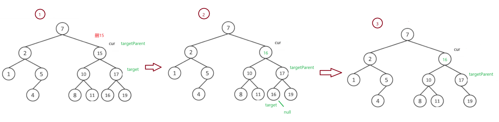

   Q&A

   - [X] 为什么不直取一层左子节点？—— 我验证过了用while确实没问题，用if仅检查一层，是无法找到真正的最小节点

主框架：删除的准备工作

```java
public void remove(int key) {
        if (root == null) {
            System.out.println("树为空");
            return;
        }
        TreeNode parent = null;
        TreeNode cur = root;
        while (cur != null) {
            if (cur.val < key) {
                parent = cur;
                cur = cur.right;
            }else if (cur.val > key){
                parent = cur;
                cur = cur.left;
            }else {
                removeNode(parent,cur);
                return;
            }
        }
    }
```

删除的实际操作在`removeNode`方法中

```java
private void removeNode(TreeNode parent, TreeNode cur) {
        if (cur.left == null) {
            if (cur == root) {
                root = root.right;
            }else if (cur == parent.left) {
                parent.left = cur.right;
            }else {
                parent.right = cur.right;
            }
        }else if (cur.right == null){
            if (cur == root) {
                root = root.left;
            } else if (cur == parent.left) {
                parent.left = cur.left;
            }else {
                parent.right = cur.left;
            }
        }else {
            TreeNode targetParent = cur;
            TreeNode target = targetParent.right;
            //找到右树中最左边的节点
            while (target.left != null) {
                targetParent = target;
                target = target.left;
            }
            cur.val = target.val;

            if (target == targetParent.left) {
                targetParent.left = target.right;
            }else {
                targetParent.right = target.right;
            }
        }
    }
```

# 搜索

Map和Set是专门搜索的数据结构，但他们的搜索效率与其他们具体实例化的子类有关——两者都是接口

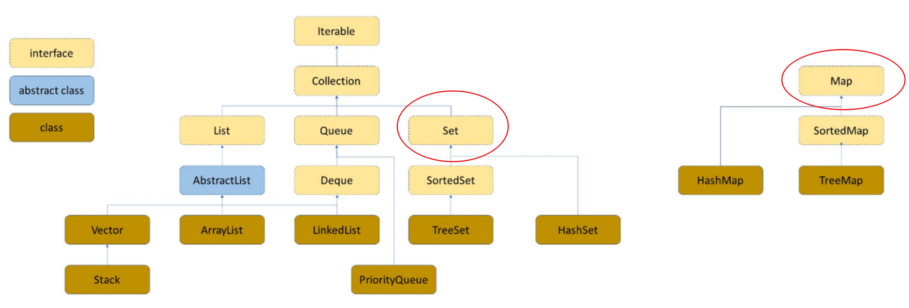

以前的搜索方式有遍历搜索，二分查找，但都是适用于静态查找。当涉及到插删查改的操作时，我们需要效率更高的查找方式，即动态查找，此时引出查找工具——Map和Set——适合动态查找的集合容器

## 模型

我们一般把要搜索的数据叫做关键字，而关键字中可能或带有对应的“值”，我们叫键值对Key-Value

比如一个数组{1，2，3，4，4，4}，我们要寻找每一个数字出现的次数，此时寻找的数字是关键字，而它们出现的次数则称之为对应的“值” 如数字4出现了3次，则键值对是<4 , 3>或<3 , 4>

1. 纯Key模型
2. Key-Value模型

Set中只存储Key模型，而Map存储Key-Value模型

---

# Map

Map是一个接口，存储的是<Key , Value>键值对，并且k是唯一的

实例化对象需要实现类#TreeMap#​或#HashMap#​，还有个#LinkedHashMap#，基于HashMap维护了一个双向链表记录来记录元素的插入次序

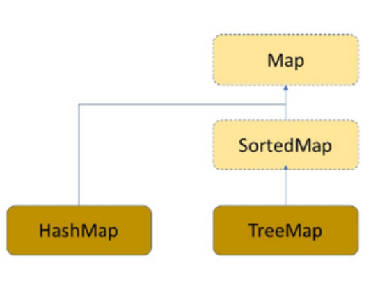

## TreeMap和HashMap的区别

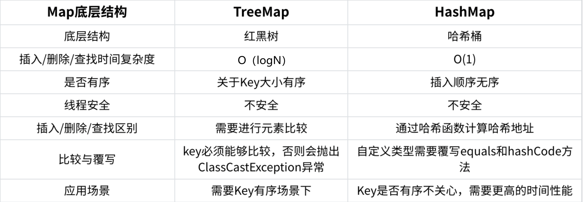

- TreeMap的Key不能传null

## 常用方法

- V <u>put</u>——存放键值

  🧭 步骤：

  1. **调用 key 的** **​`hashCode()`​** ​ **方法**
  2. **扰动函数处理**（JDK 1.8 引入，提升 hash 分布质量）

  ```java
  static final int hash(Object key) {
      int h;
      return (key == null) ? 0 : (h = key.hashCode()) ^ (h >>> 16);
  }
  ```

  > 小技巧：`h ^ (h >>> 16)` 这一步是为了让高位参与运算，因为哈希表大小是 2 的幂，只看低位的话容易冲突。
  >

  3. **根据数组长度计算 index**

  ```java
  index = (n - 1) & hash;
  ```

  ⚠️ 这里是一个位与操作，比取模 `%` 快得多（因为 n 是 2 的幂）

  4. **判断桶是否为空：**

     - 如果是空，直接插入
     - 如果不为空，遍历链表：

       - 如果已有相同 key（`hash 相同 && equals()` 返回 true），则覆盖
       - 否则添加到链表尾部（或树）
  5. **链表长度超过 8 时（阈值）：转为红黑树**
  6. **元素总数超过负载因子 × 容量时：触发扩容（resize）**
- V <u>get</u>——返回key对应的value
- V <u>getOrDefault</u>——返回key对应的value，如果key不存在，==则建立新的key并返回新默认的value==
- V <u>remove</u>——移除的key
- Set<> <u>keySet</u>（需要Set<>来接收）——返回所有不重复的key值的集合
- Collection<> <u>values</u>（需要Collection<>来接收）——返回所有不重复的value的集合
- ✨Set<Map.entry<K , V>> <u>entrySet</u>（需要Set<Map.entry<K , V>>接收）——返回所有的Key-Value的映射关系的集合

  关于Map.entry<K , V>

  entry可以看成是一个节点，相当于二叉树的Node节点，将键值打包成entry节点放入Set里面，同时它自身也实现了getValue和getKey方法

  ​`   Set<Map.Entry<Object, Integer>> set = map.entrySet();
     for (Map.Entry<Object, Integer> entry: set) {
         System.out.println("key: "+entry.getKey()+" -> val: "+entry.getValue());
      }`

  若直接打印set则是各个Key-Value的集合
- boolean <u>containsKey</u>
- boolean <u>containsValue</u>

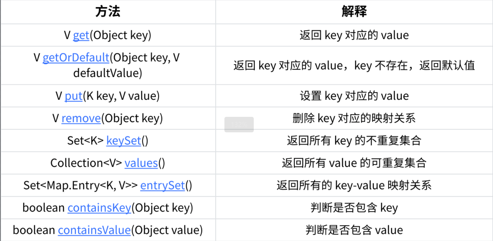

## 总结

1. Map是一个接口，不能直接实例化对象，如果要实例化对象需要实现类<span data-type="text" style="background-color: var(--b3-font-background12);">TreeMap</span>或<span data-type="text" style="background-color: var(--b3-font-background13);">HashMap</span>
2. Map中的Key / Value都可以被全部分离出来存到Set / Collection当中，Key是唯一的，Value可以重复
3. Map中的Key不能被修改，Value可以被修改，如果要修改Key只能先删除再建立新的Key
4. TreeMap的Key不能传null，HashMap可以——TreeMap的remove就不能传null，HashMap可以
5. ✨Map中传的Key一定要可以比较——搜索树本质上来说每插入一个元素都要进行大小比较

   解决办法：

   1. 给自定义类实现Comparable接口——（TreeMap）
   2. 构造TreeMap时传比较器，注意HashMap不能传比较器——（TreeMap）
   3. 重写equals和hashCode方法——（HashMap）

---

# Set

Set也是一个接口，他没有具体的对象，继承自Collection接口类，只能存储Key模型，而且Key也是唯一的，可以把它看成一个塑料袋（集合），里面装着杂乱无序的不重复的数据。

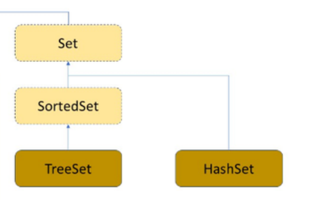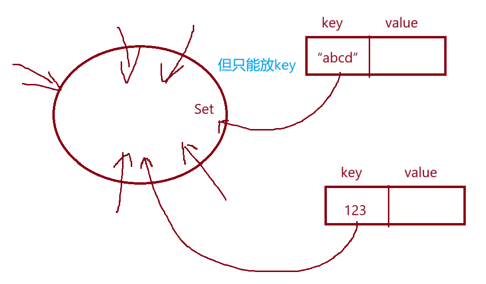

实现Set接口要实现类#TreeSet#​和#HashSet#​，还有个#LinkedHashSet#，是在HashSet的基础上维护了一个双向链表来记录元素的插入次序

## TreeSet和HashSet区别

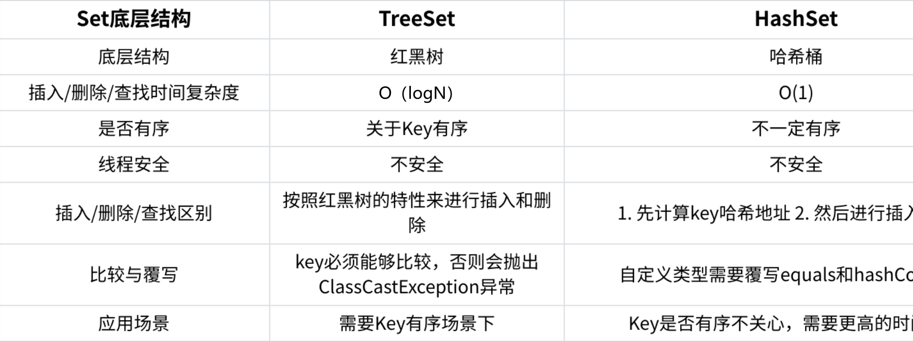

- TreeSet插入的Key不能是null——会空指针异常，但HashSet可以

## 常见方法

1. boolean <u>add</u>——添加数据，但重复元素不会被添加成功
2. boolean <u>remove</u>——删除集合中的所选数据
3. void <u>clear</u>——清空集合
4. boolean <u>contains</u>
5. Iterator<E> <u>iterator</u>——返回迭代器

   注意Map没有本身继承迭代器接口，如果需要迭代器遍历，需要强转为Set/List/Queue接口或者通过 `keySet()`​、`entrySet()`​、`values()` 来获取集合视图并迭代

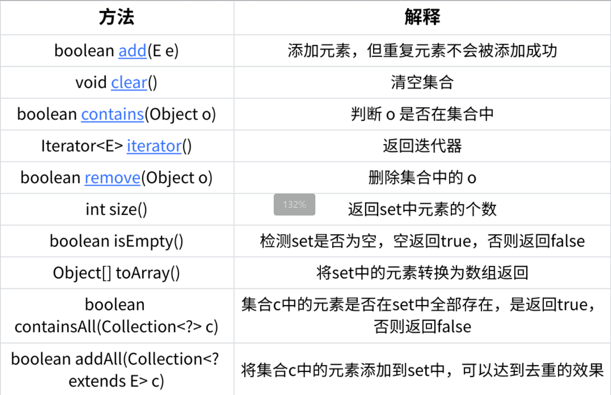

## 总结

1. Set只能存储K，且K也是和Map一样唯一的
2. 💫TreeSet的底层是用Map实现的，其使用的Key与Object的一个默认的对象（Value）组成键值插入到Map中
3. TreeSet插入的Key不能是null，但HashSet可以——故TreeSet的remove不能传null，HashSet可以传null
4. Set最大的功能是对Key去重——TreeSet是天然去重的
5. Set中的Key也是像Map一样不能修改的，如需修改要删除
6. ✨Set中的Key也是一定要可比较——原理同Map

   解决方法：

   1. 给自定义类实现Comparable接口——（TreeSet）
   2. 构造TreeSet传入比较器，同理HashSet不能传比较器——（TreeSet）
   3. 重写equals和hashCode方法——（HashSet)

---

# Map和Set的关系

- TreeSet的底层是用Map实现的，其使用的Key与Object的一个默认的对象（Value）组成键值插入到Map中
- TreeMap和TreeSet的复杂度都是log<sub>2</sub>N，它们的 K 都是要能比较大小的。
- HashMap和HashSet的复杂度都是O（1），
- 两者都是集合类型，且底层通常基于哈希表或红黑树来实现，两者的数据结构存在差异：Set主要关注元素的唯一性，但Map更关注键值对的关系

‍

前面提到了HashMap，HashSet，LinkedHashMap，LinkedHashSet，那Hash到底是什么呢？为什么他们的效率这么高？这就引入哈希表的概念

# 哈希表/散列表

## 概念

理想的搜索方法：不经过任何的比较，一次直接从表中得到想要的元素。如果构造一种存储结构，能够通过某种函数使得元素与它的关键字/码之间建立某种联系，那么在查找的时候就很容易得到这些元素

该方式就叫哈希方法，哈希方法中使用的函数就叫做<u>==哈希函数/散列函数==</u>，构造出来的结构就为==<u>哈希表/散列表</u>==

‍

每一种数据结构它的哈希函数都不一致，但是哈希表本质上是一个数组，不过数组不是放的单一数据，而是存放的键值对，所以哈希表是数组的一种拓展，这是哈希表的表现形式

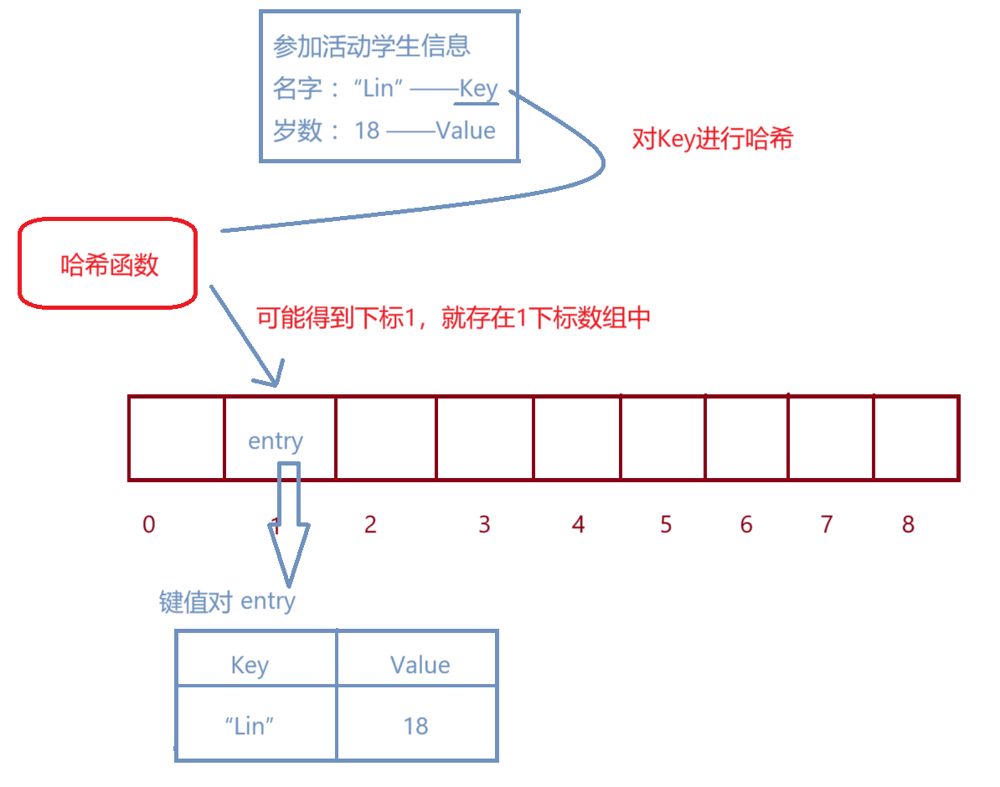

我们将学生信息包括名字和岁数（Key—Value），我们先通过哈希函数让Key进行计算，得出Index，确定键值对entry存放的位置，但是有一个问题，如果数据多了，别的key通过哈希函数可能也会得到相同的下标Index，像这样具有不同关键码但具有相同哈希地址的数据元素称为“同义词”，这个问题我们称之<u>==哈希冲突，==</u>哈希是一种用来进行高效查找的<u>==数据结构==</u>

---

## 哈希冲突

那么有哈希冲突就会有解决哈希冲突问题的办法

‍

哈希冲突是必然的，我们做的应该是降低冲突率，引起冲突的一个原因可能是哈希函数设计不合理，但是我们一般都不会涉及到设计哈希函数，但常用的哈希函数我们需要了解

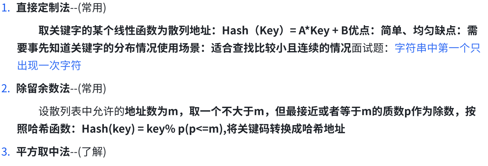

哈希函数设计的越精妙，产生哈希冲突的可能性就越低，但是无法避免哈希冲突

那反应哈希冲突率的一个数据叫负载因子

---

### 负载因子

哈希列表的负载因子定义为 α = 填入表中的元素 / 哈希表的长度

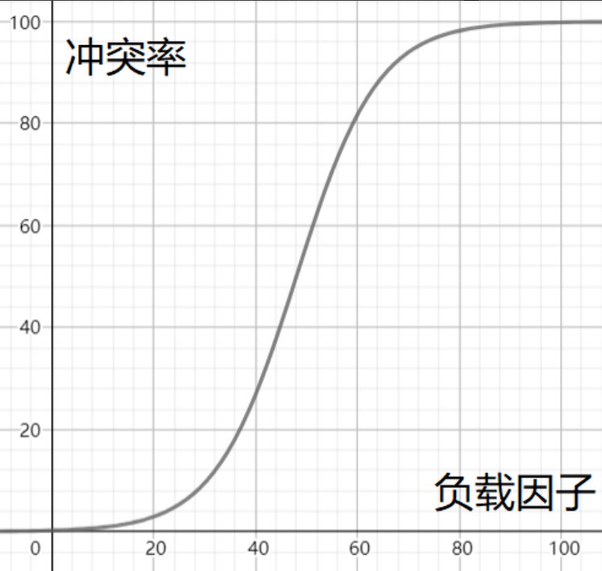

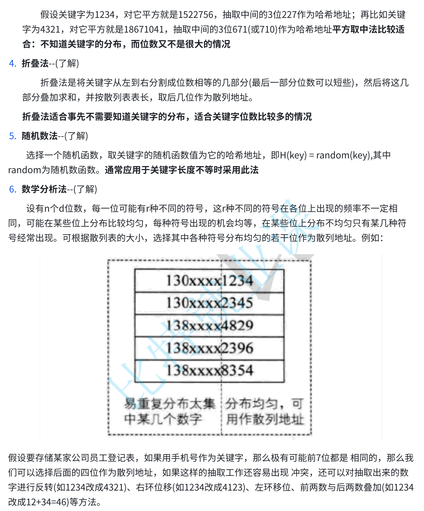

## 避免哈希冲突

两个方法 : 优化哈希函数、<span data-type="text" style="color: var(--b3-font-color12); background-color: var(--b3-font-background11);">降低负载因子✨</span>

- 💯<span data-type="text" style="color: var(--b3-font-color12);">降低负载因子即需要对数组进行扩容，扩容之后需要对原来的数组的元素进行重新哈希分配——即重新哈希</span>

  ```java
  public void resize() {
  	Node[] newArray = new Node[array.length * 2];
  	for(int i = 0; i < array.length; i++) {
  		Node cur = array[i];
  		while(cur != null) {
  			int newIndex = cur.key%(newArray.length);
  			Node curN = cur.next;
  			cur.next = newArray[newindex];
  			newArray[newindex] = cur;
  			cur = curN;
  		}
  	}
  	array = newArray;
  }
  ```

### 解决哈希冲突

两种常见方法：#闭散列#​和#开散列#

### 注意要区分清楚：哈希冲突的处理方法和哈希函数

哈希函数作用是：建立元素与其存储位置之前的对应关系的，在存储元素时，先通过哈希函数计算元素在哈希表格中的存储位置，然后存储元素。好的哈希函数可以减少冲突的概率，但是不能够绝对避免，万一发生哈希冲突，得需要借助哈希冲突处理方法来解决。

-    常见的哈希函数有：直接定址法、除留余数法、平方取中法、随机数法、数字分析法、叠加法等

-    常见哈希冲突处理：闭散列（线性探测、二次探测）、开散列(链地址法)、多次散列

### 闭散列

也叫#开放地址法#，当发生哈希冲突时， 如果哈希表没有被装满，说明哈希表还有位置可以放，那么就可以把Key放到空的位置上

- 线性探测：从发生冲突的位置开始找到空位置放
- 二次探测：优化了线性探测的问题（不重点解释，需要可再查找）

---

### 💫开散列（重点）

开散列，又叫#链地址法#​（#拉链法#），首先对关键码集合用哈希函数计算哈希地址，具有相同地址的关键码归于同一子集合，每一个子集合称为一个桶，各个桶中的元素通过一个单链表链接起来，各链表的头结点存储在哈希表中。

与闭散列不同，这种将链表的头地址存储在哈希表的方式，不会影响与自己哈希地址不同的元素的增删查改的效率

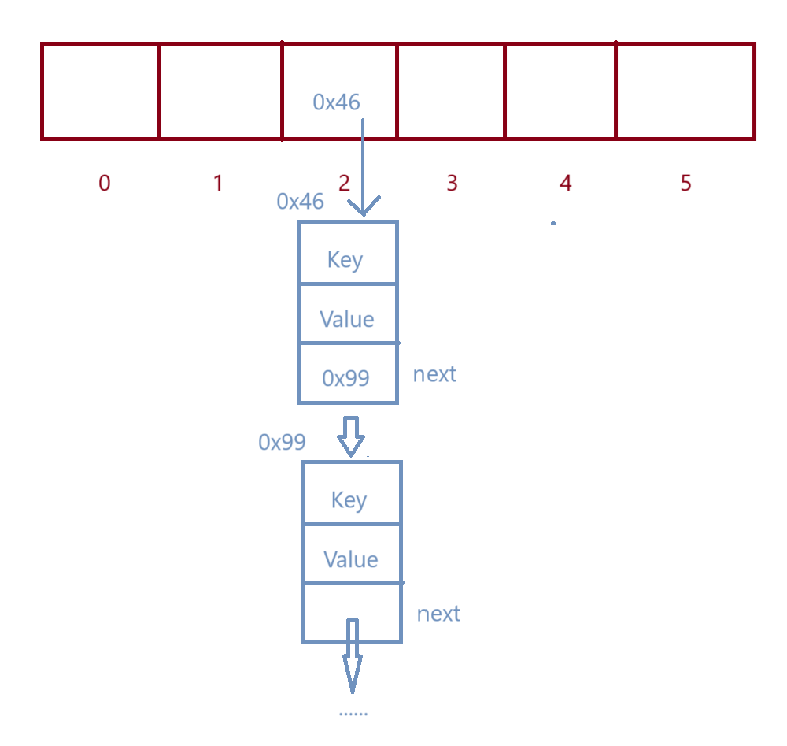

放入的entry可以用头插也可以用尾插法，与链表的操作相似，由此可见，开散列的每个桶当中都放的哈希冲突的元素，

但如果出现极端情况，即所有元素都产生了冲突，都放到了同一个桶之中，那哈希表的增删查改的效率就退化为O（N），此时我们可以把这个桶转化为红黑树 TreeMap or TreeSet，效率就为O（log<sub>2</sub>N）

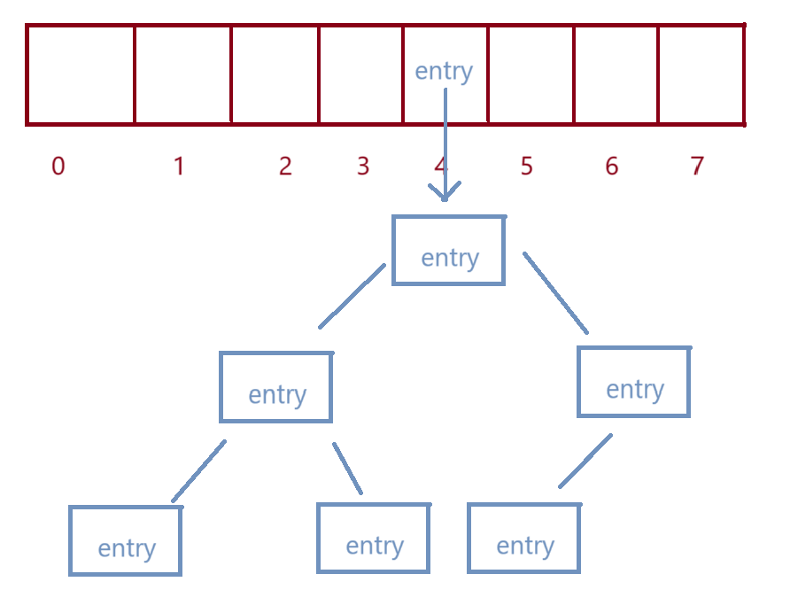

树化条件 ：<span data-type="text" style="color: var(--b3-font-color12);">链表的长度 &gt;= 8 &amp;&amp; 数组长度 &gt;= 64 </span>如果红黑树删除后不满足条件或没必要再用红黑树时可以变回为哈希桶的结构

**开散列可以认为是把大集合中的搜索问题转化为了小集合中做搜索了**

---

## 💫与Java类集合的关系

1. HashMap和HashSet都是Java中利用哈希表来实现的Map和Set
2. Java会在冲突链表长度大于一定阈值的时候，将链表树化为红黑树TreeSet or TreeMap
3. Java是用哈希桶来解决哈希冲突的（链表）
4. ✨Java计算的哈希值实际上是调用类的<u>hashCode</u>方法，进行Key的对比时是调用<u>equals</u>方法。所以如果要调用自定义类作为HashMap或HashSet的值，必须覆写hashCode和equals方法，而且做到equals相等的对象，其hashCode一定是相等的，反之则不一定——hashCode相等equals未必相等（哈希冲突）

   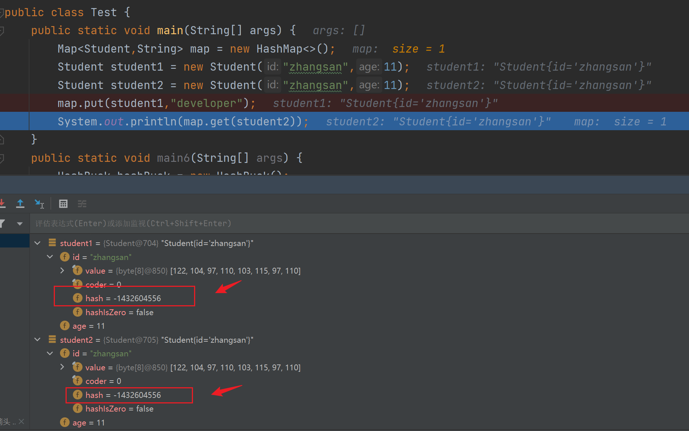自定义类重写`hashCode（）`​和`equals（）`接口

## ​#平均查找长度#

len = 总的比较次数 / 元素个数

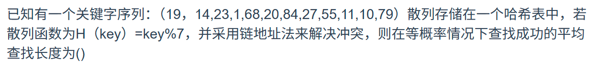​​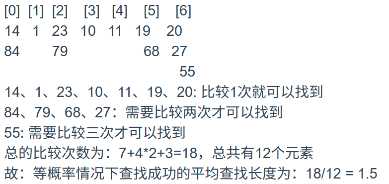

‍
