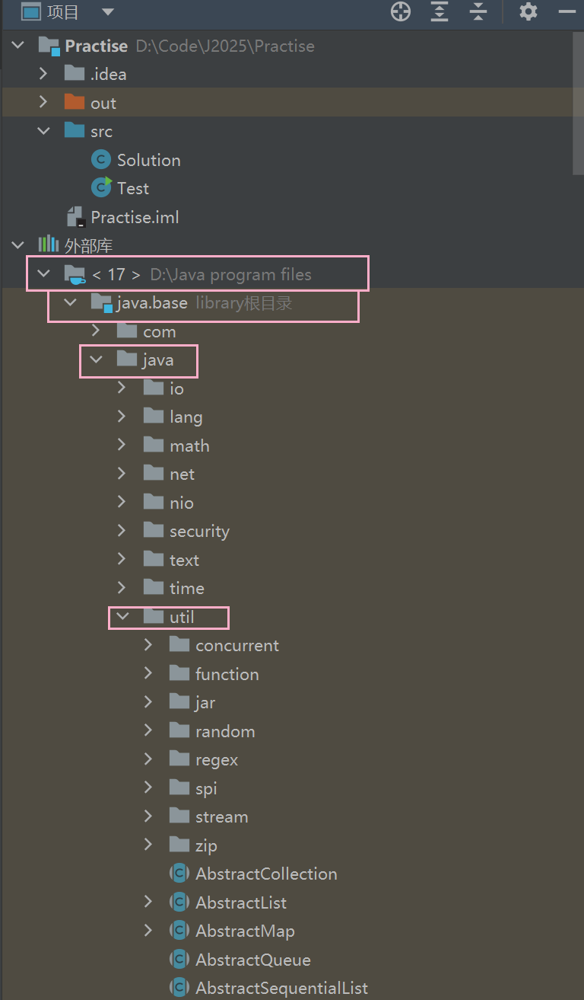
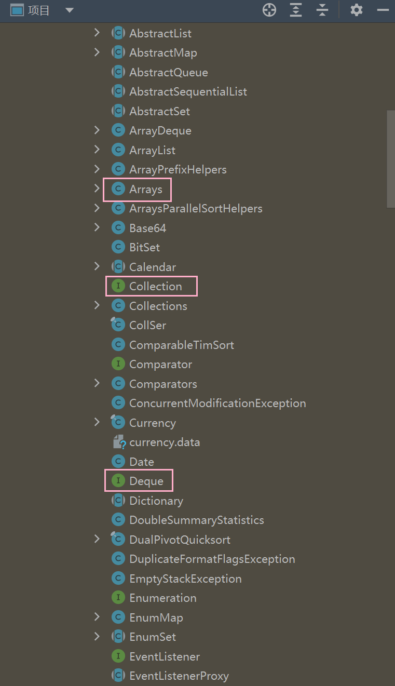
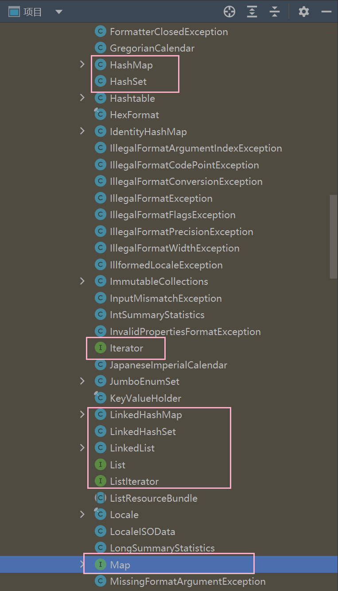
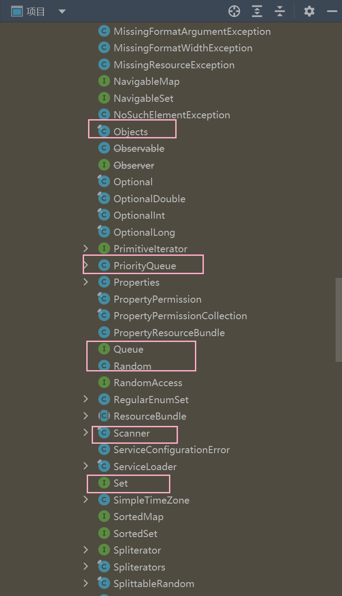
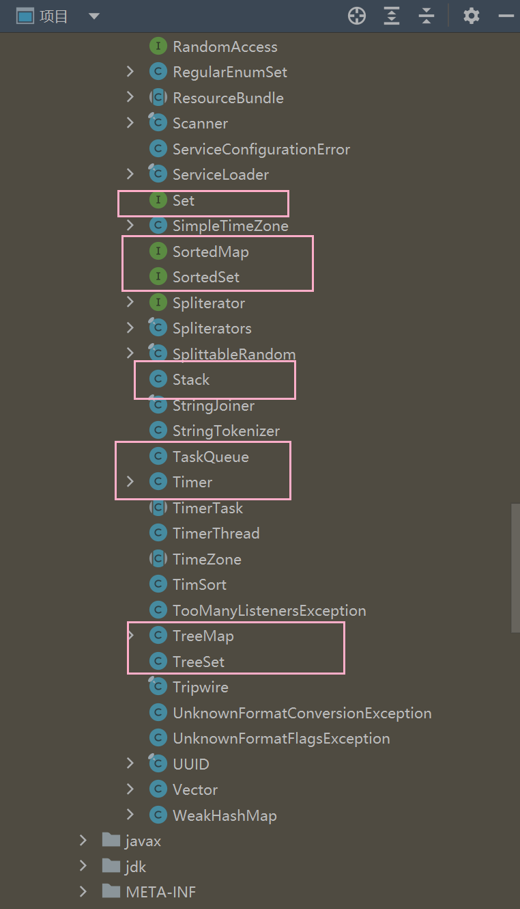

# 前言
> 相关笔记：[[数据结构/数据结构|数据结构 知识总结]]

数据结构是一种基于多维数据的多种处理方式，对合适的数据运用合适的数据结构

# 集合框架

又称为容器，是在`java.util`​包里的一些`Interface`​和实现类`Class`​，有强大的功能，且平时用到的`Scanner、Arrays、Iterator`都在Utils包下

工作中最高频使用的数据结构

1. ArrayList / 数组
2. HashMap
3. Queue

---

其他的Stack、Linkedlist，TreeSet等等很少用到

‍
