# 数据结构——排序
> 相关笔记：[[数据结构/数据结构|数据结构 知识总结]]


# 排序概念

在数据结构中，有许多无序的数据，所谓排序，就是使一串无序的记录，按照其中某个或某些关键字的大小，来进行递增或者递减的排列起来的操作

## ​#稳定性#

在待排序的数据中，存在一些相同数据的，如果排序之后他们的相对位置保持不变，那么这个排序就是稳定的，相反则不稳定

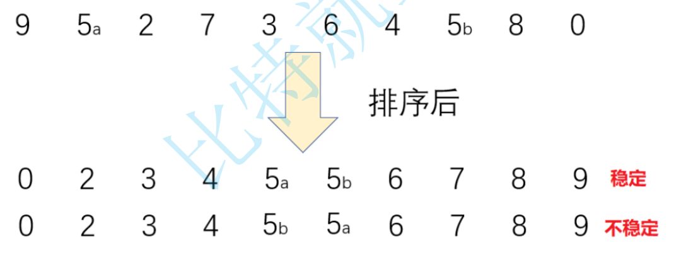

# **常见排序**

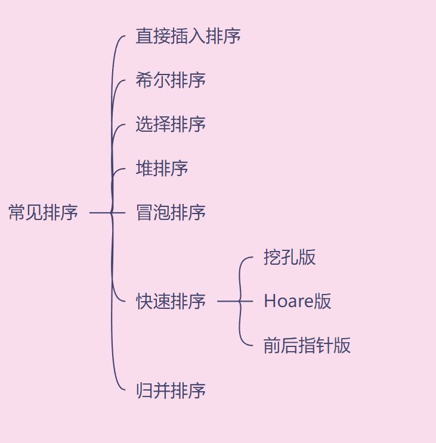

---

## <span id="20250519110700-aauve5w" style="display: none;"></span>[直接插入排序]()​`InsertSort`

类似于扑克牌的排法，先有第一张”牌“，然后插入新的元素进来与前面的”牌“比较，最终使得整幅”牌“趋于有序

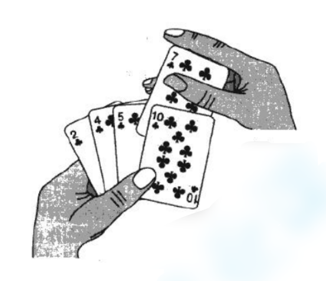

**<u>直接插入排序特性总结</u>**

- 元素集合越接近有序，直接插入排序的效率越高——可以嵌套快排中，优化排序效率
- 时间复杂度 o（N<sup>2</sup>）——每张”牌“都需要进行对比
- 空间复杂度 o（1）——基于原本的数组进行排序，没有开辟新的空间
- 稳定性：稳定

  ‍

代码块

```java
public void insertSort(int[] array) {
        for (int i = 1; i < array.length; i++) {
            int tmp = array[i];
            int j = i-1;
            for (; j >= 0; j--) {
                //如果是 >= 那就不稳定了
                if (array[j] > tmp) {
                    array[j+1] = array[j];
                }else {
                    //array[j+1] = tmp;
                    break;
                }
            }
            //j == -1
            array[j+1] = tmp;
        }
    }
```

---

## 希尔排序`ShellSort`——优化直接插入排序 ✨

先选定一个整数 <span data-type="text" style="font-size: 17px;">Gap，把数据分成多个组，所有距离为 Gap 的记录分在同一个组内，对组内进行排序，然后让 Gap 趋于 1，此时再排序数据就是有序的</span>

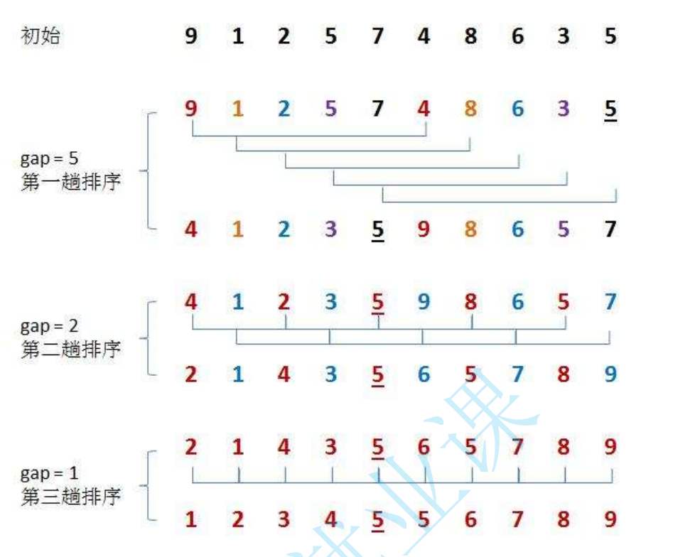

**<u>希尔排序特性总结</u>**

- 希尔排序是对直接插入排序的优化
- Gap > 1 的时候都是预排序，是为了等 Gap = 1 的时候的排序效率更加高效（ Gap= 1 时是直接插入排序）
- 时间复杂度 o（N<sup>1.3~1.5</sup>）
- 空间复杂度 o（1）——没有开辟内存
- 稳定性：不稳定

代码块

```java
public void shellSort(int[] array) {
        int gap = array.length;
        while (gap >= 1) {
            shell(array,gap);
            gap = gap/2;
        }
    }

    public void shell (int[] array,int gap) {
        for (int i = gap; i < array.length; i++) {
            int tmp = array[i];
            int j = i - gap;
            for ( ;j >= 0; j -= gap) {
                if (array[j] > tmp) {
                    array[j+gap] = array[j];
                }else {
                    break;
                }
            }
            array[j+gap] = tmp;
        }
    }
```

---

## 选择排序`SelectSort`

每次向后寻找最小（或者最大）的元素，找出下标 minIndex（maxIndex）与初始位置进行交换，直到全部待排序的数据元素排完

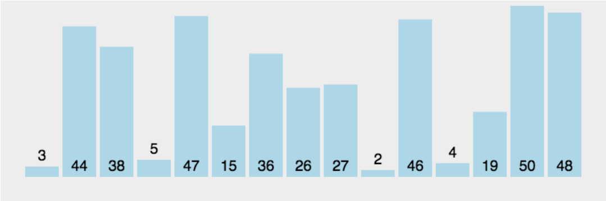

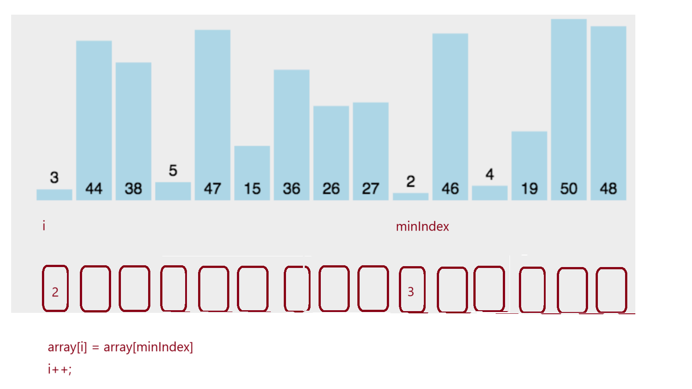

**<u>选择排序特性总结</u>**

- 选择排序的效率不高，通常很少使用
- 时间复杂度 o（N<sup>2</sup>）
- 空间复杂度 o（1）
- 稳定性：不稳定

代码块

```java
public void selectSort(int[] array) {
        for (int i = 0; i < array.length; i++) {
            int minIndex = i;
            for (int j = i + 1; j < array.length; j++) {
               if (array[j] < array[minIndex]) {
                   minIndex = j;
               }
            }
            swap(array,i,minIndex);
        }
    }
```

---

## 堆排序`HeapSort`

是指利用堆积树（堆）这种数据结构所设计的⼀种排序算法，它是选择排序的⼀种。它是通过堆来进行选择数据。需要注意的是**<u>排升序建大堆，排降序建小堆</u>**

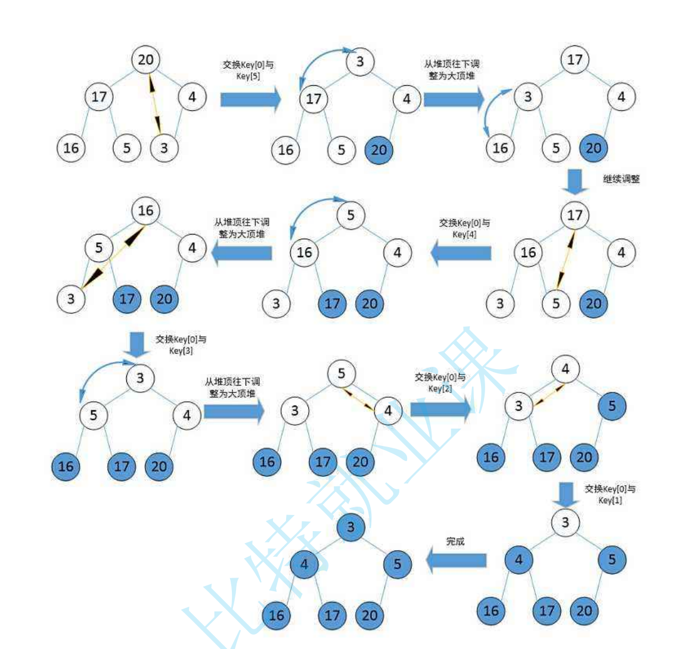

**<u>堆排序特性总结</u>**

- 堆排序使用堆来选数，效率高
- 时间复杂度 o（N * log<sub>2</sub>N）——数据 N * 树的高度 log<sub>2</sub>N
- 空间复杂度 o（1）
- 稳定性：不稳定

代码块

```java
public void heapSort(int[] array) {
        int end = array.length-1;

        //创建大根堆
        for (int parent = (end-1)/2; parent >= 0; parent-- ) {
            siftDown(array,parent,array.length-1);
        }
        while (end > 0){
            swap(array,0,end);
            siftDown(array,0,end);
            end--;
        }
    }

    public void siftDown(int[] array, int parent,int length) {
        int child = 2*parent + 1;
        while (child < length) {
            //判断是否有右树
            if (child + 1 < length && array[child] < array[child+1]) {
                child++;
            }
            if (array[child] > array[parent]) {
                swap(array,parent,child);
                parent = child;
                child = 2*parent + 1;
            }else {
                break;
            }
        }
    }
```

---

## 冒泡排序`BubbleSort`

**<u>冒泡排序特性总结</u>**

- 非常容易理解
- 时间复杂度 o（N<sup>2</sup>）
- 空间复杂度 o（1）
- 稳定性：稳定

代码块

```java
public void bubbleSort(int[] array) {
        //i表示趟数
        for (int i = 0; i < array.length-1; i++) {
            boolean flg = false;//优化
            for (int j = 0; j < array.length-1-i; j++) {
                if (array[j] > array[j+1]) {
                    swap(array,j,j+1);
                    flg = true;
                }
            }
            if (!flg){
                break;
            }
        }
    }
```

---

## 快速排序`QuickSort`✨

任取待排序元素作为基准值，按照该排序将排序集合分为两个子序列（一边是小于基准值，另一边是大于基准值），然后最左右子序列重复该过程，直至所有元素排列完成

```java
public void quickSort(int[] array){
        //接口统一性 ---重载
        quickSort(array,0,array.length-1);
    }
    private static void quickSort(int[] array,int left,int right){
        if (left >= right) {
            return;
        }
        int par = partition(array,left,right);
        quickSort(array,left,par-1);
        quickSort(array,par+1,right);
    }
```

以上代码为快排的主框架，发现与二叉树的前序遍历规则非常像，此地方写递归方法时可想到二叉树前序遍历规则即可快速写出来，后面只需要分析如何按照基准值对数据进行划分即可

### 快速排序三种方法的效率对比

挖坑版 > Hoare 版 > 前后指针版

---

‍

将区间按照基准值划分为左右部分的方式有：

#### Hoare 版

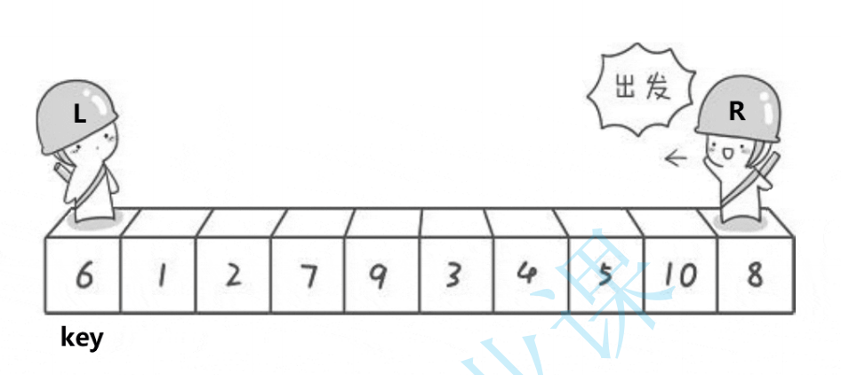

```java
private int partitionHoare(int[] array,int low,int high) {
        int i = low;
        int tmp = array[low];
        while (low < high) {
            while (low < high && array[high] >= tmp) {
                high--;
            }
            while (low < high && array[low] <= tmp) {
                low++;
            }
            swap(array,low,high);
        }
        //left == high
        swap(array,low,i);
        return low;
    }
```

#### 挖坑版

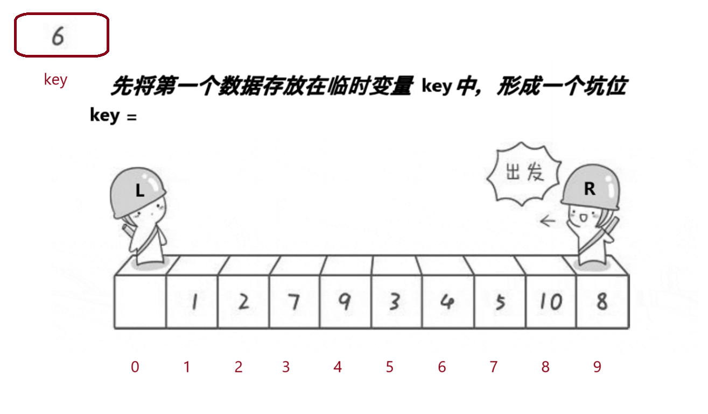

```java
private int partition(int[] array,int low,int high) {
        int tmp = array[low];
        while (low < high) {
            while (low < high && array[high] >= tmp) {
                high--;
            }
            array[low] = array[high];
            while (low < high && array[low] <= tmp) {
                low++;
            }
            array[high] = array[low];
        }
        array[low] = tmp;
        return low;
    }
```

#### 前后指针法

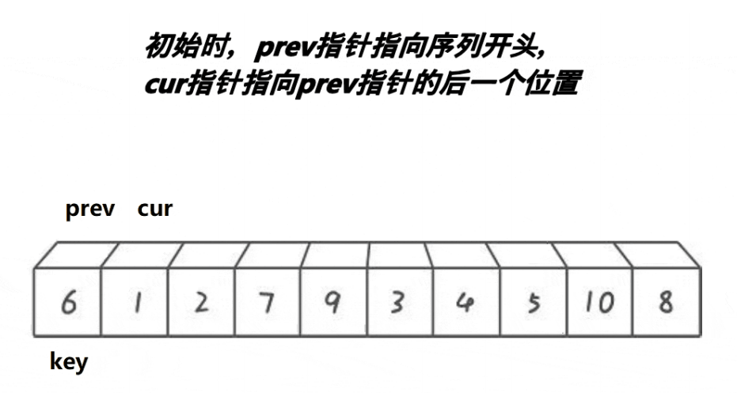

```java
private int partition1(int[] array,int low,int high) {
        int prv = low;//
        int cur = low+1;//找tmp小的
        int tmp = array[low];
        while (low < high) {
            if (array[cur] < tmp && array[++prv] != array[cur]) {
                swap(array,prv,cur);
            }
            cur++;
        }
        swap(array,prv,low);
        return prv;
    }
```

### 快排的内部优化

为了使得最开始找的基准值更加合理，提高排序效率，利用三数取中

#### 1.三数取中

找数据的最左边的元素和最右边的元素，再找中间值，取出他们三者之间的平均值的下标

```java
private static int threeMid(int[] array,int low, int high) {
        int mid = (low + high) / 2;
        if (array[low] > array[high]) {
            if (array[mid] < array[high]) {
                return high;
            }else if (array[mid] > array[low]) {
                return low;
            }else {
                return mid;
            }
        }else {
            if (array[mid] < array[low]) {
                return low;
            }else if (array[mid] > array[high]) {
                return high;
            }else {
                return mid;
            }
        }
    }
```

#### 2.嵌套直接插入排序

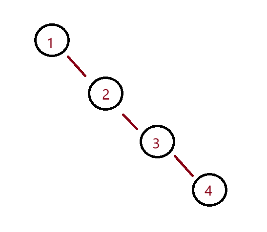当数据集合有序的时候，快排还需要遍历只有右子树的情况，浪费了时间，此时嵌套[直接插入排序](#20250519110700-aauve5w)则可以直接减少遍历

此时针对快排主框架的情况，直接插入排序要做出一点改变，总体框架不变

```java
private static void insertSortRange(int[] array,int low,int high) {
        for (int i = low + 1; i < high; i++) {
            int tmp = array[i];
            int j = i-1;
            for (; j >= low; j--) {
                // 这里 >= 就不是稳定的排序了！！
                if (array[j] > tmp) {
                    array[j+1] = array[j];
                }else {
                    //array[j+1] = tmp;
                    break;
                }
            }
            //j == -1
            array[j+1] = tmp;
        }
    }
```

优化后的 QuickSort 的主框架

```java
private static void quickSort(int[] array,int left,int right){
        if (left >= right) {
            return;
        }
        //优化 内置插入排序 趋于有序时减少检查的次数
        if (right - left + 1 <= 8) {
            insertSortRange(array,left,right);
            return;
        }

        //优化 采用三数取中法 找下标 使得tmp更加合理
        int index = threeMid(array,left,right);
        swap(array,index,left);

        int par = partition(array,left,right);
        quickSort(array,left,par-1);
        quickSort(array,par+1,right);
    }
```

---

‍

**<u>快速排序的特性总结</u>**

- 快排顾名思义，效率高，综合性能与应用场景都是比较好的
- 时间复杂度：

  - 最好情况下 o（N * log<sub>2</sub>N）
  - 最坏情况下o（N<sup>2</sup>）
- 空间复杂度 o：

  - 最好情况下 o（log<sub>2</sub>N）——满二叉树的情况
  - 最坏情况下 o（N）——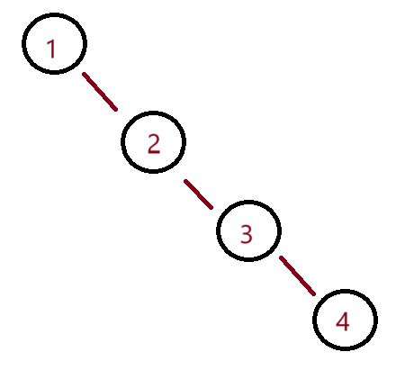

- 稳定性：不稳定

### 非递归快排`QuickSortNor`

利用栈进行排序

代码块

```java
public static void quickSortNor(int[] array) {
        int start = 0;
        int end = array.length-1;
        int par = partition(array,start,end);

        Deque<Integer> stack = new LinkedList<>();
        if (par > start+1) {
            stack.push(start);
            stack.push(par-1);
        }
        if (par < end - 1) {
            stack.push(par + 1);
            stack.push(end);
        }
        while (!stack.isEmpty()){
            end = stack.poll();
            start = stack.poll();
            par = partition(array,start,end);
            if (par > start+1) {
                stack.push(start);
                stack.push(par-1);
            }
            if (par < end - 1) {
                stack.push(par + 1);
                stack.push(end);
            }
        }
    }
```

---

## 归并排序`MergeSort`

运用了”分而治之“的思想，采用”分治法“，即是将每个子序列变得有序，再使子序列段有序。若将两个有序表合并成一个有序表，叫二路归并。

‍

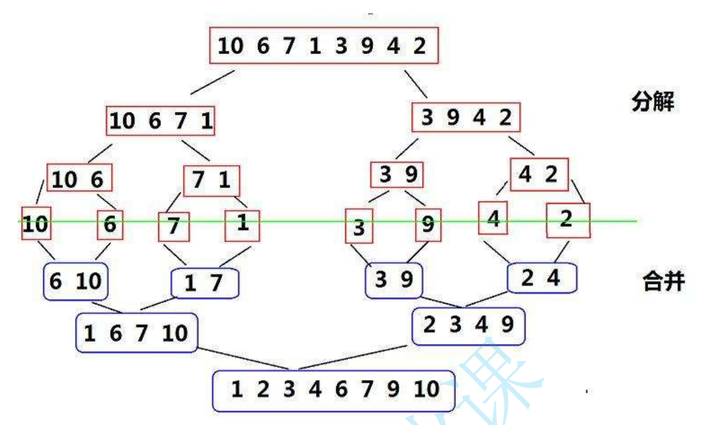

**<u>归并排序特性总结</u>**

- 归并排序需要开辟新的空间内存来，所以更多考虑的是解决磁盘中的外排序问题
- 时间复杂度 o（N * log<sub>2</sub>N）
- 空间复杂度 o（N）
- 稳定性：稳定

代码块

```java
public static void mergeSort(int[] array) {
        mergeSortChild(array,0,array.length-1);
    }
    public static void mergeSortChild(int[] array,int left,int right) {
        //判断结束
        if (left >= right) {
            return;
        }
        int mid = (right + left) / 2;

        mergeSortChild(array,left,mid);
        mergeSortChild(array,mid + 1,right);
        //合并数组
        merge(array,left,mid,right);
    }

    private static void merge(int[] array, int left, int mid, int right) {
        int s1 = left;
        int e1 = mid;
        int s2 = mid+1;
        int e2 = right;

        int[] tmp = new int[right - left + 1];
        int k = 0;
        while (s1 <= e1 && s2 <= e2) {
            if (array[s1] < array[s2]) {
                tmp[k++] = array[s1++];
            }else {
                tmp[k++] = array[s2++];
            }
        }
        while (s1 <= e1) {
            tmp[k++] = array[s1++];
        }
        while (s2 <= e2){
            tmp[k++] = array[s2++];
        }
        //赋值给数组
        for (int i = 0; i < tmp.length; i++) {
            //i+left 使得右树tmp数组的数值也能正确对应原数组的下标
            array[i + left] = tmp[i];
        }
    }
```

---

### 非递归归并排序`MergeSortNor`✨

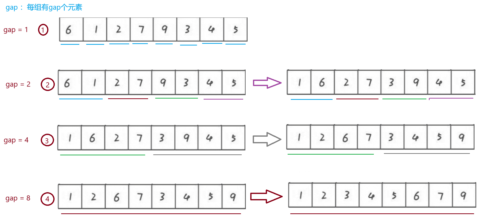

代码块

```java
public void mergeSortNor(int[] array) {
        int gap = 1;
        while (gap < array.length) {
            for (int i = 0; i < array.length; i = i + 2*gap) {
                int left = i;
                int mid = i + gap - 1;
                if (mid >= array.length) {
                    mid = array.length-1;
                }
                int right = mid + gap;
                if (right >= array.length) {
                    right = array.length-1;
                }
                merge(array,left,mid,right);
            }
            gap *= 2;
        }
    }
```

‍

‍
