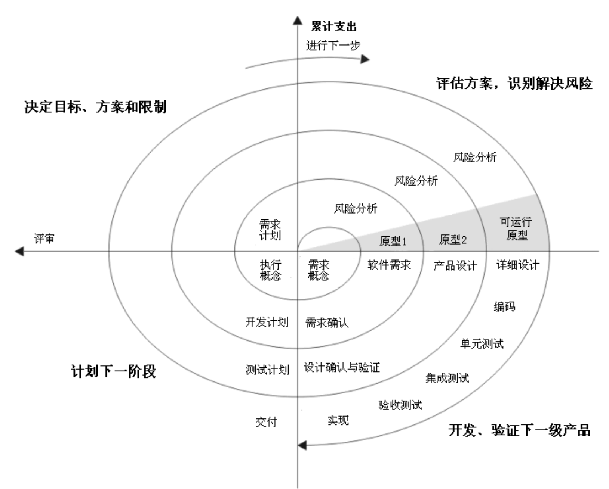
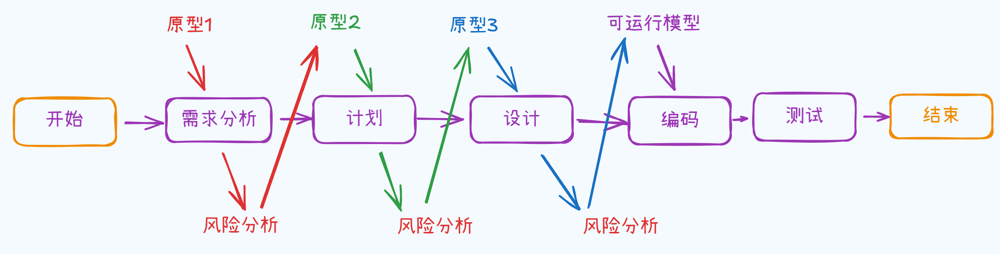
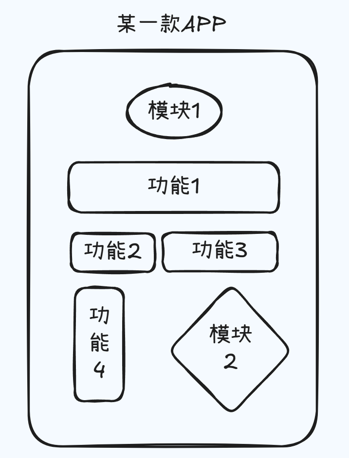
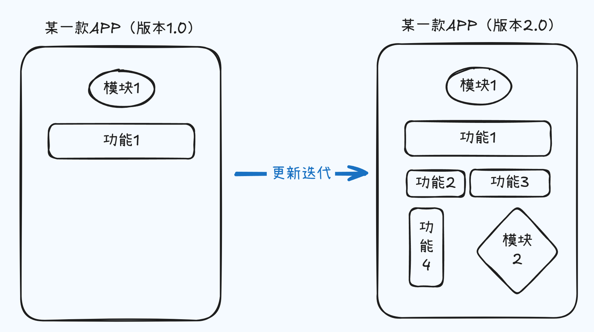
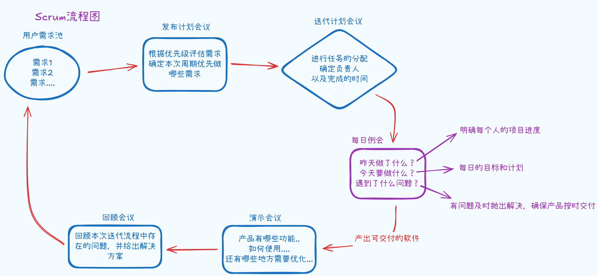
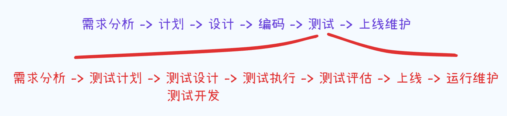
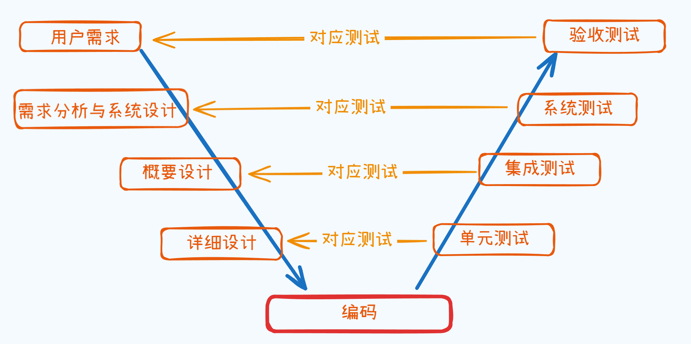
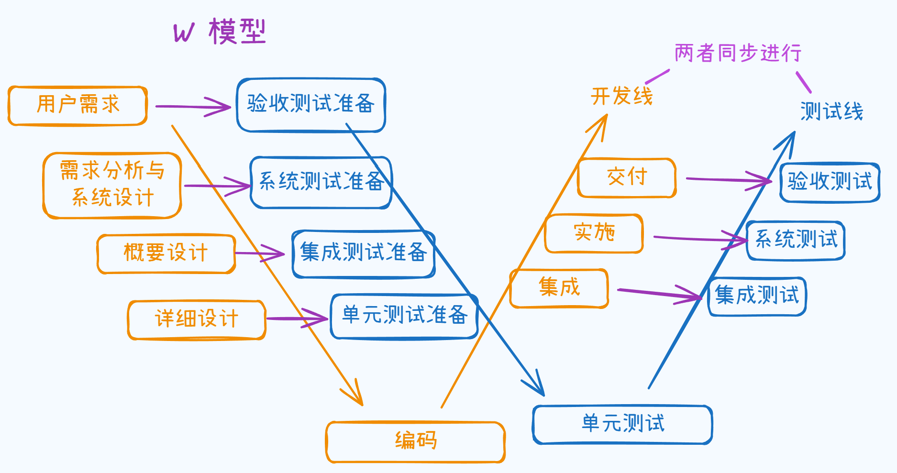

# 开发模型和测试模型
> 相关笔记：[[测试/测试|测试 知识总结]]

# 开发模型

学习测试，我们需要了解产品的开发流程，开发模型实际上指的就是产品的开发流程

## 瀑布模型

瀑布模型是其他模型的基础框架，它是最基础的模型，模型如图所示

特点 / 优点：

- 开发流程是线性的，每个阶段执行一次就结束
- 适合小项目的开发

缺点：

- 交付时间长，需要很久才能看到产品
- 测试阶段执行晚，如果一个需求引入的缺陷要到测试阶段或更晚的阶段才能看到，可能会导致前面的工作大面积的返工

## 螺旋模型

它与瀑布模型的不同是在需求分析到编码环节都进行风险分析，评估方案后才进入下一级产品

特点 / 优点：

- 强调开发中各个环节的质量
- 严格的风险管理
- 增加风险分析与原型
- 适合规模庞大、复杂度高、风险大的项目

缺点：

- 开发成本增高，人员、资金、时间的投入
- 项目中存在的风险性与风险管理人员的水平有直接的关系

## 增量模型 / 迭代模型

它的核心思想是不要一次性把系统全部做完，而是分阶段地、分模块地逐步完善。

每一次的构建（称为 “增量“）都在上一个版本的基础上进行完善与扩展；每一次的迭代都包括**开发 → 测试 → 反馈 → 修正**的完整过程。

“增量”强调的是**量的增长（功能一点点加）；** “迭代”强调的是**质的改进（版本不断优化）**

想象你在搭建一座乐高城堡。你不会一次性把所有零件拼完，而是先搭出地基，再加上城门、塔楼、装饰。每加完一部分（增量），你都会检查它是否稳固、是否和之前的部分契合（迭代）。  
这样，当城堡最终完工时，它不仅完整，而且每一层都经过了检验。

特点 / 优点：

- 每个增量都要单独测试，保证它稳定、可集成
- 每次迭代都能提前发现风险
- 测试结果反过来指导下一轮开发
- 适用于大项目且需求不明确的情况

缺点：

- 如果项目的方向控制不严，就可能陷入**反复重构、推倒重来的恶性循环，尤其在客户频繁修改需求时，团队可能永远都在“打补丁”，而不是向最终目标靠近。**
- 系统整体性不易把握，后期可能会出现接口不兼容，模块耦合度过高等问题
- 管理和测试成本增高，每一次迭代都需要经过一次完整的开发、测试、评审、部署流程

### 增量模型

可能先上线一部分的功能 / 模块，后续再进行完善，上线顺序可能是 模块1 -> 功能1 -> 功能2 -> 功能3 -> 功能4 -> 模块2

### 迭代模型

## 敏捷模型

敏捷模型的特点是：轻文档、轻流程、重目标，重产出。

**Scrum模型**就是敏捷模型中的一种，又称为迭代式增量软件开发模型，可以看成**迭代模型与增量模型的结合。**

scrum的基本流程如图所示

‍

# 软件测试

**软件测试的最终目的是验证产品**​<u>==**特性**==</u>​**是否满足客户需求~**

**软件测试贯穿于软件的整个生命周期~（非常重要！！！！！面试可以装杯）**

🤔延申问题：如何理解**软件测试贯穿于软件的整个生命周期~** 这句话？

先来看软件的生命周期，才能更好的理解软件测试的生命周期

软件的生命从需求分析就开始了，一直到上线维护

软件测试的生命周期也从需求分析开始，虽然说在软件声明周期内测试是排在编码之后，但是软件测试的内容从需求分析就开始了，故说 **<u>==软件测试贯穿于整个软件的生命周期！==</u>**

1. 需求分析：从用户角度（软件需求是否合理）、技术角度（技术上是否可行）、测试角度（是否存在业务逻辑错误、冲突等问题）分析
2. 测试计划：指定测试计划——什么时候开发测试，什么时候结束测试，耗时需要多久
3. 测试设计、开发：参考需求文档、技术文档等，来编写测试用例；编写测试文档，明确标注用到的测试方法，测试工具，测试形式等（输出测试设计）
4. 测试执行：充分利用测试用例与工具，尽可能的做到全方面覆盖测试
5. 测试评估：测试是否通过，本次测试是否有遗留BUG，产出测试报告——描述清楚测试的进度、项目进度，得出测试结论：是否具备上线条件
6. 上线：上线后，测试人员跟踪并测试线上环境，确保运行是否正常
7. 运行维护：在运行项目时收集问题并反馈相关负责人

# 测试模型

测试中有两个重要且标志性的测试模型：V 模型与 W 模型

## V模型

其中测试环节中的单元测试与集成测试一般是由开发人员来测试，单元测试的单元是人为规定的，可以认为是某个接口 / api / 方法 / 类

它也是基于瀑布模型的，所以缺点也是测试后置，导致风险到后期才发现

我们希望给测试留有充足的时间，否则会把缺点直接暴露到线上

## W模型

在 W 模型中，V 模型的测试后置的问题得到了解决，如图所示

特点：

- 测试与开发是同步进行的，测试的对象也不仅仅是程序，需求、设计等同样需要测试，有利于能尽早发现问题

缺点：

- 注重流程，无法支持敏捷开发的模式，灵活性低
- 无论是测试线还是开发线，都是线性的，直到上一阶段的完全结束才能开始下一阶段的工作

‍
