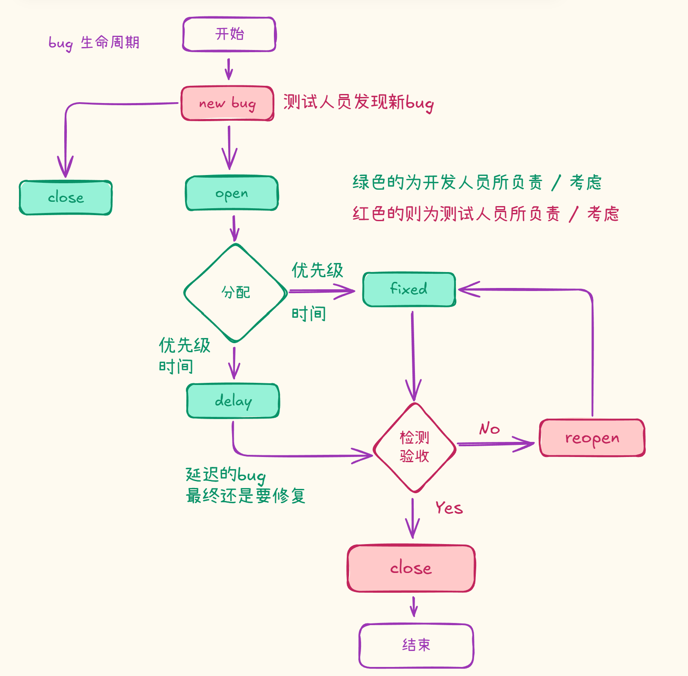
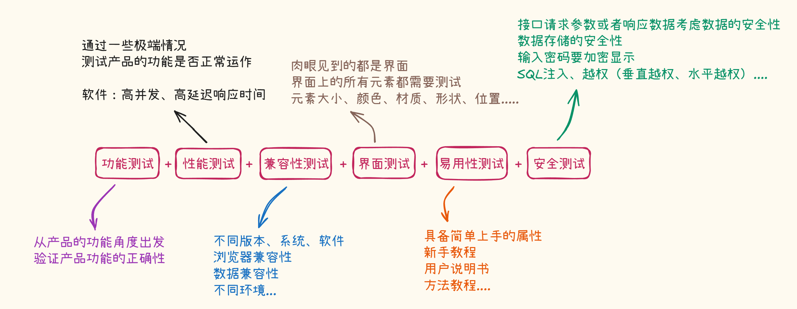
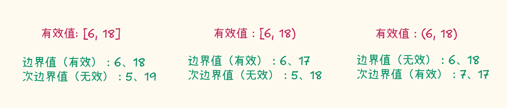

# 用例测试
> 相关笔记：[[测试/测试|测试 知识总结]]

检查程序是否 “未做其应该做的” 仅是测试的一半，测试的另一半是检查程序是否 “做了其不应该做的”

如果在开发过程中，我们测试用例需要参考开发需求文档来设计测试用例

开发需求文档中涉及到的功能，测试用例一定要涉及到；开发需求文档未涉及到的功能，测试用例也可以涉及到

# bug的生命周期

# 设计测试用例

万能公式：功能测试 + 界面测试 + 兼容性测试 + 性能测试  + 易用性测试 + 安全测试 

当然还不止这些，除此之外，还有比较常用的测试类型：弱网测试、安装卸载测试

- 弱网测试：在低网速 / 高延迟的情况下进行测试（2G、3G、4G、5G环境....)
- 安装卸载测试：

  1. 检查是否可以正常安装
  2. 检查是否可以正常卸载
  3. 卸载后重新安装，是否可以正常安装
  4. 卸载后重新安装，用户信息是否还保留
  5. 卸载是否删除干净本地文件数据

# 具体的涉及方法

## 基于黑盒测试

黑盒测试指的是把程序当作一个“黑盒子”，你不知道里面的代码和逻辑，以用户视角来检查系统是否正常工作

### 等价类分析法

等价类主要解决了不能穷举的问题

根据需求将输入分为若干个等价类，从类中取出具有代表性的数据，如果这个数据通过，则证明这整个类测试通过，用较少的测试用例达到尽量多的功能覆盖

可以分为两大类：有效等价类与无效等价类

比如密码选项中，需要填 6~18 位数字：

- 有效类：6 ~ 18，可以取15位
- 无效类：< 6 和 >18 位的数字，如 取3位、20位

### 边界值分析法

边界值分析法通常是对等价类的划分的补充，测试用例来自等价类的边界

边界值包含了：边界值 + 次边界值

次边界值是边界值的对立面

所以边界值分析法一般搭配等价类分析法一起使用

### 错误猜测法

凭借个人经验与直觉来推测产品可能出现的漏洞，进而有针对性地设计测试用例的方法

eg：SQL注入——在用户输入、组装 SQL 语句查询数据库的操作中

<mark class="hltr-grey">故在实习工作中，一定要注意积累，做完项目之后一定要写项目测试的总结文档！！！！！（重要）</mark>

‍
