# 自动化测试
> 相关笔记：[[测试/测试|测试 知识总结]]


自动化测试包括


1. 接口自动化测试
2. UI自动化测试

   - Web自动化测试

   - 客户端界面自动化测试

**这次来讲讲Web 自动化测试。**

# Web 自动化测试

在大厂的研发流程中，自动化测试是"CI/CD（持续集成/持续部署）"不可或缺的一环。

简单来说，Web 自动化测试就是​**把原本需要人工在浏览器上点击、输入、验证的操作，通过代码指令让计算机自动执行**。

# Selenium 与 WebDriver

目前业界最主流的 Web 自动化工具就是 **Selenium**。虽然现在也有 Playwright 等新秀，但 Selenium 依然是很多大厂面试的基石。

## Selenium 是什么？

Selenium 不是一个单一的软件，它是一个工具套件。核心组件是 ​**Selenium WebDriver**。

- 它提供了一套跨语言的 API（Java, Python, C#, etc.）。
- 它通过“原生”方式与浏览器交互，就像真实用户在操作一样。

## WebDriver 的工作原理（面试）

这是Selenium官方文档对WebDriver的介绍

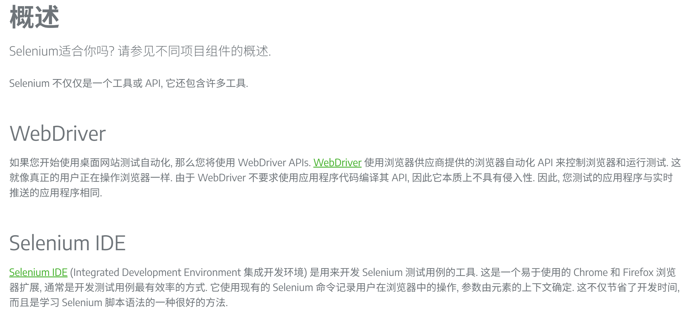

理解了这个图，你就懂了为什么需要下载“驱动”。

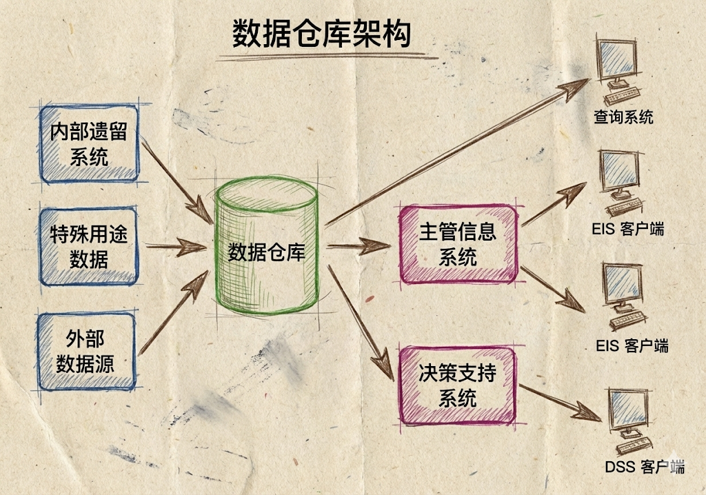

**它的运作流程是一个经典的“C/S 架构”（客户端/服务器）：**

1. **Client（你的代码）：**  你写的 Java 代码（发送命令，比如 `driver.get("www.baidu.com")`）。
2. **JSON Wire Protocol / W3C Protocol：**  代码将命令封装成 JSON 格式的 HTTP 请求，发送给驱动。
3. **Server（浏览器驱动）：**  比如 `chromedriver.exe`。它接收到 HTTP 请求后，解析命令，并调用浏览器的原生接口。
4. **Browser（浏览器）：**  执行操作（打开网页、点击按钮），并将结果返回给驱动，驱动再返回给你的代码。

‍

## Selenium 与 WebDriver的关系？（面试）

Selenium 是一个工具集，而 WebDriver 是其中用于通过原生协议驱动浏览器的核心 API。现在我们常说的 Selenium，通常默认指的就是 Selenium WebDriver。

## 安装Selenium库

安装Selenium在Java中只需引入Maven依赖即可

```java
<!-- https://mvnrepository.com/artifact/org.seleniumhq.selenium/selenium-java -->
    <dependency>
        <groupId>org.seleniumhq.selenium</groupId>
        <artifactId>selenium-java</artifactId>
        <version>4.37.0</version>
    </dependency>
// version 2025.12.6
```

Selenium内置了 WebDriver 的 API，但它**不包含浏览器驱动文件（exe），故需要手动下载 / 自动下载驱动**

程序想打开web浏览器就需要浏览器驱动，即（WebDriver），WebDriver以本地化的方式来驱动浏览器

# 关于“驱动”

浏览器驱动（BrowserDriver）是你的代码和浏览器之间的**桥梁**。

## 为什么需要驱动？

浏览器（Chrome, Firefox等）都是复杂的闭源或开源软件，出于安全考虑，不允许外部程序直接随意控制。浏览器厂商（Google, Mozilla）为了方便测试，自己开发了对外接口的“遥控器”，这个遥控器就是 Driver。

# 常见浏览器与驱动对应表

|**浏览器**|**驱动名称**|**下载关键词**|
| --| --------------| ------|
|**Google Chrome**|ChromeDriver|​`chromedriver`|
|**Firefox**|GeckoDriver|​`geckodriver`|
|**Microsoft Edge**|EdgeDriver|​`msedgedriver`|

驱动版本适配管理（重点）

> 版本匹配原则：这是新手最容易报错的地方。
>
> 你的 Chrome 浏览器版本 必须与 ChromeDriver 版本 严格对应。例如，浏览器是 v120，驱动也必须下载 v120 版本的。否则会报错 SessionNotCreatedException。
>
> 我们可以在浏览器内查看当前浏览器版本，安装的selenium 驱动版本，可以在本地c盘用户的`C:\Users\xxx.cache`文件下看到selenium文件夹，里面安装着不同的内核版本
>
> 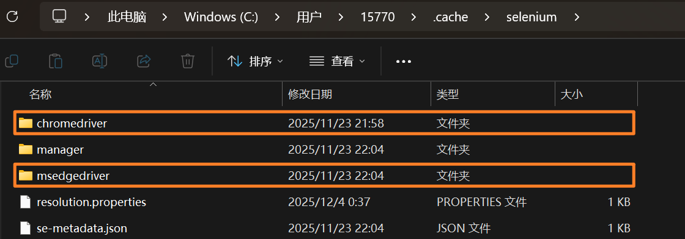

# 常见驱动下载方式

## 手动下载（不建议）

 **（注：虽然可以有程序自动管理驱动，但了解手动匹配依然是基础)**

下载驱动的位置在Selenium官方文档中有提供，地址为

​`https://www.selenium.dev/documentation/webdriver/troubleshooting/errors/driver_location/#download-the-driver`

不建议手动下载，因为浏览器的更新功能是默认打开的，什么时候更新是不知道的。可能今天自动化正常执行，第二天就要重新下载最新版的驱动了，且不同的浏览器就要我们手动下载不同的驱动，非常麻烦。

这也不建议手动关闭浏览器的自动更新功能，不仅测试环境与生产环境有脱节，错过了新的自动化的功能或者改进的地方，而且可能导致Selenium库与旧的浏览器版本兼容，这种头疼砍头的操作不可取。

## 由驱动程序自动下载

 **（注：Selenium 4.6.0 版本开始引入了 Selenium Manager，可以自动管理驱动，但了解WebDriverManager也是非常重要的基础）**

更好的做法不是禁用更新，而是采用更健壮的测试策略

需要引入WebDriverManager辅助工具库

- 用途：它可以让你不用手动去浏览器官网找对应版本的驱动下载，它会在代码运行时自动检测浏览器版本并下载对应的驱动。

引入WebDriverManager依赖

```java
<!-- https://mvnrepository.com/artifact/io.github.bonigarcia/webdrivermanager -->
    <dependency>
       <groupId>io.github.bonigarcia</groupId>
        <artifactId>webdrivermanager</artifactId>
        <version>6.1.0</version>
    </dependency>
// version 2025.12.6
```

## 更新Selenium库至 4.6+ 版本

适用于更加新的项目，直接 new Driver()， Selenium就能给你匹配最新的驱动版本

Selenium文档中的描述

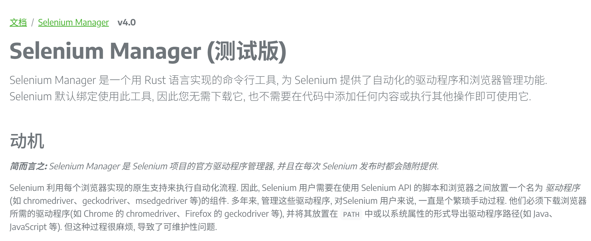

- **传统方案：**  使用 `webdrivermanager` 第三方库。适合维护旧项目（Selenium 3.x 或 4.x 早期版本）

  ```java
  // 传统方案
  WebDriverManager.chromedriver().setup(); // 手动呼叫后勤
  WebDriver driver = new ChromeDriver();
  ```
- **现代方案：**  直接使用 `selenium-java`​ (4.6+)，利用内置的 `Selenium Manager`，实现零辅助库配置启动

  ```java
  // 什么都不用配，直接 new
  // 底层会自动触发 Selenium Manager 去干活
  WebDriver driver = new ChromeDriver();
  ```

# 断言配置

配置断言需要在IDE上手动配置

 assert

如：assert txt.equals("登录")

**<u>idea中开启断言的方法</u>**

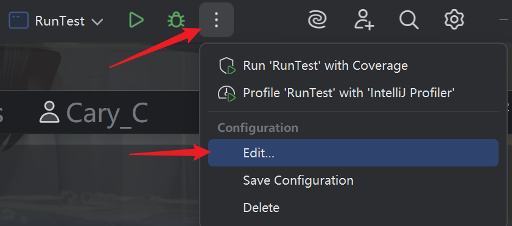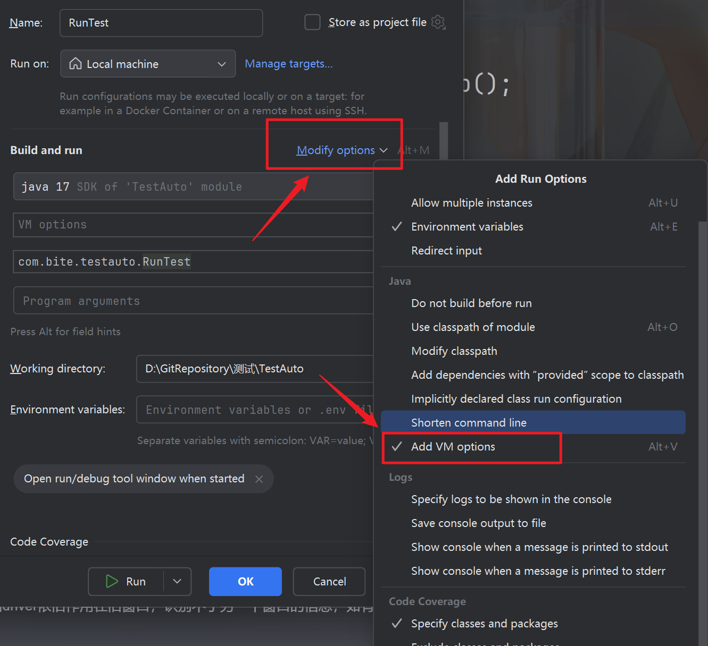

# 总结

我用Banana Pro生成了这一副插画，能更加形象的了解Web自动化测试执行的逻辑😽

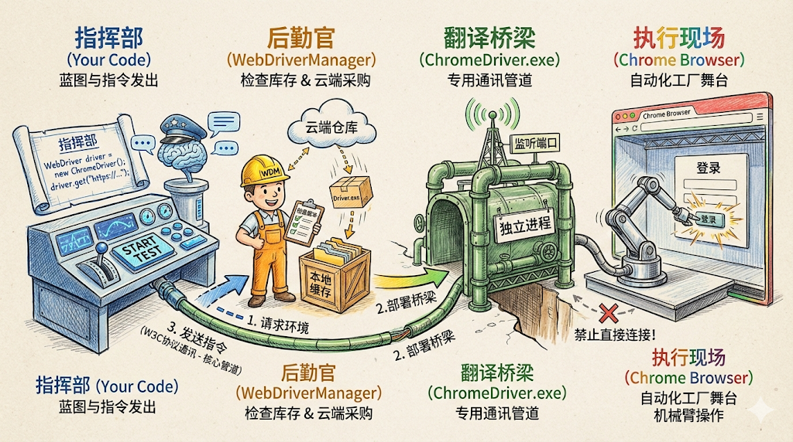

# Web自动化常用函数

🙈与其像流水账一样罗列 API，不如**按照“业务场景”或者“对象层级”来分类**

## 浏览器级的操作（Driver）

这部分方法是直接作用于`WebDriver`​对象的，控制着浏览器的生命周期与状态，通常用于测试开始前的准备（Setup）或测试结束后的清理（Teardown），以及用于 “[断言](自动化测试/断言.md)” 的前置检查。

1. ### 获取页面信息 **（用于断言）**

   在自动化测试中，我们怎么知道脚本是不是跳转到了正确的页面？靠的就是这两个方法：

   - ​**​`driver.getTitle()`​** 

     - ​**介绍**：获取当前浏览器窗口标签页上的标题文本。
     - **用途**：这是最常用的断言点。比如登录成功后，验证标题是否包含“个人中心”或“首页”

     注意：如果新开窗口后没有切换driver，则driver依旧作用在旧窗口，识别不了另一个窗口的信息，如有需要用到切换窗口的方法，这就引出获取当前 / 所有句柄id
   - ​**​`driver.getCurrentUrl()`​** 

     - ​**介绍**：获取浏览器地址栏当前的 URL 字符串。
     - **用途**：验证重定向是否正确。比如支付完成后，URL 是否跳转到了 `/success` 页面。
   - ​**​`driver.getWindowHandle() / getWindowHandles()`​** 

     - 介绍：获取句柄（标签页）id
     - 用途：一般搭配切换句柄的操作

       ```java
       // getWindowHandle 获取driver当前标签页/句柄id
         String window = driver.getWindowHandle();
         System.out.println("window: " + window);

         // getWindowHandles 获取所有标签页/句柄id
         driver.findElement(By.xpath("//*[@id=\"s-top-left\"]/a[6]")).click();
         Set<String> handles = driver.getWindowHandles();    

       // 切换窗口操作
           for (String handle : handles) {
               if (!window.equals(handle)) {
                   driver.switchTo().window(handle);
               }
           }
           String jump_title = driver.getTitle();
           String jump_url = driver.getCurrentUrl();
           System.out.println("jump_title：" + jump_title);
           System.out.println("jump_url：" + jump_url);

       // 这样就能正确切换窗口且得到新窗口的title 和 url
       ```

2. ### 浏览器窗口调整

   ​**​`driver.manage().window().maximize()`​** ​  **/**   **​`.setSize(里面需传入Dimension对象，手动规定尺寸)`​** ：

   - **介绍**：自动化脚本启动时，默认通常是小窗口。
   - ​**用途**：

     - ​**全屏**​：通常建议在 `driver`​ 初始化后立即调用 `maximize()`，因为很多网页在小窗口下会折叠菜单（变成汉堡按钮），导致元素不可见或定位失败。
     - ​**指定尺寸**​：在测试“响应式布局”时，通过 `setSize()` 模拟手机或平板的分辨率。

3. ### 浏览器的关闭 **（面试）**

   - ​**​`driver.close()`​** ：

     - **介绍**：仅仅关闭**当前正在操作的那个标签页（Tab）或窗口**
     - **注意**：如果当前浏览器只有一个窗口，调用它也会导致浏览器退出，但它不会清除驱动进程。

   **避坑点：** 当调用 `driver.close()`​ 关闭当前标签页后，**WebDriver 并不会自动把焦点切换回剩下的那个标签页**

   **解决办法：**

   1. 在 close 前保存下当前句柄 id，然后删除后便于 driver 切换新的标签页（适用于随便去一个活着的窗口的情况）

      ```java
      		driver.get("https://www.baidu.com/");
              // 新开百度图片标签页
              driver.findElement(By.xpath("//*[@id=\"s-top-left\"]/a[6]")).click();
              // 删除当前标签页后 driver 指向空，无法对新开的百度图片标签页进行操作
              // 故需要在关闭标签页后切换句柄 使driver对象指向新的句柄
              String windowHandle = driver.getWindowHandle();
              Set<String> windowHandles = driver.getWindowHandles();

              driver.close();

              // 无法直接获得新的句柄的title 必须使driver切换句柄
      //        System.out.println(driver.getTitle()); // error~~

              // 需要切换句柄
              for (String handle : windowHandles) {
                  if (!handle.equals(windowHandle)) {
                      driver.switchTo().window(handle);
      				break；
                  }
              }
              System.out.println(driver.getTitle()); // success~~
      ```
   2. Parent-Child 模式（标准）

      在实际业务测试中（如：在列表页点击商品 -\> 弹出新标签页详情 -\> 验证完关闭详情 -\> 回到列表页继续点下一个）需要“从哪里来，回哪里去”的逻辑，**更有目的性地跳回**

      ```java
      // 场景：在 首页(A) 点击链接打开了 详情页(B)，处理完 B 后关闭并回到 A

      // 1. 【核心】在这一刻，Driver 还在 A 页面，先保存 A 的身份证
      String originalWindowHandle = driver.getWindowHandle();

      // 2. 执行打开新页面的操作
      driver.findElement(By.id("open-new-tab-link")).click();

      // 3. 切换到新窗口 (这里假设只要不是原窗口就是新窗口)
      for (String handle : driver.getWindowHandles()) {
          if (!handle.equals(originalWindowHandle)) {
              driver.switchTo().window(handle);
              break; // 切过去就不动了
          }
      }

      // --- 此时 Driver 已经在 B 页面了 ---
      System.out.println("在新页面操作: " + driver.getTitle());

      // 4. 业务结束，关闭当前的新页面 B
      driver.close(); 
      // ⚠️ 此时 Driver 是悬空的，指向一个不存在的 B

      // 5. 【核心】显式切换回原窗口 A
      driver.switchTo().window(originalWindowHandle);

      // --- 此时 Driver 又回到了 A 页面，复活了 ---
      System.out.println("回到原页面: " + driver.getTitle());
      ```

   - ​**​`driver.quit()`​** ：

     - **介绍**：**彻底关闭整个浏览器，关闭所有打开的标签页，并销毁 ChromeDriver 进程**。
     - **注意**：**在自动化测试框架的** **​`finally`​**​ **块或**  **​`@After`​**​ **钩子中，**​**<u>必须使用</u>** **<u>​`quit()`​</u>** ​ **，否则你的服务器内存会被浏览器进程吃光。强调资源释放的重要性！**
4. ### 浏览器导航

   控制页面的前进、后退与刷新：

   - ​**​`driver.navigate().back()`​** ：模拟点击浏览器“后退”按钮
   - ​**​`driver.navigate().forward()`​** ：模拟点击浏览器“前进”按钮
   - ​**​`driver.navigate().refresh()`​** ：强制刷新当前页面
5. ### 屏幕截图

   一般用于记录错误现场 / 检验是否达到预期效果

   ```java
   File srcFile = ((TakesScreenshot)driver).getScreenshotAs(OutputType.FILE);
   FileUtils.copyFile(srcFile, new File("error.png"));
   ```
6. ### 浏览器参数设置

   在初始化 `driver`​ 前通过 `Options` 类配置：

   - **无头模式**：`options.addArguments("--headless")`（不打开界面运行，速度快，但难以看到进行到哪一步）
   - **隐身模式**：`options.addArguments("--incognito")`

## 元素级操作（Element）

需要先通过 `driver.findElement()`​ 找到元素`WebElement`后才能调用后续的方法。这是自动化测试中最繁忙的部分，简单来讲就是模拟人类的手指的各种操作

1. ### 输入与交互

   - ​**​`element.sendKeys("text")`​** ：

     - ​**介绍**：模拟键盘向输入框输入指定内容。
     - ​**高阶用法**​：它不仅能输入文字，还能用于​**文件上传**​（如果 input 类型是 file，直接 sendKeys 文件路径即可），或者模拟按键（如 `Keys.ENTER`）。
   - ​**​`element.clear()`​** ：

     - **介绍**：清空输入框中的已有文本。

     **避坑**：在调用 `sendKeys`​ 之前，建议先调用 `clear()`​。因为如果输入框有默认值，`sendKeys` 会直接追加在后面，导致数据错误。如：

     ```java
     // 如果不进行clear操作，则会在“gpt”文本后追加“chrome”文本
     driver.get("https://www.baidu.com/");
     driver.findElement(By.xpath("//*[@id=\"chat-textarea\"]")).sendKeys("gpt");
     // 应该clear上一次的文本
     // driver.findElement(By.xpath("//*[@id=\"chat-textarea\"]")).clear();
     driver.findElement(By.xpath("//*[@id=\"chat-textarea\"]")).sendKeys("chrome");
     driver.findElement(By.xpath("//*[@id=\"chat-submit-button\"]")).click();
     ```

     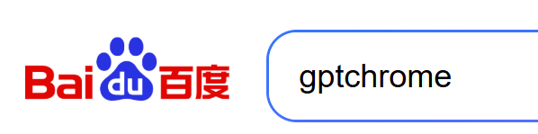
   - ​**​`element.click()`​** ：

     - ​**介绍**：模拟鼠标左键点击。
     - ​**适用**：不仅是按钮，超链接、复选框、单选按钮，甚至普通的文本（如果有点击事件）都可以点。

2. ### 获取元素信息

   - ​**​`element.getText() / .getAttribute("value")`​** ：

     - ​**介绍**​：获取元素标签对之间的​**可见文本**。
     - ​**用途**：这是验证测试结果的核心。比如下单成功后，获取页面上的提示语“支付成功”，与预期结果进行比对。
     - **注意**：如果元素在页面上被隐藏（Hidden），这个方法通常会返回空字符串。

     **避坑点：** 如果为了获取输入框里用户输入的值，用 `getText()`​ 是拿不到的，必须用 `getAttribute("value")`

     比如想获取红色框的文字，定位这元素所在的位置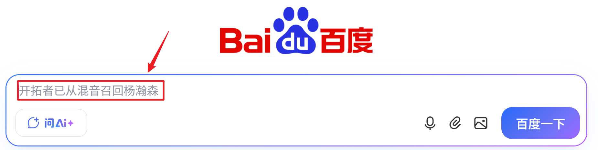

     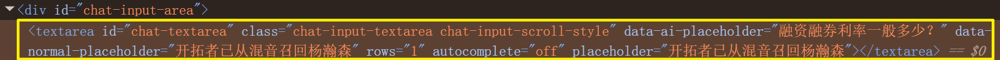

     发现文字是在`placeholder`​属性内的，必须要用`getAttribute("placeholder")`才能拿到！

     ​`getText()`​适合用在<标签> <u>**"xxxx"**</u> <标签>被标签内包裹的文本信息，如

     

3. ### 文件上传

   **<u>文件上传不同于我们普通的鼠标点击页面选择文件上传，Selenium是无法控制系统窗口来选择文件的</u>**

   **操作**：无需点击“上传”按钮弹出系统窗口，直接对 `type='file'`​ 的 `<input>`​ 标签使用 `sendKeys("文件绝对路径")`
4. ### 窗口与句柄切换

   ​**​`driver.switchTo().window(handle)`​** ：

   - ​**核心概念——句柄 (Handle)** ：每个标签页都有一个唯一的身份证号，叫句柄。
   - **场景**：当点击了一个链接，浏览器打开了一个**新的标签页**。此时虽然人眼看到了新页面，但 `driver`​ 的焦点还停留在**旧页面**上。如果直接操作新页面的元素，会报错：`NoSuchElementException`
   - ​**操作逻辑**：

     1. 获取所有窗口的句柄：`driver.getWindowHandles()`。
     2. 遍历这些句柄，排除掉当前句柄。
     3. 使用 `switchTo().window(新句柄)` 将控制权移交到新页面。

   ```java
   // getWindowHandle 获取driver当前标签页/句柄id
     String window = driver.getWindowHandle();
     System.out.println("window: " + window);

     // getWindowHandles 获取所有标签页/句柄id
     driver.findElement(By.xpath("//*[@id=\"s-top-left\"]/a[6]")).click();
     Set<String> handles = driver.getWindowHandles(); 

   // 切换窗口操作 （随机切换式）
       for (String handle : handles) {
           if (!window.equals(handle)) {
               driver.switchTo().window(handle);
   			break;
           }
       }
   // 这样就能正确切换窗口
   ```

# 特殊交互处理

1. JS弹窗

   这类弹窗不是 HTML 元素，需使用 `driver.switchTo().alert()` 切换焦点，三种弹窗都能切换。弹窗一般有这三种

   |**弹窗类型**|**描述**|**操作方法**|
   | --| ----------------------| ----------|
   |**警告弹窗**|只有“确定”按钮|​`alert.accept()`|
   |**确认弹窗**|有“确定”和“取消”|​`accept() / dismiss()`|
   |**提示弹窗**|可以输入文本|​`sendKeys("文本")`​后`accept() / dismiss()`|

   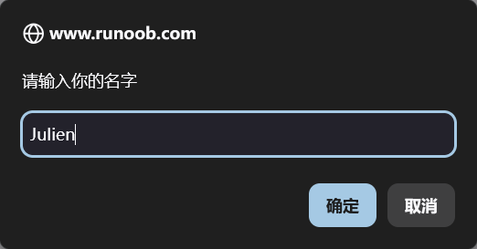

   Selenium的Alert类源码

   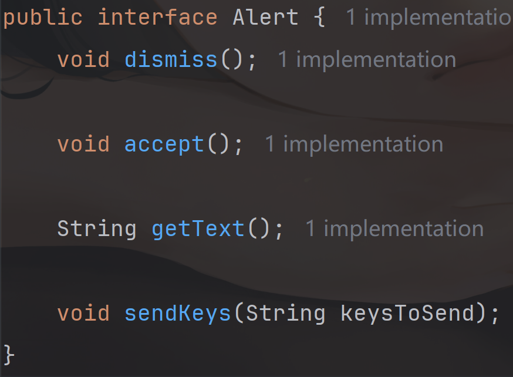

# 等待机制与DOM

## DOM

**DOM (Document Object Model)**  是浏览器将 HTML 代码解析后生成的一棵“树”。

- 每一个 HTML 标签（如 `<div>`​, `<a>`​, `<button>`​）都是这棵树上的一个**节点（Node）**
- **存在于 DOM 中：**  意味着这棵树上已经长出了这个节点

**<u>理解等待的前提是分清元素在 HTML 里的状态</u>**，我们可以把网页比作一栋正在盖的房子，那么里面的家具就是元素：

1. 存在于 DOM  **：**  相当于房子的**地基和框架**已经打好了。虽然你还没看到窗户（元素被遮盖了，你在网页上看不到），但窗户的位置已经在建筑图纸里确定了（click-false）
2. 可见  **：**  相当于装修完成且灯光照亮。你不仅知道窗户在哪，还能伸手摸到它（click-success）

## 等待机制

|**类型**|**机制**|**作用范围**|**核心特点**|
| ----| -------------------| ------| --------------------------------------------------|
|**强制等待 (**​**​`Thread.sleep`​**​ **)**|强行暂停线程|局部|**最死板**。无论加载多快都要等够时间，浪费效率|
|**隐式等待 (**​**​`implicitlyWait`​**​ **)**|轮询 DOM 查找元素|**全局**|**只管“存在”** 。只要 DOM 里有标签就停止等待，不管元素是否可见|
|**显式等待 (**​**​`WebDriverWait`​**​ **)**|指定条件触发|局部| **（最优先💫) 最灵活**。可等待“可见”、“可点击”等多种状态，满足即止|

## 等待使用方式

```java
		// 强制等待
        Thread.sleep(1000);

        // 隐式等待 作用域所有Element元素 直至页面资源完全加载出来
        driver.manage().timeouts().implicitlyWait(Duration.ofSeconds(2));
        driver.findElement(By.cssSelector("#s_tab_inner > a.s-ta" +
                "b-item.s-tab-item_1CwH-.s-tab-more > span")).click();
        // 后续不需要再写等待 隐式等待同时作用于这里
        driver.findElement(By.cssSelector("#content > div:nth-child(6) > div:nth-child(2) > a")).click();

        // 显示等待
        WebDriverWait wait = new WebDriverWait(driver, Duration.ofSeconds(2));
        // 显示等待结束的满足条件：urlContains/visibilityOfElementLocated/....
        wait.until(ExpectedConditions.urlContains("https://www.baidu.com/more/"));
```

# Actions类

Selenium提供了Actions类，用来模拟在键盘 / 鼠标的操作，更有利于**==复杂式的交互动作==**

## 执行

每次执行一个操作链路，后面都要以`.perfrom()`结尾，否则动作不会真正执行

## 鼠标级操作

|**方法**|**说明**|**业务场景**|
| ------| -------------------| --------------------------------|
|​**​`moveToElement(ele)`​** |鼠标悬停（Hover）|触发二级下拉菜单显示|
|​**​`contextClick(ele)`​** |鼠标右键点击|打开自定义右键菜单|
|​**​`doubleClick(ele)`​** |鼠标双击|选中文字或触发特定双击事件|
|​**​`dragAndDrop(source, target)`​** |拖拽 A 到 B|滑块验证码、排序列表、拖拽文件|
|​**​`clickAndHold()`​** |按住不放|模拟长按效果|

## 键盘级操作

通常配合 `Keys` 枚举类使用，适合处理快捷键组合。Keys类枚举了许多键盘的按键，列举几个常用的

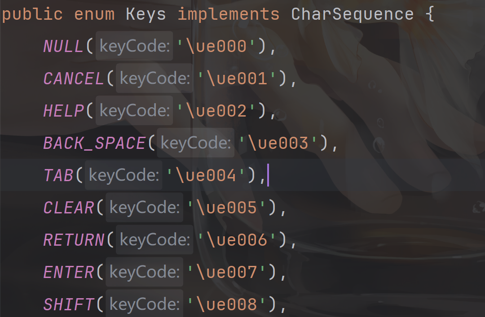

- ​**​`keyDown(Keys.SHIFT)`​** ：按下某个键不松开
- ​**​`keyUp(Keys.SHIFT)`​** ：释放按下的键
- ​**​`sendKeys(Keys.ENTER)`​** ​：回车键（比元素级的 `sendKeys` 更通用）

**场景示例（全选并删除）**

```java
new Actions(driver)
		.keyDown(Keys.CONTROL)
		.sendKeys("a")
		.keyUp(Keys.CONTROL) 		// Ctrl + A 全选
        .sendKeys(Keys.BACK_SPACE)  // 退格删除
        .perform();  				// 以perform结尾
```

‍
