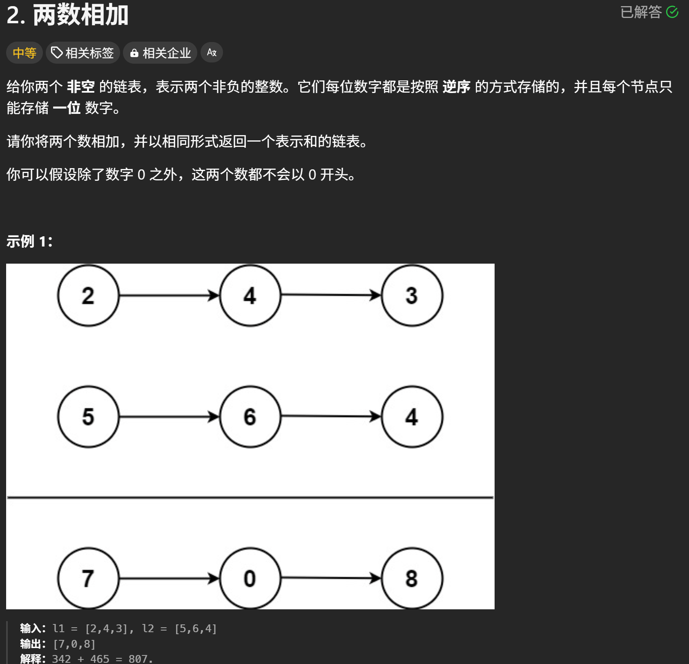
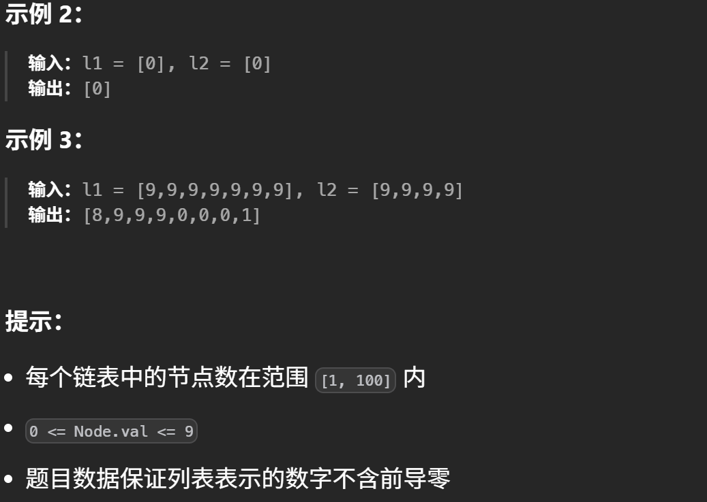
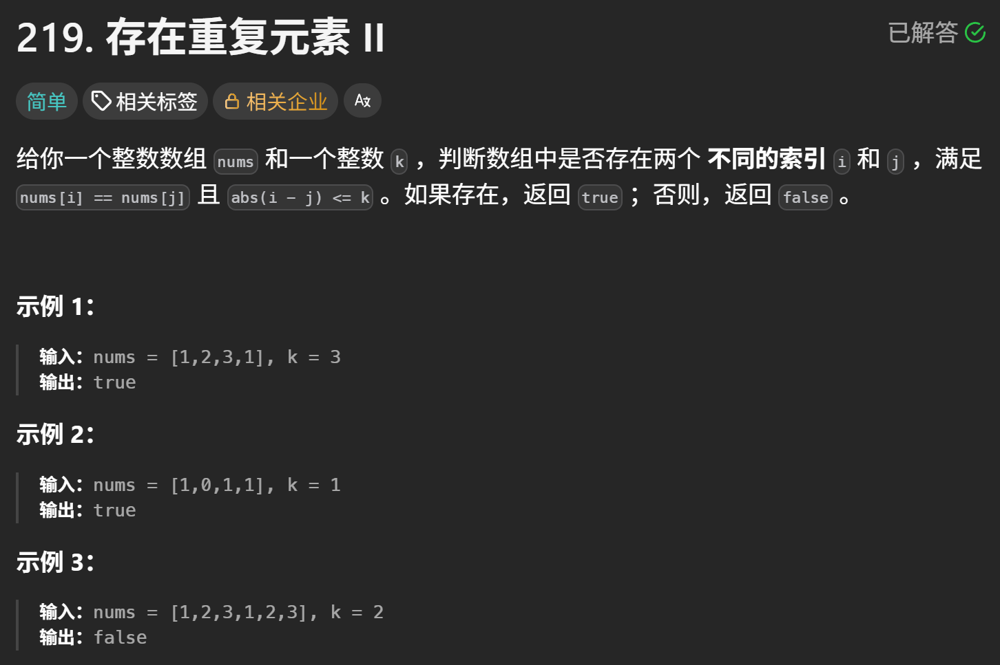
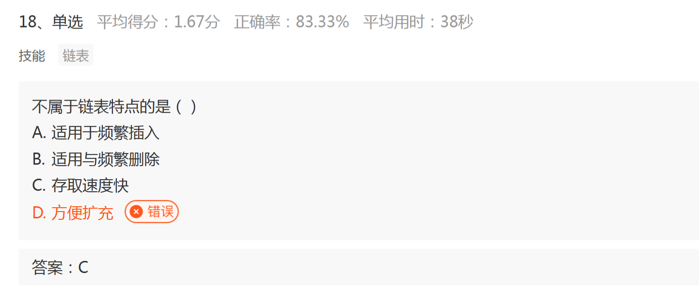
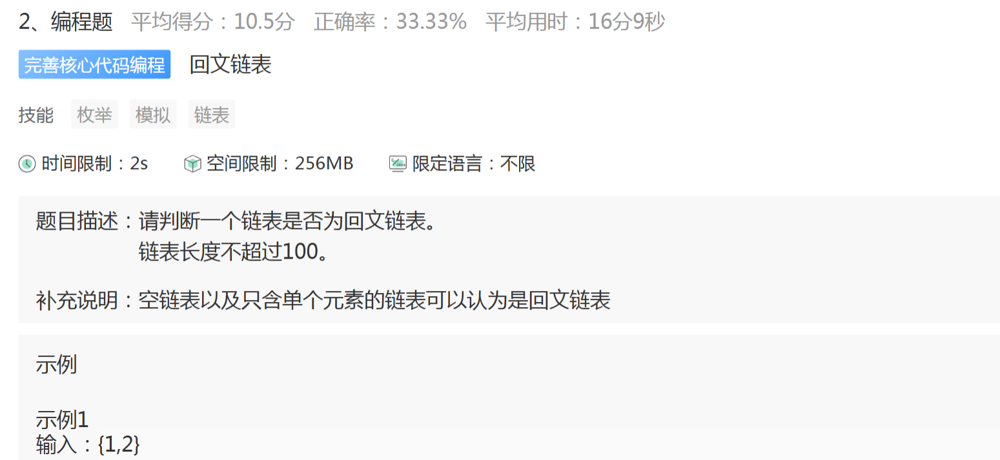
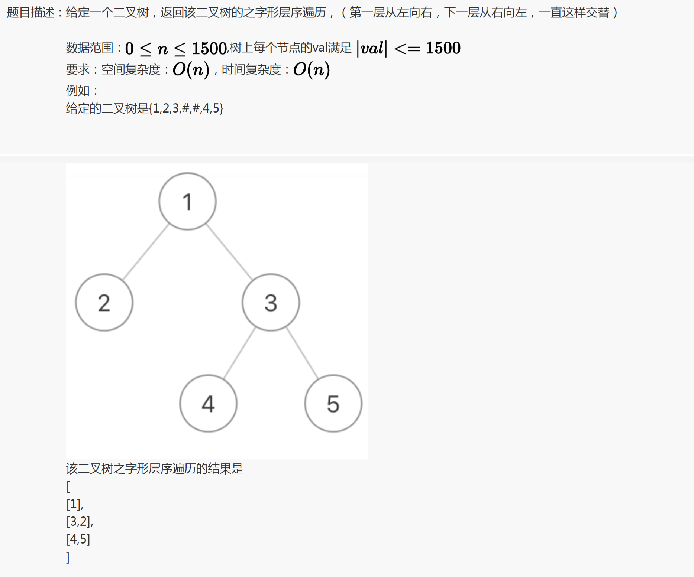
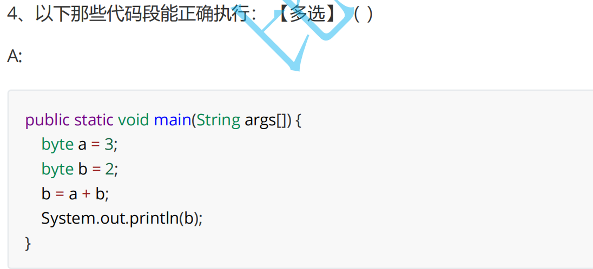
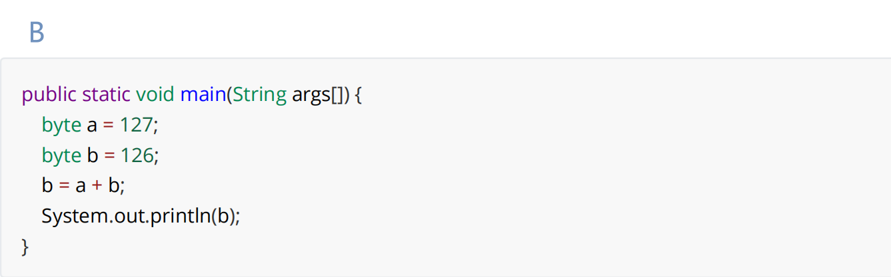
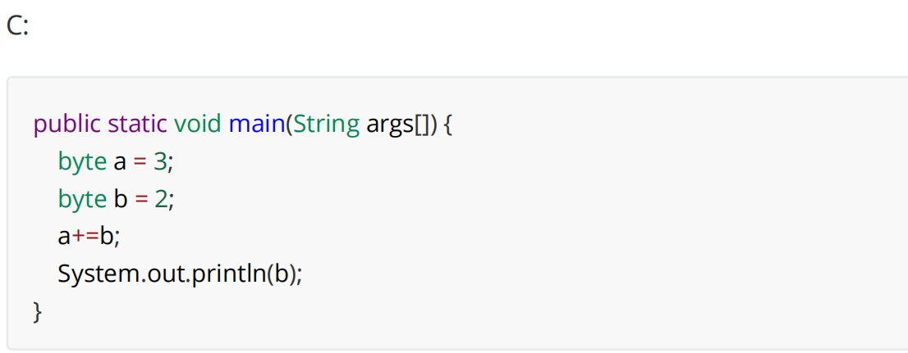
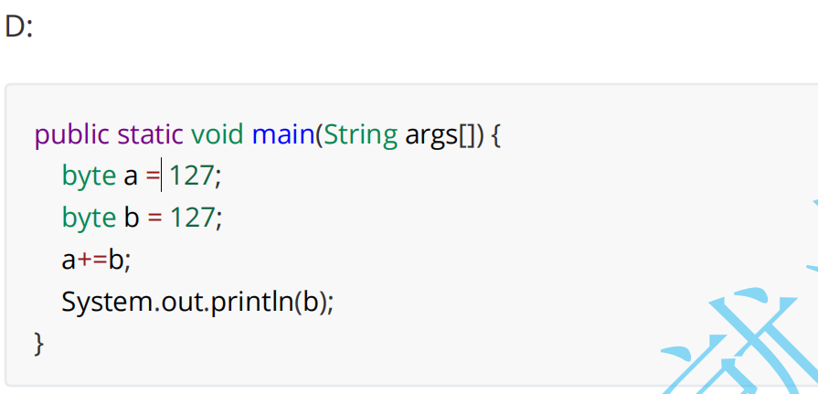

# 数据结构
> 相关笔记：[[算法|算法 知识总结]]




我的思路：将链表的元素提取出来再进行倒序相加，再逐一提取每一位上的数字

错误点 ❌：效率低，且难处理进位问题

正确思路：

- 将两个链表看成是相同长度的进行遍历，如果较短链表则在面前补 0，逢十就标记 Carry 进位
- 每一位相加都要考虑上一位的进位问题
- 如果两个链表遍历完后有进位，那么在新的链表最前方添加节点 1（进 1）

处理链表问题时，如果要求返回头节点时，通常需要先初始化一个哨兵节点 pre，该节点的下一节点指向真正的头节点 head

```java
public ListNode addTwoNumbers(ListNode l1, ListNode l2) {
        //哨兵节点
        ListNode pre = new ListNode();
        ListNode cur = pre;
        //标记进位
        int carry = 0;
        while(l1 != null || l2 != null) {
            int x = l1 == null ? 0 : l1.val;
            int y = l2 == null ? 0 : l2.val;
            int sum = x + y + carry;

            carry = sum / 10;
            int ret = sum % 10;
            cur.next = new ListNode(ret);
            cur = cur.next;
            if(l1 != null) {
                l1 = l1.next;
            }
            if(l2 != null) {
                l2 = l2.next;
            }
        }
        if(carry == 1) {
            cur.next = new ListNode(carry);
        }
        return pre.next;
    }
```

---

‍



我的思路：遍历数组创建 Set 对象逐一保存，再开辟一个 Set2，遍历数组放查找相同的元素的下标

错误点 ❌：无法获取 Set 中相同元素的下标

正确思路：用 Map 可保存下标，且能记录每个元素的最大下标，（K 是唯一的）

- 如果哈希表中已经存在和 nums[i] 相等的元素且该元素在哈希表中记录的下标 j 满足 i−j≤k，返回 true
- 将 nums[i] 和下标 i 存入哈希表，此时 i 是 nums[i] 的最大下标
- 当遍历结束时，如果没有遇到两个相等元素的下标差值 <=k，返回 false

```java
public boolean containsNearbyDuplicate(int[] nums, int k) {
        Map<Integer, Integer> map = new HashMap<>();
        for (int i = 0; i < nums.length; i++) {
            if (map.containsKey(nums[i]) && i - map.get(nums[i]) <= k) {
                return true;
            }
            map.put(nums[i], i);
        }
        return false;
    }
```

---

‍



错误点❌：扩容概念模糊，没有具体了解

正确思路✔：

首先明白扩容的概念：有容才能扩——原有存储容量不足时，为容纳更多元素，系统所做的结构或内存调整操作

	数组的扩容：在ArrayList中，数组是连续的内存块，当元素超过容量时会自动扩容成1.5倍

	但链表没有扩容这么一说：链表的行为不能叫扩容，他不存在固定的容量限制。所以它是“动态扩展，不需扩容”——链表是天然无限扩展的，只受限于JVM的内存空间

### 🫥为什么不能说它“易于扩容”？

|理由|解释|
| -------------------------------------------| --------------------------------------------------------|
|❌ 它根本没有“容量”的概念|LinkedList 不会预分配，也没有 capacity，无法谈“扩容”|
|❌ 没有可扩与不可扩的状态|节点加多少都行，只要 JVM 能分配内存|
|❌ 真正扩容要做的（连续内存）它根本不需要|所以也谈不上“易于”|

---

‍



错误点❌：对回文链表概念不熟悉，错认为回文链表是循环链表

正确思路✔：回文链表是12 34 45 34 12 的类型

代码块

```java
static class ListNode{
        //数据
        public int val;
        //节点的引用
        public ListNode next;

        public ListNode() {
        }

        public ListNode(int val) {
            this.val = val;
        }
    }
public boolean chkPalindrome()
```

---

‍



正确思路✔：先模拟层序遍历，将每层遍历的元素放入数组后，隔层将数组翻转元素即可

代码块

```java
public ArrayList<ArrayList<ListNode>> fun1(ListNode pRoot) {
        ArrayList<ArrayList<ListNode>> ret = new ArrayList<>();
        if (pRoot == null) {
            return ret;
        }
        boolean flg = true;
        Queue<ListNode> queue = new LinkedList<>();
        queue.offer(pRoot);
        while (!queue.isEmpty()) {
            int size = queue.size();
            ArrayList<ListNode> tmp = new ArrayList<>();
            while (size != 0) {
                ListNode cur = queue.poll();
                if (cur.left != null) {
                    queue.offer(cur.left);
                }
                if (cur.right != null) {
                    queue.offer(cur.right);
                }
                tmp.add(cur);
                size--;
            }
            if (flg) {
                flg = false;
            }else {
                Collections.reverse(tmp);
                flg = true;
            }
            ret.add(tmp);
        }
        return ret;
    }
```

---





我选的❌：AC

正确答案✔：CD

我的思路❌：BC可能会运算溢出，byte的取值范围是（-128~~127）

纠错✔：

1. 在运算时，JVM的规则是所有比int小的整型（byte，short，char）在运算前都会转换成int再进行运算，所以不存在数值溢出的情况，AB选项运算的时候就不能再赋值给byte类型了
2. +=除了实现+的功能外，还能根据接受变量的类型进行自动的类型转换（ a += b -> byte a = (byte) (a+b)  )

---

‍
