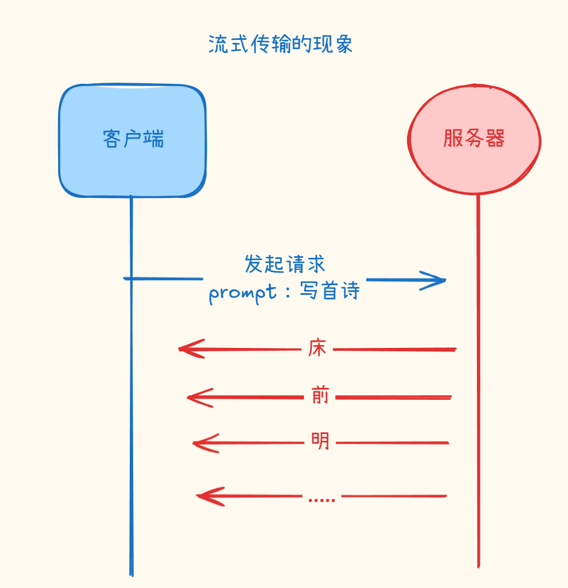
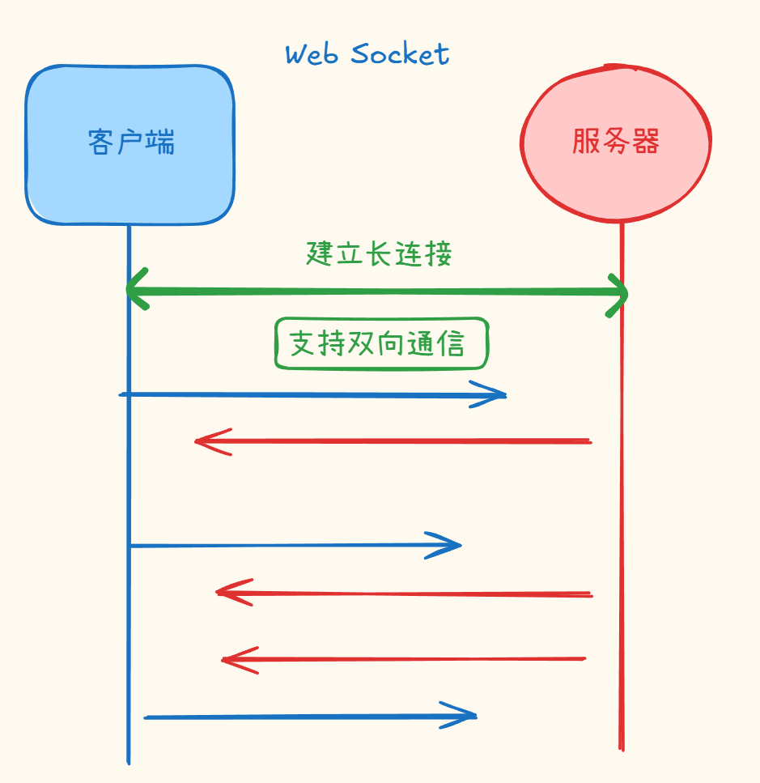
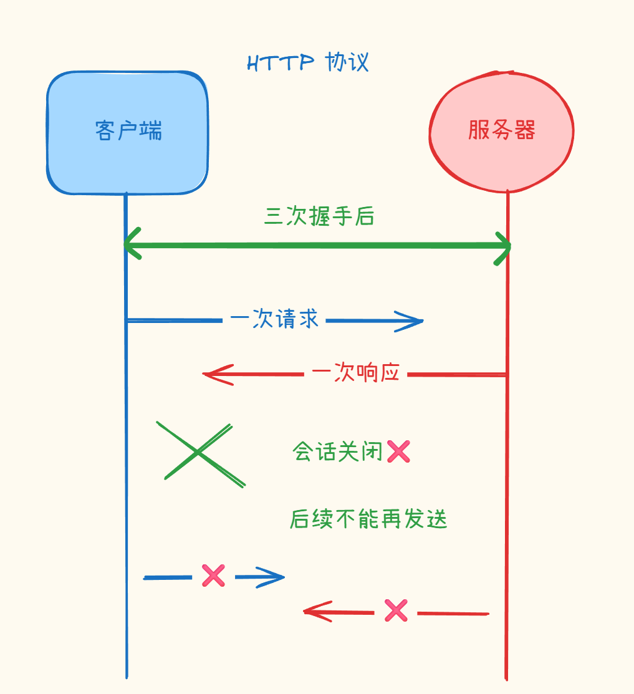
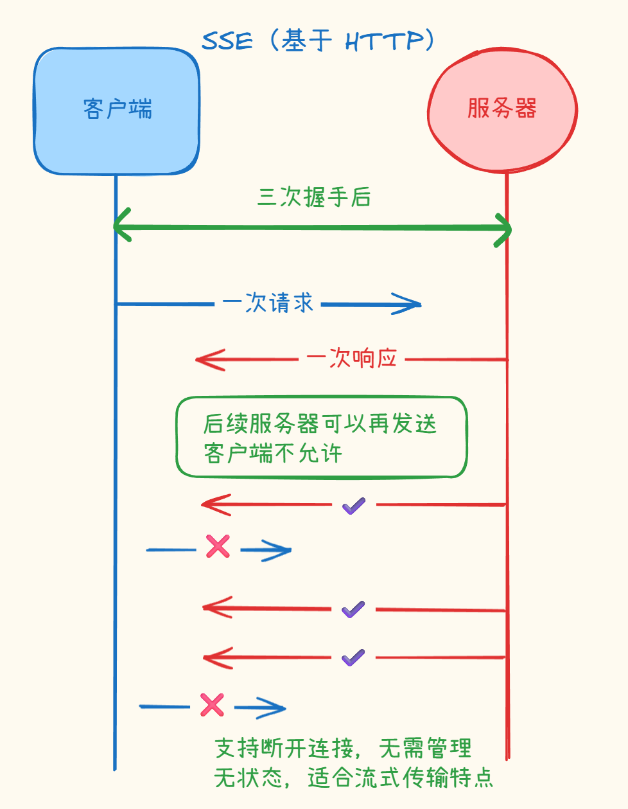

# 流式传输
> 相关笔记：[[通信协议|通信协议 知识总结]]、[[API 类型总结|API 类型总结]]

所谓流式传输即当客户端向大模型发起请求后，大模型会一个 token 一个 token 往外蹦，提高用户的使用体验

讲完现象，来讲讲流式传输的底层协议

# 底层协议SSE

像这种客户端与服务器交流的过程，首先能想到的是用 WebSocket 的方式进行连接

WebSocket 维护了客户端——服务器之间的链接，链接建立之后，客户端——服务器就能进行**<u>双向通信</u>**

但**这样的链接，客户端与服务器都是需要维护，这都是消耗资源的。** 这就提到了**SSE技术**，它能更加节省资源地维护双方会话。

## SSE

SSE 技术是基于 / 受限于 HTTP 协议来升级的技术，它无需额外的端口，兼容性好且容易部署

它解决了 HTTP 协议的特点——无状态协议：一般的 HTTP 协议，客户端给服务器发一个请求，服务器给客户端发一个响应，这一次的聊天就直接结束了。如果想要再发送一次消息是做不到的，会话已经关闭了。

SSE 则可以做到基于 HTTP ，服务端向客户端多次发送响应的行为。

当客户端对服务器进行三次握手之后，建立链接。当将HTTP协议升级成SSE协议之后，就支持服务端向客户端持续的发送消息。但是有**<u>单向通信机制：服务器后续可以向客户端多次发送响应，客户端后续不能再向服务器发送请求。</u>**

**而且支持断开连接，无需管理连接，依旧是无状态协议，减轻服务器压力**

SSE 协议 和 WebSocket 的不同点就是：

- **WebSocket**：是**<u>双向通行</u>**的。它是一个**独立的协议**。它更适用于聊天、游戏这种**<u>长时间维护连接</u>**的场景
- **SSE**：是直接在现有的 HTTP 上，画出了一条专用的“<u>**单向车道**</u>”。它是一项**基于 HTTP 的技术应用，适合流式传输**

这就是流式传输的底层协议，解释了为什么可以一个 token 一个 token 往外冒

‍
