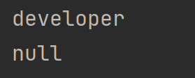
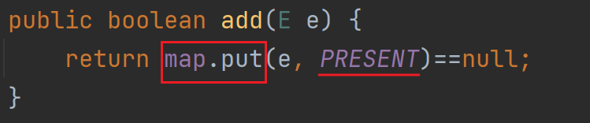

# 数据结构
> 相关笔记：[[面试|面试 知识总结]]


腾讯-Java后台开发面经

1. <span id="20250601192202-g0vldua" style="display: none;"></span>HashMap 了解不，介绍一下，如果一个对象为 key 时，hashCode 和 equals 方法的用法要注意什么？

   ❌HashMap是Java中Map接口的一个实现类，底层是Map接口实现的

   ✔HashMap是Java中Map接口的一个实现类，底层是采用哈希表（数组+红黑树/数组）来存储键值对（key-value）

   ❌本质上是一组数组，基于哈希表的处理方式，来保存哈希地址，以此对数据进行增删查改。

   ✔HashMap底层由一个Node[ ] 数组组成，每个数组的位置是一个桶（bucket），通过key的hashCode（）定位。发生哈希冲突时，在桶中用红黑树/链表来存储多个Entry

   HashMap处理的对象是一组组键值对（Key-Value），而且Key是唯一的，Value可更新。

   如果一个对象为key要分两种情况：

   1. Java自身实现的类

      ❌Java自身实现了`hashCode`​和`equals`​方法，默认存储的都是哈希地址

      ✔Java标准类通常都正确重写了`hashCode（）`​方法和`equals（）`方法，用于支持基于哈希的容器（例如HashMap/HashSet）中作为key的使用
   2. 自定义的类

      ❌自定义类要实现对`hashCode`​和`equals`​方法的覆写，否则无法获得精确的哈希地址

      ✔作为一个自定义类的实例作为HashMap/HashSet的key值，必须要重写`hashCode（）`​和`equals（）`方法，以确保在key的比较的过程中能按照逻辑内容判断相等性，否则无法正确查找，更新和删除数据

‍

第一题拓展

- 必须重写`hashCode（）`​和`equals（）`方法：

  - ​`hashCode（）`：计算桶（bucket）的位置
  - ​`equals（）`：用于在”哈希冲突“时进行逻辑内容的比较
- <span data-type="text" style="color: var(--b3-font-color12);">如果只重写了equals（）方法没有重写hashCode（）会发生什么？</span>

  ```java
  Map<Student,String> map = new HashMap<>();
          Student student1 = new Student("zhangsan",11);
          Student student2 = new Student("zhangsan",11);
          map.put(student1,"developer");
          System.out.println(map.get(student1));
          System.out.println(map.get(student2));
  ```

  

  为什么第二行是null？

  - 虽然 `p1.equals(p2)`​ 是 `true`，但是：

    - ​`p1.hashCode()`​ ≠ `p2.hashCode()`​（因为继承了 `Object.hashCode()`，按地址生成的）
    - 所以 `HashMap`​ 根本就没找到那个“桶”去调用 `equals()` ！

    这就像：

    > 你在小区 10 栋找人，但别人其实住在 8 栋——你连门都敲错了，当然找不到人。
    >

- equals() 和 hashCode() 的总结重点和使用场景对比：

  |方法|作用|
  | ------| -----------------------------------|
  |​`hashCode`|用于定位桶（bucket）的位置|
  |​`equals`|用于桶内比较两个 key 是否“相等”|

  |用途|调用方法|
  | ---------------------------| ----------------|
  |定位桶位置|​`hashCode()`+ 扰动函数|
  |桶内查找 key 是否“相等”|​`equals()`|

- 其他拓展

  |问题|回答|
  | -------------------------------| ----------------------------------------------------------------|
  |HashMap 的线程安全性？|❌ 线程不安全，使用 ConcurrentHashMap 替代|
  |HashMap 和 Hashtable 区别？|Hashtable 是线程安全的，效率低；HashMap 是非线程安全的，效率高|
  |为什么建议 key 是不可变对象？|避免 hashCode 值变化导致查找失败|
  |可以用 null 作为 key 吗？|✅ 可以，HashMap 允许一个 null key|

‍

---

2. HashSet 和 HashMap 的区别是什么？

   1. **相同点**

      - 底层都是哈希表（数组+红黑树/链表）来存储数据
      - ❌底层都是继承Map接口

        ✔HashMap继承的是Map接口，HashSet继承的是Set接口
      - 他们的key都是唯一的——判断重复依据是 key 的 `hashCode()`​ 和 `equals()` 方法。
      - 都依赖`hashCode（）`​和`equals（）`来判断对象的唯一性
   2. **不同点**

      |比较点|HashMap|HashSet|
      | ------------| ------------------------------------| -------------------------------------------|
      |接口实现|实现`Map`接口|实现`Set`接口|
      |存储内容|键值对（Key-Value）|只存储 Key|
      |元素唯一性|key 唯一，value 可重复|所有元素唯一|
      |是否有序|默认无序|默认无序|
      |底层实现|哈希表结构（Node[] + 链表/红黑树）|基于 HashMap 实现，value 永远是固定占位符|
      |迭代方式|​`map.keySet()`​/`entrySet()`等|直接迭代（实现 Iterable）|

      - Set中继承迭代器，Map没有继承迭代器，Map如果需要遍历需要强转成（List/Queue/Set）

        Map本身没有继承迭代器，但能通过`map.keySet（）`​\\`map.entrySet（）`等方法间接迭代
      - Set存储key，Map存储键值对
      - Set主要关注元素的唯一性，但Map更关注键值对的关系
      - ❌Set中存储的数据是无序的，Map理论上是有序的，因为他本质上是Node[ ]数组

        ✔HashMap和HashSet默认都是无序的，内部结构Node[ ] 不代表“有序”

        1. 如果需要保持插入排序，可以使用LinkedHashMap / LinkedHashSet
        2. 如果需要保持Key排序，用TreeMap
      - Set中存储的数据是唯一的不重复的，Map中的key是唯一的，value可重复
   3. 拓展知识点

      - HashSet是基于HashMap实现的（底层依赖于HashMap，向 HashSet 添加元素时，实质上是将元素作为 key 存入 HashMap，并使用一个统一的虚拟 value（如 `PRESENT`）进行占位

        

‍

---

3. HashMap 是线程安全的么？那需要线程安全需要用到什么？

   ###  **❓ HashMap 是线程安全的吗？**

   > ❌ 否。HashMap 是 **非线程安全的**，它没有对读写操作加锁。  
   > 在多线程环境下，如果多个线程同时对同一个 HashMap 进行结构性的修改（如 put、remove），**可能导致数据丢失、死循环（JDK 1.7）或数据错乱。**
   >

    **❗ 补充说明：**

   <u>☠️ JDK 1.7 中的经典问题：</u>

   - 在多线程扩容过程中容易形成 **链表环**，导致 `get()` 死循环。

   <u>☠️ JDK 1.8 </u>之后虽然用尾插法 + CAS 替代了头插法，大幅降低了死循环风险，但：

   - **底层依然无锁，仍然不是线程安全的**。
   - 多线程环境使用 HashMap 会存在并发问题。

   😕**如果需要线程安全的情况？**

   ### ☑️ 替代方案

   |场景|推荐类|特点|
   | --------------| ----------------| -----------------------------------------|
   |高并发环境|​`ConcurrentHashMap`|基于分段锁（JDK 1.7）/CAS（JDK 1.8+），**线程安全，高性能**|
   |简单同步|​`Collections.synchronizedMap(Map)`|给 HashMap 外部加锁，**线程安全但性能差**|
   |只读访问|​`Map.of(...)`（JDK 9+）|**不可变线程安全 Map**|
   |Set 线程安全|​`Collections.synchronizedSet(...)`​或`ConcurrentHashMap.newKeySet()`|适用于 HashSet 替代|

   ###  **💫总结**

   > **HashMap 是非线程安全的，如果多个线程同时对其进行修改，可能会出现数据覆盖、丢失甚至死循环问题。**
   >
   > 若需要线程安全，推荐使用：
   >
   > - ​`ConcurrentHashMap`（高并发场景推荐）
   > - 或 `Collections.synchronizedMap(new HashMap<>())`（简单同步，性能较低）
   >
   > 同样，`HashSet`​ 也是非线程安全的，它本质上基于 `HashMap` 实现，替代方案有：
   >
   > - ​`Collections.synchronizedSet(new HashSet<>())`
   > - 或 `ConcurrentHashMap.newKeySet()`（性能优于前者）
   >

‍

---

阿里巴巴-Java后台开发面经

1. ArrayList 和 LinkedList 的区别是什么？

   - ❌ArrayList是一个数组

     ✔ArrayList是基于可变数组长度实现的顺序容器，内部使用Object[ ] 来存储元素，支持自动扩容
   - ❌LinkedList是一个链表，分单向链表，双向链表和回文链表

     ✔Java的LinkedList是一个标准的双向链表
   - 相同点：

     1. ❌他们查找都需要遍历

        ✔ArrayList支持随机访问，直接通过数组下标访问，而LinkedList每次查找都需要从头或尾巴开始遍历
   - 不同点：

     1. ❌ArrayList需要保存每一个元素，LinkedList只需要保存头节点，通过他的next/prev就能找到下面的元素

        ✔两者都需要保存全部元素，LinkedList也要为每个节点维护对象，只是结构不同——✨更精确的说法：ArrayList 将元素连续存储在数组中，而 LinkedList 中每个节点都保存一个元素和两个指针（前一个和后一个节点)
     2. 双向链表可以回头查找元素，单向链表和ArrayList都不能回头找元素
     3. ❌Arraylist开辟的空间多，如果数据多还需扩容，LinkedList只需保存头节点，因此能存储更多数据

        ✔在开辟内存上，LinkedList每个节点还需要保存前一个节点和后一个节点的地址，🏄‍♀️<u>**单个元素的开销比ArrayList要高**</u>，总体占用更多的内存
   - ### 🔍 ArrayList vs LinkedList 对比总结表

     |特性|ArrayList|LinkedList|
     | ----------------------| -----------------------------------| ------------------------------|
     |底层结构|动态数组（Object[]）|双向链表|
     |查询效率|✅ O(1) 随机访问|❌ O(n) 顺序遍历|
     |插入/删除中间元素|❌ O(n)（需要移动元素）|✅ O(1)（前后指针调整）|
     |尾部插入|✅ O(1)（未扩容时）|✅ O(1)|
     |空间占用|较小，仅存元素|较大，每个节点额外存两个引用|
     |内存连续性|✅ 连续内存块|❌ 分散内存块|
     |线程安全性|❌ 都不是线程安全的（需手动加锁）|❌|
     |是否支持快速随机访问|✅ 支持`get(index)`|❌ 需遍历|
   - ### ⚠️ 重点误区提醒（很多人搞混）：

     |误区说法|正确解释|
     | --------------------------------| -------------------------------------------|
     |ArrayList 不能插入删除快|只在尾部快，中间操作慢（要挪动元素）|
     |LinkedList 更节省空间|❌ 实际上空间占用更大（每个节点两个引用）|
     |LinkedList 比 ArrayList 更高级|❌ 不是高级，只是适合不同场景|
   - ### 👻使用场景

     1. 频繁查找，随机访问——ArrayList
     2. 频繁插入删除元素——LinkedList

‍

---

2. 有了解过 HashMap 的具体实现么？

   [HashMap 了解不，介绍一下，如果一个对象为 key 时，hashCode 和 equals 方法的用法要注意什么？](#20250601192202-g0vldua)

‍

---

3. HashMap 和 ConcurrentHashMap 哪个效率更高？

‍

---

今日头条-Java后台开发面经

1. 编程题：判断一个链表是否是一个回文链表

   🧖思路：

   代码实现
2. Redis 的 zset 类型对应到 java 语言中大致是什么类型？
3. hashCode 主要是用来做什么用的？

‍
